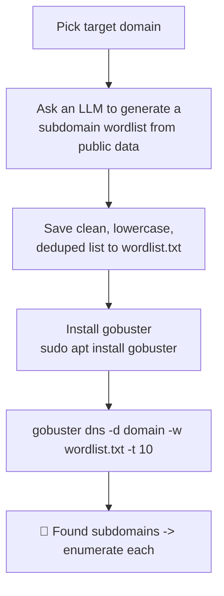

---
tags:
  - ai-assisted
  - phase/enumeration
---

# Active LLM-Aided Enumeration

> [!tip] Quick Reference — LLM-Aided Enumeration
> | Goal | Command |
> |------|---------|
> | Install gobuster | `sudo apt install gobuster` |
> | DNS brute force with LLM wordlist | `gobuster dns -d <domain> -w wordlist.txt -t 10` |
> | Show resolved IPs too | `gobuster dns -d <domain> -w wordlist.txt -i` |
> | Use a specific resolver | `gobuster dns -d <domain> -w wordlist.txt -r 8.8.8.8` |
> | Force past wildcard DNS | `gobuster dns -d <domain> -w wordlist.txt --wildcard` |
> | Faster alt tool (massdns) | `massdns -r resolvers.txt -t A -o S wordlist-fqdn.txt` |
> | Faster alt tool (ffuf, vhost mode) | `ffuf -w wordlist.txt -u https://<domain> -H "Host: FUZZ.<domain>"` |

As we learned in the previous section about DNS enumeration, one of our first steps is to create a robust wordlist. In this section, we'll learn how to use LLMs to create effective wordlists for DNS enumeration. Building a strong wordlist is crucial to uncovering subdomains, services, or directories associated with a target domain. Traditionally, this process required us to manually sift through public information, but modern LLMs can streamline and enhance this step, helping us uncover patterns and generate better results.

Let's take megacorpone.com as an example again. We can start by asking ChatGPT to fetch any company's public data and filter that output to create a list of likely DNS subdomains that will make up our wordlist.

Using public data from MegacorpOne's website and any information that can be inferred about its organizational structure, products, or services, generate a comprehensive list of potential subdomain names.
	•	Incorporate common patterns used for subdomains, such as:
	•	Infrastructure-related terms (e.g., "api", "dev", "test", "staging").
	•	Service-specific terms (e.g., "mail", "auth", "cdn", "status").
	•	Departmental or functional terms (e.g., "hr", "sales", "support").
	•	Regional or country-specific terms (e.g., "us", "eu", "asia").
	•	Factor in industry norms and frequently used terms relevant to MegacorpOne's sector.

Finally, compile the generated terms into a structured wordlist of 1000  words, optimized for subdomain brute-forcing against megacorpone.com

Ensure the output is in a clean, lowercase format with no duplicates, no bulletpoints and ready to be copied and pasted.
Make sure the list contains 1000 unique entries.


In order to speed up our DNS enumeration, we can install gobuster on our Kali machine, which is an open-source, command-line tool designed for fast and efficient brute-forcing and enumeration of different kind of resources.


With gobuster installation out of the way, we will issue gobuster dns -d megacorpone.com -w wordlist -t 10 to perform a DNS brute-forcing operation on the domain megacorpone.com.

The dns option will specify that we are utilizing Gobuster's DNS module. By including -d megacorpone.com, we will direct the tool to target this specific domain for our enumeration.

The -w wordlist.txt argument will allow us to supply the custom LLM-generated wordlist. Finally, the -t 10 parameter will define the level of concurrency, setting Gobuster to use 10 threads simultaneously in order to improve efficiency.

> [!info] Because the prompt specified the output format and size, the LLM returns the requested 1000-word subdomain wordlist (typically as a downloadable file). Save it as `wordlist.txt` for the next step.


> [!example] Install gobuster on Kali before brute forcing:
> ```bash
> sudo apt update
> sudo apt install gobuster
> ```


```sh
gobuster dns -d megacorpone.com -w wordlist.txt -t 10
```

## Visual Flow



> [!success] What success looks like
> The LLM returns a clean list of candidate names (one per line, no bullets) and gobuster prints `Found: admin.megacorpone.com`, `Found: mail.megacorpone.com`, etc. Each discovered subdomain becomes a new target for port scanning and service enumeration.

> [!danger] Common errors
> - `Unable to validate base domain ... no such host` → gobuster could not resolve the apex domain; point it at a resolver with `-r 8.8.8.8` or check connectivity (it can still find subdomains).
> - LLM output has bullets/quotes/duplicates → re-prompt asking for "clean lowercase, one entry per line, no bullet points, no duplicates" before feeding it to gobuster.
> - `the dns command requires --domain` on newer gobuster → v3.6+ uses `--do` instead of `-d`; check `gobuster dns --help`.
> - Every guessed name "resolves" (hundreds of false `Found:` hits) → the domain uses wildcard DNS, so any subdomain answers. Re-run with `--wildcard` to force gobuster to continue correctly instead of aborting/false-positiving.
> - LLM refuses to output the full 1000-word list or truncates it mid-response → ask it to continue from the last entry, or request smaller batches (e.g. 200 at a time) and concatenate.
> Full list: [[⚠️ Common Errors & Troubleshooting]]

> [!warning] Don't over-thread against a real target
> High `-t` values (50+) against a live DNS server can look like a denial-of-service attempt and may trigger IDS alerts or rate-limiting/blocking on OSCP exam infrastructure. Keep `-t 10` unless you know the target can take it.

> [!tip] Beginner note
> An **LLM is just a smarter wordlist generator** here — it guesses likely subdomain names (api, dev, hr, vpn...) from a company's public info so your brute force has better candidates than a generic list. The actual discovery still happens with a real tool (gobuster) that queries DNS for each guessed name. Always sanity-check LLM output; it can invent plausible-looking but fake entries.

## Resources
- [gobuster — GitHub](https://github.com/OJ/gobuster)
- [SecLists DNS wordlists](https://github.com/danielmiessler/SecLists/tree/master/Discovery/DNS) — fallback if LLM output is weak

---
%% graph-links %%
## Related
- [[LLM-Powered Passive Information Gathering]]
- [[Nmap Scripting Engine (NSE)]]

> [!info] Navigation
> Section: [[Active Information Gathering/_index|Active Information Gathering]] · Home: [[🏠 Home]]

