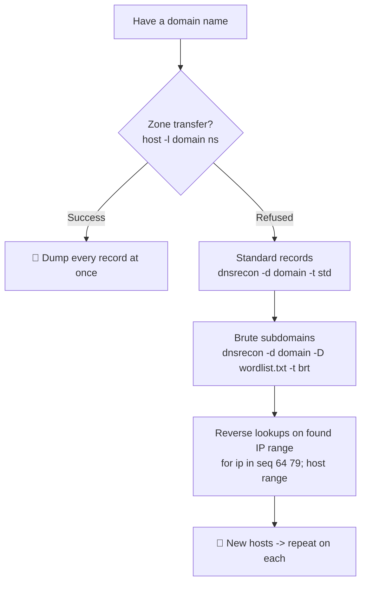

---
tags:
  - dns
  - enumeration
  - phase/enumeration
---

# DNS Enumeration

> [!tip] Quick Reference — DNS
> | Goal | Command |
> |------|---------|
> | Basic lookup | `host <domain>` |
> | Find name servers | `host -t ns <domain>` |
> | Find mail servers | `host -t mx <domain>` |
> | Zone transfer attempt | `host -l <domain> <nameserver>` |
> | dnsrecon sweep | `dnsrecon -d <domain> -t std` |
> | Zone transfer (dnsrecon) | `dnsrecon -d <domain> -t axfr` |
> | Brute force subdomains | `dnsrecon -d <domain> -D /usr/share/wordlists/dnsmap.txt -t brt` |
> | dnsenum full | `dnsenum <domain>` |
> | dig any record | `dig any <domain>` |
> | dig zone transfer | `dig axfr <domain> @<nameserver>` |
> | dig against a specific resolver | `dig @8.8.8.8 <domain>` |
> | dig short answer only | `dig +short <domain>` |
> | dig reverse (PTR) lookup | `dig -x <IP> @<nameserver>` |

## Decision Tree

```
Have a domain name?
├── Try zone transfer first (low-hanging fruit)
│   └── host -l <domain> <ns1.domain>
│       ├── SUCCESS → massive recon win, map every host
│       └── FAIL    → continue below
├── Enumerate standard records
│   └── dnsrecon -d <domain> -t std
├── Brute force subdomains
│   └── dnsrecon -d <domain> -D /usr/share/seclists/Discovery/DNS/subdomains-top1million-5000.txt -t brt
└── Reverse lookup on IP range
    └── dnsrecon -r <IP>/24 -n <nameserver>
```

## Visual Flow



> [!success] What success looks like
> A zone transfer dumps the full record list in one shot. Otherwise `dnsrecon -t std` returns NS/MX/A/TXT records, and brute forcing prints lines like `A mail.megacorpone.com 167.114.21.68` — each new hostname/IP is a fresh target to enumerate.

> [!danger] Common errors
> - `Host X not found: 3(NXDOMAIN)` → the name simply does not resolve; that hostname does not exist (this is normal during brute forcing).
> - Zone transfer `Transfer failed` / `connection timed out; no servers could be reached` → the nameserver refuses AXFR (the secure default). Move on to `-t std` and brute forcing.
> - `Unable to validate base domain ... no such host` → your DNS resolver cannot reach the domain; specify a nameserver with `-n <ns IP>` or fix `/etc/resolv.conf`.
> - `dig` hangs then `;; communications error to <IP>#53: timed out` → nameserver is unreachable or UDP/53 (or TCP/53 for AXFR) is firewalled; confirm with `nc -nv -u <IP> 53` or try a different resolver.
> - `dig axfr` returns instantly with `; Transfer failed.` and no `communications error` → the server actively refused AXFR (correct, secure behavior), as opposed to a timeout (network problem) — don't keep retrying, just move to brute forcing.
> Full list: [[⚠️ Common Errors & Troubleshooting]]

> [!tip] Beginner note
> A **zone transfer** (AXFR) is a feature meant to copy the entire DNS database from a primary nameserver to a backup. If a server is misconfigured to allow it to anyone, you get a complete list of every host in the domain for free — always try it first. A **record type** just tells DNS what kind of answer you want: `A` = IPv4, `MX` = mail server, `NS` = nameserver, `TXT` = free-text, `PTR` = reverse (IP back to name).

## Resources
- [HackTricks — DNS](https://book.hacktricks.xyz/network-services-pentesting/pentesting-dns)
- [SecLists DNS wordlists](https://github.com/danielmiessler/SecLists/tree/master/Discovery/DNS)


The Domain Name System (DNS) is a distributed database responsible for translating user-friendly domain names into IP addresses. It's one of the most critical systems on the internet. This is facilitated by a hierarchical structure that is divided into several zones, starting with the top-level root zone.

> [!info] Common DNS record types
> - **NS** — authoritative nameservers hosting the domain's DNS records.
> - **A** — IPv4 address of a hostname (e.g. `www.megacorpone.com`).
> - **AAAA** — IPv6 address of a hostname.
> - **MX** — mail servers handling email for the domain (a domain can have several).
> - **PTR** — reverse-lookup record mapping an IP back to a hostname.
> - **CNAME** — alias pointing one hostname at another.
> - **TXT** — arbitrary text, often used for domain-ownership verification.
>
> DNS holds a wealth of infrastructure detail, making it a prime target for active enumeration.


> [!example] Look up the A record (IPv4) of a hostname:
> ```bash
> host www.megacorpone.com
> ```
> Returns: `www.megacorpone.com has address 149.56.244.87`


> [!example] By default `host` returns the A record; use `-t` to query other record types (MX, TXT, NS...):
> ```bash
> host -t mx megacorpone.com
> ```
> ```
> megacorpone.com mail is handled by 10 fb.mail.gandi.net.
> megacorpone.com mail is handled by 20 spool.mail.gandi.net.
> megacorpone.com mail is handled by 50 mail.megacorpone.com.
> megacorpone.com mail is handled by 60 mail2.megacorpone.com.
> ```

In this case, we first ran the host command to fetch only megacorpone.com MX records, which returned four different mail server records. Each server has a different priority (10, 20, 50, 60) and the server with the lowest priority number will be used first to forward mail addressed to the megacorpone.com domain (fb.mail.gandi.net).

> [!example] Query TXT records — often reveal SPF, verification tokens, or notes:
> ```bash
> host -t txt megacorpone.com
> ```
> ```
> megacorpone.com descriptive text "Try Harder"
> megacorpone.com descriptive text "google-site-verification=..."
> ```


> [!example] `dig` is the more flexible/scriptable alternative to `host`. `any` requests every record type in one query, `+short` trims the output to just the answer, and `@<resolver>` targets a specific DNS server instead of the system default:
> ```bash
> dig any megacorpone.com
> dig +short megacorpone.com
> dig @8.8.8.8 megacorpone.com
> ```

> [!example] Attempt a zone transfer with `dig axfr` — the more common tool-of-choice over `host -l` for this. Pass the domain, then `@<nameserver>`:
> ```bash
> dig axfr megacorpone.com @ns1.megacorpone.com
> ```
> Success dumps every record in the zone in one response. A refused/secured server returns `; Transfer failed.` — move on to brute forcing.

> [!example] A **valid** hostname resolves to an address:
> ```bash
> host www.megacorpone.com
> ```
> Returns: `www.megacorpone.com has address 149.56.244.87`


> [!example] An **invalid** hostname returns NXDOMAIN — this distinction is what makes brute forcing possible:
> ```bash
> host idontexist.megacorpone.com
> ```
> Returns: `Host idontexist.megacorpone.com not found: 3(NXDOMAIN)`

Having learned the basics of DNS enumeration, we can develop DNS brute-forcing techniques to speed up our research.

Brute forcing is a trial-and-error technique that seeks to find valid information such as directories on a web server, username, and password combinations, or in this case, valid DNS records. By using a wordlist containing common hostnames, we can attempt to guess DNS records and check the response for valid hostnames.

In the examples so far, we used forward lookups, which request the IP address of a hostname to query both a valid and an invalid hostname. If host successfully resolves a name to an IP, this could be an indication of a functional server.

> [!example] Build a small list of candidate hostnames (`list.txt`), one per line:
> ```
> ftp
> mail
> proxy
> router
> ```


> [!example] Loop `host` over the wordlist to brute-force forward lookups:
> ```bash
> for ip in $(cat list.txt); do host $ip.megacorpone.com; done
> ```
> Resolving names (`mail`, `router`, `www`) reveal live hosts; the rest return NXDOMAIN. For much larger wordlists, install SecLists with `sudo apt install seclists` (to `/usr/share/seclists`).

[https://github.com/danielmiessler/SecLists](https://github.com/danielmiessler/SecLists)

Except for the www record, our DNS-forward brute force enumeration revealed a set of scattered IP addresses in the same approximate range (167.114.21.X). If the DNS administrator of megacorpone.com configured PTR records for the domain, we could scan the approximate range with reverse lookups to request the hostname for each IP.

> [!example] Reverse-lookup a range (167.114.21.64–79), filtering out failures, to map IPs back to hostnames:
> ```bash
> for ip in $(seq 64 79); do host 167.114.21.$ip; done | grep -Ev "not found|timed out"
> ```
> Each hit resolves a PTR record, e.g.:
> ```
> ...64 domain name pointer admin.megacorpone.com.
> ...68 domain name pointer mail.megacorpone.com.
> ...70 domain name pointer router.megacorpone.com.
> ...76 domain name pointer vpn.megacorpone.com.
> ```

We have successfully managed to resolve several IP addresses to valid hosts using reverse DNS lookups. If we were performing an assessment, we could further extrapolate these results, and might scan for "mail2", "router", etc., and reverse-lookup positive results. These types of scans are often cyclical; we expand our search based on any information we receive at every round.

Now that we have developed our foundational DNS enumeration skills, let's explore how we can automate the process using a few applications.

There are several tools in Kali Linux that can automate DNS enumeration. Two notable examples are DNSRecon and DNSenum; let's explore their capabilities.

DNSRecon is an advanced DNS enumeration script written in Python. Let's run dnsrecon against megacorpone.com, using the -d option to specify a domain name and -t to specify the type of enumeration to perform (in this case, a standard scan).

> [!example] DNSRecon is a Python DNS enumeration script. `-d` sets the domain, `-t std` runs a standard scan (SOA, NS, MX, A, TXT, SRV):
> ```bash
> dnsrecon -d megacorpone.com -t std
> ```
> Typical output surfaces the nameservers, mail servers, and records in one pass:
> ```
> INFO NS ns1.megacorpone.com 51.79.37.18
> INFO MX mail.megacorpone.com 167.114.21.68
> INFO A  megacorpone.com 149.56.244.87
> INFO TXT megacorpone.com Try Harder
> ```

> [!example] Reuse the same `list.txt` wordlist for dnsrecon's brute-force mode:
> ```
> ftp
> mail
> proxy
> router
> ```


> [!example] Brute force subdomains with dnsrecon — `-d` domain, `-D` dictionary file, `-t brt` for brute force:
> ```bash
> dnsrecon -d megacorpone.com -D ~/list.txt -t brt
> ```
> Each matching name prints as an A record, e.g. `A router.megacorpone.com 167.114.21.70`.


DNSEnum is another popular DNS enumeration tool that can be used to further automate DNS enumeration of the megacorpone.com domain. We can pass the tool a few options, but for the sake of this example, we'll only pass the target domain parameter:

> [!example] DNSEnum automates the whole process — host addresses, nameservers, zone-transfer attempts, and the domain's class-C ranges:
> ```bash
> dnsenum megacorpone.com
> ```
> It enumerates every A record it can find (admin, mail, router, vpn...) and lists the netranges (e.g. `167.114.21.0/24`) worth scanning next.

We have now discovered several previously-unknown hosts as a result of our extensive DNS enumeration. This set of hostnames can now be used for service enumeration, port scanning, or validating exposure. As mentioned at the beginning of this Module, information gathering has a cyclic pattern, so we'll need to perform all the other passive and active enumeration tasks on this new subset of hosts to disclose any new potential details.


> xfreerdp /u:student /p:lab /v:192.168.50.152


> nslookup mail.megacorptwo.com


In this example, we are specifically querying the 192.168.50.151 DNS server for any TXT record related to the info.megacorptwo.com host.

The nslookup utility is as versatile as the Linux host command and the queries can also be further automated through PowerShell or Batch scripting.

> [!example] Connect to the Windows 11 client over RDP — `/u:` user, `/p:` password, `/v:` target IP:
> ```bash
> xfreerdp /u:student /p:lab /v:192.168.50.152
> ```


> [!example] On Windows, `nslookup` resolves a name to an IP (the Linux `host` equivalent):
> ```powershell
> nslookup mail.megacorptwo.com
> ```
> The default DNS server (192.168.50.151) answers with `mail.megacorptwo.com  Address: 192.168.50.154`.


> [!example] Like `host`, `nslookup` can request a specific record type from a specific DNS server — here a TXT record from 192.168.50.151:
> ```powershell
> nslookup -type=TXT info.megacorptwo.com 192.168.50.151
> ```
> Returns: `info.megacorptwo.com text = "greetings from the TXT record body"`.


```sh
> nslookup -type=TXT info.megacorptwo.com 192.168.50.151
```

---
%% graph-links %%
## Related
- [[WHOIS Enumeration]]
- [[SMB Enumeration]]
- [[Nmap Scripting Engine (NSE)]]

> [!info] Navigation
> Section: [[Active Information Gathering/_index|Active Information Gathering]] · Home: [[🏠 Home]]

