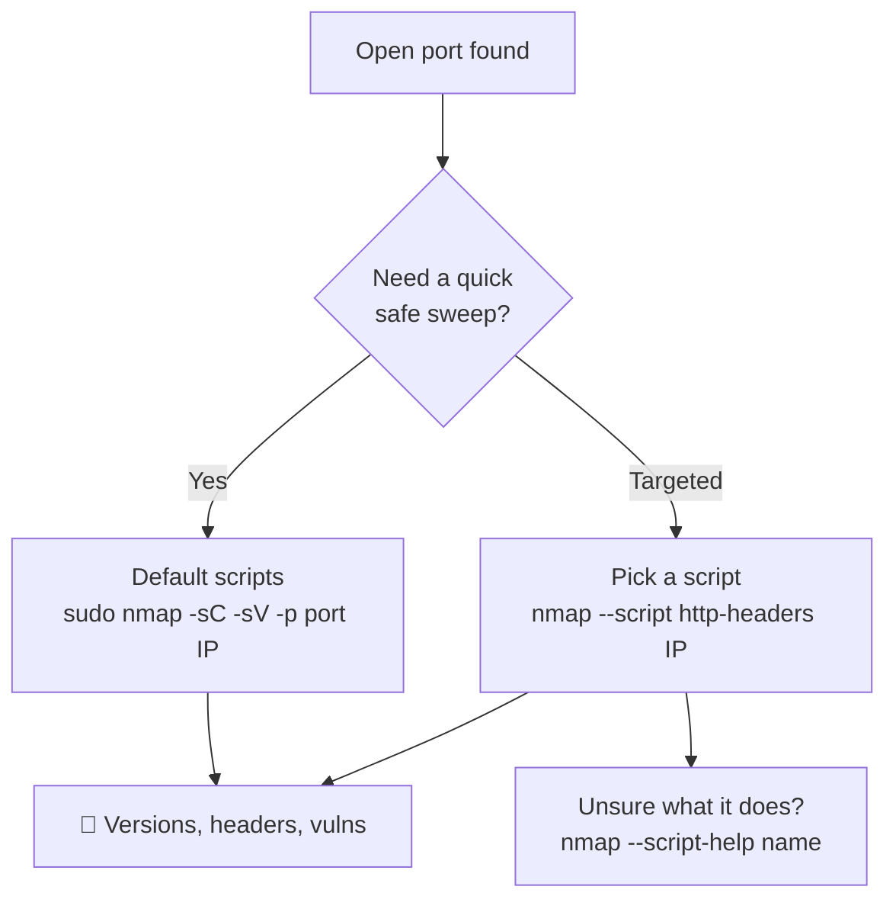

---
tags:
  - enumeration
  - nmap
  - nse
  - phase/enumeration
---

# Nmap Scripting Engine (NSE)

> [!tip] Quick Reference — Nmap
> | Goal | Command |
> |------|---------|
> | Fast SYN scan all ports | `sudo nmap -sS -p- --min-rate 5000 <IP>` |
> | Full version + scripts | `sudo nmap -sC -sV -p <ports> <IP>` |
> | UDP top 20 | `sudo nmap -sU --top-ports 20 <IP>` |
> | OS detection | `sudo nmap -O --osscan-guess <IP>` |
> | Output all formats | `sudo nmap -sC -sV -oA scan <IP>` |
> | Sweep live hosts | `nmap -sn 10.10.10.0/24` |

## Decision Tree

```
Target identified?
├── Single host → sudo nmap -sS -p- --min-rate 5000 <IP> -oA full
│   └── Ports found → sudo nmap -sC -sV -p <open-ports> <IP> -oA detail
└── Subnet → nmap -sn 10.x.x.0/24 | grep "report for" | awk '{print $5}'
    └── For each live host → repeat single host flow

Service on unusual port?
└── Always run -sV to confirm what's actually listening

Firewall dropping packets?
└── Try -Pn (skip host discovery) and --scan-delay 1s
```

## Resources
- [HackTricks — Nmap](https://book.hacktricks.xyz/generic-methodologies-and-resources/pentesting-network/nmap-cheatsheet)
- [Nmap NSE scripts list](https://nmap.org/nsedoc/)

## Visual Flow



> [!success] What success looks like
> The scan prints normal port lines plus extra indented `|` output from the script, e.g. an `http-headers` run shows `Server: Apache/2.4.41 (Ubuntu)`. That banner/version is what you feed into searchsploit.

> [!danger] Common errors
> - `'http-headers' did not match a category, filename, or directory` → typo in the script name; list options with `ls /usr/share/nmap/scripts/`.
> - Scripts run but return nothing → the service was not actually that protocol; confirm with `-sV` first.
> - `-sC` feels slow / noisy → it runs the whole `default` category; narrow to one script with `--script <name>` on real exams.
> Full list: [[⚠️ Common Errors & Troubleshooting]]

> [!tip] Beginner note
> **NSE** = Nmap Scripting Engine: small Lua scripts (in `/usr/share/nmap/scripts`) that do deeper work than a plain port scan, like grabbing HTTP headers or testing for known vulns. The shortcut `-sC` just means "run the default set of safe scripts" — pair it with `-sV` for version detection.

We can use the NSE to launch user-created scripts to automate various scanning tasks. These scripts perform a broad range of functions including DNS enumeration, brute force attacks, and even vulnerability identification. NSE scripts are in the /usr/share/nmap/scripts directory.

> [!example] The `http-headers` script connects to a target's HTTP service and lists the response headers — useful for identifying the server software:
> ```sh
> nmap --script http-headers 192.168.50.6
> ```
> The script output appears under the open port, e.g. `| Server: Apache/2.4.41 (Ubuntu)` — feed that banner into searchsploit.


> [!example] Use `--script-help` to see a script's description, categories, and a docs URL before running it:
> ```sh
> nmap --script-help http-headers
> ```

---
%% graph-links %%
## Related
- [[TCPUDP Port Scanning Theory]]
- [[FingerPrinting with Nmap]]
- [[NMAP]]
- [[SMB Enumeration]]

> [!info] Navigation
> Section: [[Active Information Gathering/Port Scanning with Nmap/_index|Port Scanning with Nmap]] · Home: [[🏠 Home]]

