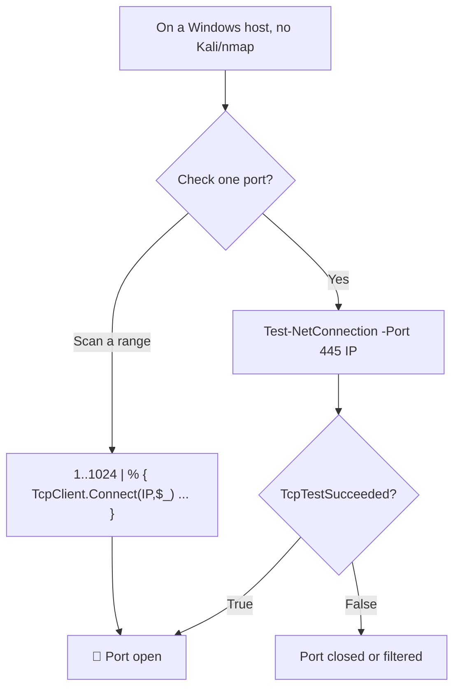

---
tags:
  - enumeration
  - nmap
---

# Window:  Test-NetConnection

> [!tip] Quick Reference — Nmap
> | Goal | Command |
> |------|---------|
> | Fast SYN scan all ports | `sudo nmap -sS -p- --min-rate 5000 <IP>` |
> | Full version + scripts | `sudo nmap -sC -sV -p <ports> <IP>` |
> | UDP top 20 | `sudo nmap -sU --top-ports 20 <IP>` |
> | OS detection | `sudo nmap -O --osscan-guess <IP>` |
> | Output all formats | `sudo nmap -sC -sV -oA scan <IP>` |
> | Sweep live hosts | `nmap -sn 10.10.10.0/24` |

## Decision Tree

```
Target identified?
├── Single host → sudo nmap -sS -p- --min-rate 5000 <IP> -oA full
│   └── Ports found → sudo nmap -sC -sV -p <open-ports> <IP> -oA detail
└── Subnet → nmap -sn 10.x.x.0/24 | grep "report for" | awk '{print $5}'
    └── For each live host → repeat single host flow

Service on unusual port?
└── Always run -sV to confirm what's actually listening

Firewall dropping packets?
└── Try -Pn (skip host discovery) and --scan-delay 1s
```

## Visual Flow



> [!success] What success looks like
> The output ends with `TcpTestSucceeded : True` — that line is the whole point and means the TCP port is open. The 1..1024 one-liner prints `TCP port 88 is open` for each reachable port.

> [!danger] Common errors
> - `TcpTestSucceeded : False` with a ping reply → the host is up but that specific port is closed/filtered; try another port.
> - `WARNING: TCP connect ... failed` and it hangs → no route or firewall dropping; this is the normal "closed" case, not a tool bug.
> - One-liner floods red errors → that is expected for closed ports; the `2>$null` at the end is what suppresses them, so keep it.
> Full list: [[⚠️ Common Errors & Troubleshooting]]

> [!tip] Beginner note
> `Test-NetConnection` is the built-in PowerShell way to check a port when you are stuck on a Windows box with no nmap installed. It only checks **one port at a time**, so to scan many ports you fall back to the `TcpClient` one-liner. Always read the final `TcpTestSucceeded` field — ignore the ICMP/ping lines above it.

## Resources
- [HackTricks — Nmap](https://book.hacktricks.xyz/generic-methodologies-and-resources/pentesting-network/nmap-cheatsheet)
- [Nmap NSE scripts list](https://nmap.org/nsedoc/)


The Test-NetConnection function checks if an IP responds to ICMP and whether a specified TCP port on the target host is open.

For instance, from the Windows 11 client, we can verify if the SMB port 445 is open on a domain controller, as follows:


The returned value in the TcpTestSucceeded parameter indicates that port 445 is open.

> [!note]- Screenshot
> ```
> PS C:\Users\student> Test-NetConnection -Port 445 192.168.50.151
> ComputerNiame = 192.168.50.151
> RemoteAddress : 192.168.50.151
> RemotePort. 1445
> InterfaceAlias : Ethernet
> SourceAddress : 192.168.50.152
> TepTestSucceeded : True
> Listing 47 - Port scanning SMB via PowerShell
> ```


```sh
Test-NetConnection -Port 445 192.168.50.151
```


> [!note]- Screenshot
> ```
> We can further script the whole process to scan the first 1024 ports on the Domain
> Controller with the PowerShell one-liner shown below. To do so, we need to instantiate a
> TepClient Socket object as Test-NetConnection to send additional traffic that is not
> needed for our purposes.
> 
> PS C:\Users\student> 1..1024 | % {echo ((New-Object
> 
> Net Sockets. TcpClient) Connect ("192.168.50.151", $_)) “TCP port $_ is open"} 2>$null
> 
> TcP port 88 is open
> 
> Listing 48 - Automating the PowerShell portscanning
> ```


```sh
1..1024 | % {echo ((New-Object Net.Sockets.TcpClient).Connect("192.168.50.151", $_)) "TCP port $_ is open"} 2>$null
```

---
%% graph-links %%
## Related
- [[TCPUDP Port Scanning Theory]]
- [[Nmap Scripting Engine (NSE)]]

> [!info] Navigation
> Section: [[Active Information Gathering/Port Scanning with Nmap/_index|Port Scanning with Nmap]] · Home: [[🏠 Home]]

