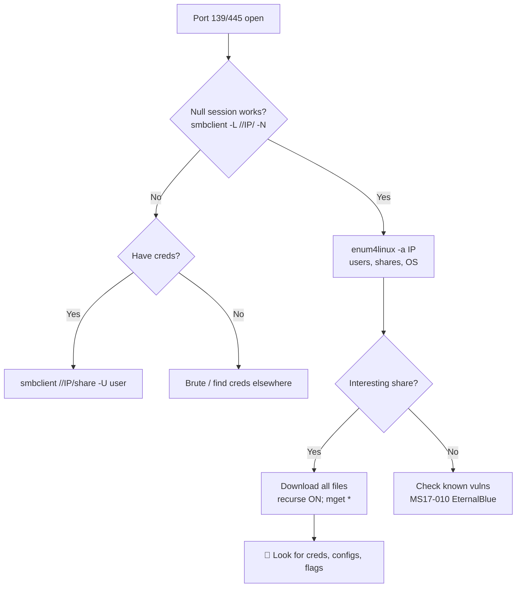

---
tags:
  - enumeration
  - phase/enumeration
  - smb
  - windows
---

# SMB Enumeration

> [!tip] Quick Reference — SMB
> | Goal | Command |
> |------|---------|
> | List shares (null session) | `smbclient -L //<IP>/ -N` |
> | Connect to share | `smbclient //<IP>/<share> -N` |
> | Enum users/shares/OS | `enum4linux -a <IP>` |
> | Nmap SMB scripts | `nmap -p 445 --script smb-enum-shares,smb-enum-users <IP>` |
> | Check vuln (EternalBlue) | `nmap -p 445 --script smb-vuln-ms17-010 <IP>` |
> | CrackMapExec sweep | `crackmapexec smb <IP>/24` |

## Decision Tree

```
Port 139/445 open?
├── Null session?
│   ├── smbclient -L //<IP>/ -N  → lists shares
│   └── enum4linux -a <IP>       → users, groups, OS, password policy
├── Have credentials?
│   ├── smbclient //<IP>/<share> -U <user>
│   └── crackmapexec smb <IP> -u <user> -p <pass> --shares
└── Check for known vulns
    ├── MS17-010 (EternalBlue) → nmap --script smb-vuln-ms17-010
    └── MS08-067              → nmap --script smb-vuln-ms08-067

Got a share? Download everything:
└── smbclient //<IP>/<share> -N -c "recurse ON; prompt OFF; mget *"
```

## Visual Flow



> [!success] What success looks like
> `enum4linux -a` prints a user list and shares; `smbclient -L` shows share names (e.g. `ADMIN$`, `C$`, custom shares). A readable custom share often contains configs, backups, or creds.

> [!danger] Common errors
> - `NT_STATUS_ACCESS_DENIED` → you need creds; try null `-N` first, then known users.
> - `protocol negotiation failed` → modern client refuses SMBv1. Add `--option='client min protocol=NT1'`.
> - `NT_STATUS_LOGON_FAILURE` → wrong creds; try empty `''` or `guest`.
> Full list: [[⚠️ Common Errors & Troubleshooting]]

> [!tip] Beginner note
> **Null session** = connecting with no username/password (`-N`). Many boxes allow it and it's the fastest first move. Always try it before anything else.

## Resources
- [HackTricks — SMB](https://book.hacktricks.xyz/network-services-pentesting/pentesting-smb)
- [PayloadsAllTheThings — SMB](https://github.com/swisskyrepo/PayloadsAllTheThings/blob/master/Methodology%20and%20Resources/Network%20Pentesting.md)


The security track record of the Server Message Block (SMB) protocol has been poor for many years due to its complex implementation and open nature

The NetBIOS service listens on TCP port 139, as well as several UDP ports. It should be noted that SMB (TCP port 445) and NetBIOS are two separate protocols. NetBIOS is an independent session layer protocol and service that allows computers on a local network to communicate with each other. While modern implementations of SMB can work without NetBIOS, NetBIOS over TCP (NBT) is required for backward compatibility and these are often enabled together. This also means the enumeration of these two services often goes together.

These services can be scanned with tools like nmap, using syntax such as the following:

Scan a range for the NetBIOS (139) and SMB (445) ports, saving greppable output:

```sh
nmap -v -p 139,445 -oG smb.txt 192.168.50.1-254
```

There are other, more specialized tools for specifically identifying NetBIOS information, such as nbtscan. We can use this to query the NetBIOS name service for valid NetBIOS names, specifying the originating UDP port as 137 with the -r option.

Query the NetBIOS name service (`-r` sets the originating UDP port to 137) to collect NetBIOS names, which are often descriptive of a host's role:

```sh
sudo nbtscan -r 192.168.50.0/24
```

The scan revealed two NetBIOS names belonging to two hosts. This kind of information can be used to further improve the context of the scanned hosts, as NetBIOS names are often very descriptive about the role of the host within the organization. This data can feed our information-gathering cycle by leading to further disclosures.

Nmap also offers many useful NSE scripts that we can use to discover and enumerate SMB services. We'll find these scripts in the /usr/share/nmap/scripts directory.

List the available SMB NSE scripts (e.g. `smb-enum-shares`, `smb-enum-users`, `smb-os-discovery`, `smb-brute`):

```sh
ls -1 /usr/share/nmap/scripts/smb*
```


> [!info] SMBv1 requirement
> The SMB discovery script only works when SMBv1 is enabled on the target. SMBv1 is disabled by default on modern Windows, but many legacy systems still run it.


The `smb-os-discovery` script reveals OS, computer name, domain/forest name, and FQDN (e.g. `client01.megacorptwo.com`). Note the OS guess can be off — here it reported Windows 10 for a Windows 11 host:

```sh
nmap -v -p 139,445 --script smb-os-discovery 192.168.50.152
```


## Windows SMB Enumeration:


From a Windows host, `net view` lists a remote host's shares. The `/all` flag also shows administrative shares ending in `$` (e.g. `ADMIN$`, `C$`, `IPC$`, `NETLOGON`, `SYSVOL`):

```sh
net view \\dc01 /all
```

-

---
%% graph-links %%
## Related
- [[SNMP Enumeration]]
- [[SMTP Enumeration]]
- [[DNS Enumeration]]
- [[Nmap Scripting Engine (NSE)]]

> [!info] Navigation
> Section: [[Active Information Gathering/_index|Active Information Gathering]] · Home: [[🏠 Home]]

