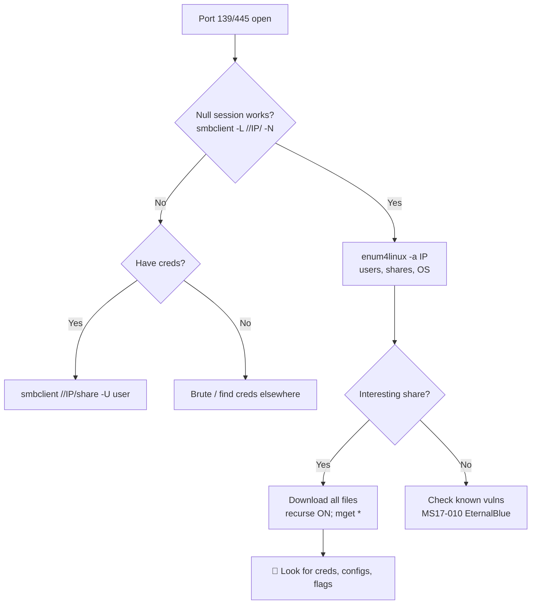

---
tags:
  - enumeration
  - phase/enumeration
  - smb
  - windows
---

# SMB Enumeration

> [!tip] Quick Reference — SMB
> | Goal | Command |
> |------|---------|
> | List shares (null session) | `smbclient -L //<IP>/ -N` |
> | Connect to share | `smbclient //<IP>/<share> -N` |
> | Enum users/shares/OS | `enum4linux -a <IP>` |
> | Nmap SMB scripts | `nmap -p 445 --script smb-enum-shares,smb-enum-users <IP>` |
> | Check vuln (EternalBlue) | `nmap -p 445 --script smb-vuln-ms17-010 <IP>` |
> | CrackMapExec sweep | `crackmapexec smb <IP>/24` |

## Decision Tree

```
Port 139/445 open?
├── Null session?
│   ├── smbclient -L //<IP>/ -N  → lists shares
│   └── enum4linux -a <IP>       → users, groups, OS, password policy
├── Have credentials?
│   ├── smbclient //<IP>/<share> -U <user>
│   └── crackmapexec smb <IP> -u <user> -p <pass> --shares
└── Check for known vulns
    ├── MS17-010 (EternalBlue) → nmap --script smb-vuln-ms17-010
    └── MS08-067              → nmap --script smb-vuln-ms08-067

Got a share? Download everything:
└── smbclient //<IP>/<share> -N -c "recurse ON; prompt OFF; mget *"
```

## Visual Flow



> [!success] What success looks like
> `enum4linux -a` prints a user list and shares; `smbclient -L` shows share names (e.g. `ADMIN$`, `C$`, custom shares). A readable custom share often contains configs, backups, or creds.

> [!danger] Common errors
> - `NT_STATUS_ACCESS_DENIED` → you need creds; try null `-N` first, then known users.
> - `protocol negotiation failed` → modern client refuses SMBv1. Add `--option='client min protocol=NT1'`.
> - `NT_STATUS_LOGON_FAILURE` → wrong creds; try empty `''` or `guest`.
> Full list: [[⚠️ Common Errors & Troubleshooting]]

> [!tip] Beginner note
> **Null session** = connecting with no username/password (`-N`). Many boxes allow it and it's the fastest first move. Always try it before anything else.

## Resources
- [HackTricks — SMB](https://book.hacktricks.xyz/network-services-pentesting/pentesting-smb)
- [PayloadsAllTheThings — SMB](https://github.com/swisskyrepo/PayloadsAllTheThings/blob/master/Methodology%20and%20Resources/Network%20Pentesting.md)


The security track record of the Server Message Block (SMB) protocol has been poor for many years due to its complex implementation and open nature

The NetBIOS service listens on TCP port 139, as well as several UDP ports. It should be noted that SMB (TCP port 445) and NetBIOS are two separate protocols. NetBIOS is an independent session layer protocol and service that allows computers on a local network to communicate with each other. While modern implementations of SMB can work without NetBIOS, NetBIOS over TCP (NBT) is required for backward compatibility and these are often enabled together. This also means the enumeration of these two services often goes together.

These services can be scanned with tools like nmap, using syntax such as the following:

> [!note]- Screenshot
> ```
> kaligkali:~$ nmap -v -p 139,445 -0G smb.txt 192.168.50.1-254
> kaligkali:~$ cat smb.txt
> # Nmap 7.92 scan initiated Thu Mar 17 06:03:12 2022 as: nmap -v -p 139,445 -oG smb.txt
> 192.168.50.1-254
> # Ports scanned: TCP(2;139,445) UDP(@;) SCTP(@;) PROTOCOLS(@;)
> Host: 192.168.52.1 () Status: Down
> Host: 192.168.50.21 () Status: Up
> Host: 192.168.5.21 () Ports: 139/closed/tcp//netbios-ssn///,
> 445 /closed/tcp//microsoft-ds///
> Host: 192.168.50.217 () Status: Up
> Host: 192.168.50.217 () Ports: 139/closed/tcp//netbios-ssn///,
> 445/closed/tcp//microsoft-ds///
> # Nmap done at Thu Mar 17 06:03:18 2022 -- 254 IP addresses (15 hosts up) scanned in
> 6.17 seconds
> Listing 49 - Using nmap to scan for the NetBIOS service
> ```


```sh
nmap -v -p 139,445 -oG smb.txt 192.168.50.1-254
```

There are other, more specialized tools for specifically identifying NetBIOS information, such as nbtscan. We can use this to query the NetBIOS name service for valid NetBIOS names, specifying the originating UDP port as 137 with the -r option.

> [!note]- Screenshot
> ```
> kaligkali:~$ sudo nbtscan -r 192.168.50.0/24
> 
> Doing NBT name scan for addresses from 192.168.50.0/24
> 
> IP address NetBIOS Name Server User MAC address
> 
> 192.168.50.124 SAMBA <server> SAMBA 20:00:00:00:00:00
> 
> 192.168.50.134  SAMBAKEB <server> SAMBANEB 20:00:00:00:00:00
> Listing 50 - Using nbtscan to collect additional NetBIOS information
> ```


```sh
sudo nbtscan -r 192.168.50.0/24
```

The scan revealed two NetBIOS names belonging to two hosts. This kind of information can be used to further improve the context of the scanned hosts, as NetBIOS names are often very descriptive about the role of the host within the organization. This data can feed our information-gathering cycle by leading to further disclosures.

Nmap also offers many useful NSE scripts that we can use to discover and enumerate SMB services. We'll find these scripts in the /usr/share/nmap/scripts directory.

> [!note]- Screenshot
> ```
> kaligkali:~$ 1s -1 /usr/share/nmap/scripts/smb*
> /usr/share/nmap/scripts/smb2-capabilities.nse
> /usr/share/nmap/scripts/smb2-security-mode.nse
> /usr/share/nmap/scripts/smb2-tine nse
> /usr/share/nmap/scripts/smb2-vuln-uptime.nse
> /usr/share/nmap/scripts/smb-brute.nse
> /usr/share/nmap/scripts/snb-double-pulsar-backdoor.nse
> /usr/share/nmap/scripts/smb-enum-domains .nse
> /usr/share/nmap/scripts/smb-enun-groups.nse
> /usr/share/nmap/scripts/smb-enum-processes nse
> /usr/share/nmap/scripts/smb-enum-sessions.nse
> /usr/share/nmap/scripts/smb-enun-shares.nse
> /usr/share/nmap/scripts/smb-enun-users.nse
> /usr/share/nmap/scripts/smb-os-discovery nse
> 
> Listing 51 - Finding various nmap SMB NSE scripts
> ```

sud

```sh
ls -1 /usr/share/nmap/scripts/smb*
```


> [!note]- Screenshot
> ```
> The SMB discovery script works only if SMBv1 is enabled on the
> target, which is not the default case on modern versions of Windows.
> However, plenty of legacy systems are still running SMBv1, and we
> have enabled this specific version on the Windows host to simulate
> such a scenario.
> ```


> [!note]- Screenshot
> ```
> Let's try the smb-os-discovery module on the Windows 11 client.
> 
> kaligkali:~$ nmap -v -p 139,445 --script snb-os-discovery 192.168.50.152
> 
> PORT STATE SERVICE REASON
> 
> 139/tcp open netbios-ssn syn-ack
> 
> 445/tcp open microsoft-ds syn-ack
> 
> Host script results:
> 
> | smb-os-discovery:
> 
> | 0S: Windows 18 Pro 22000 (Windows 10 Pro 6.3)
> 
> | 0S CPE: cpe:/o:microsoft:windows_1@: :-
> 
> | Computer name: client@1
> 
> | NetBIOS computer name: CLIENT@1\x00
> 
> | Domain name: megacorptwo.com
> 
> | Forest name: megacorptwo.com
> 
> | FODN: clientel.megacorptwo.com
> 
> I_. System time: 2022-03-17711:54:20-07:00
> 
> sting 52 - Using the nmap scripting engine to perform OS discovery
> 
> This particular script identified a potential match for the host operating system;
> however, we know it's inaccurate, as the target host is running Windows 11 instead of
> the reported Windows 10.
> ```


```sh
nmap -v -p 139,445 --script smb-os-discovery 192.168.50.152
```


## Windows SMB Enumeration:


> [!note]- Screenshot
> ```
> One useful tool for enumerating SMB shares within Windows environments is net view. It
> lists domains, resources, and computers belonging to a given host. As an example,
> connected to the client01 VM, we can list all the shares running on dc01.
> 
> C:\Users\student> net view \\dcO1 /all
> 
> Shared resources at \\dcO1
> 
> Share name Type Used as Comment:
> 
> AOMINS Disk Remote Adnin
> 
> cs Disk Default share
> 
> recs rec Remote IPC
> 
> NETLOGON Disk Logon server share
> 
> SYSVOL Disk Logon server share
> 
> ‘The command completed successfully.
> 
> Listing 53 - Running ‘net view’ to list remote shares
> 
> By providing the /a11 keyword, we can list the administrative shares ending with the
> dollar sign.
> ```


```sh
net view \\dc01 /all
```

-

---
%% graph-links %%
## Related
- [[SNMP Enumeration]]
- [[SMTP Enumeration]]
- [[DNS Enumeration]]
- [[Nmap Scripting Engine (NSE)]]

> [!info] Navigation
> Section: [[Active Information Gathering/_index|Active Information Gathering]] · Home: [[🏠 Home]]

