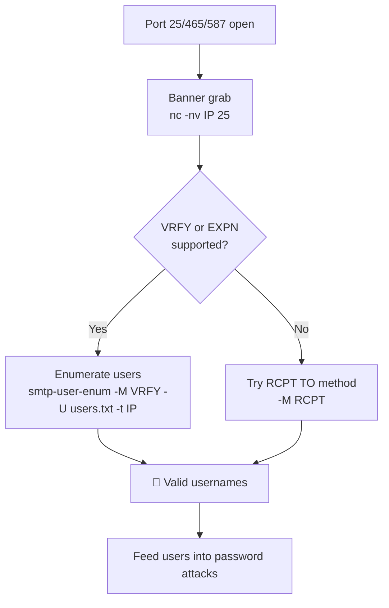

---
tags:
  - enumeration
  - phase/enumeration
  - smtp
---

# SMTP Enumeration

> [!tip] Quick Reference — SMTP
> | Goal | Command |
> |------|---------|
> | Banner grab | `nc -nv <IP> 25` |
> | Verify user exists | `VRFY <username>` (in nc session) |
> | Expand mailing list | `EXPN <list>` (in nc session) |
> | Nmap scripts | `nmap -p 25 --script smtp-enum-users,smtp-commands <IP>` |
> | smtp-user-enum tool | `smtp-user-enum -M VRFY -U /usr/share/wordlists/users.txt -t <IP>` |

## Decision Tree

```
Port 25/465/587 open?
├── Banner grab → nc -nv <IP> 25
│   └── Note software version → searchsploit it
├── User enumeration
│   ├── VRFY supported? → smtp-user-enum -M VRFY -U users.txt -t <IP>
│   ├── EXPN supported? → smtp-user-enum -M EXPN -U users.txt -t <IP>
│   └── RCPT TO supported? → smtp-user-enum -M RCPT -U users.txt -t <IP>
└── Found users? → feed into password attacks
```

## Visual Flow



> [!success] What success looks like
> A valid user returns code `252 2.0.0 root` (or `250`), while an unknown user returns `550 5.1.1 <johndoe>: Recipient address rejected: User unknown`. The difference between those two responses is what confirms a username exists.

> [!danger] Common errors
> - Every name returns `252` → the server accepts all addresses (VRFY not really validating); switch to `-M RCPT` which is more reliable.
> - `503 5.5.1 Error: send HELO/EHLO first` → say `HELO test` (or `EHLO`) before issuing VRFY/RCPT.
> - Connection just hangs → the server may be greylisting/tarpitting; add a timeout or try ports 465/587.
> Full list: [[⚠️ Common Errors & Troubleshooting]]

> [!tip] Beginner note
> **VRFY** asks the mail server "does this user exist?" and **EXPN** asks "who is on this mailing list?". Both leak valid usernames when left enabled. You are not logging in — you are just talking raw SMTP and reading the numeric reply codes (2xx = good, 5xx = rejected).

## Resources
- [HackTricks — SMTP](https://book.hacktricks.xyz/network-services-pentesting/pentesting-smtp)


The Simple Mail Transport Protocol (SMTP) supports several interesting commands, such as VRFY and EXPN. A VRFY request asks the server to verify an email address, while EXPN asks the server for the membership of a mailing list. These can often be abused to verify existing users on a mail server, which is useful information during a penetration test.

Connect with netcat and issue `VRFY` per username. A valid user returns `252 2.0.0 root`; an unknown user returns `550 5.1.1 ... User unknown`:

```sh
nc -nv 192.168.50.8 25
```

We can observe how the success and error messages differ. The 252 SMTP response code does not verify the root user exists but will accept and attempt delivery of any messages. Response code 550 indicates the mailbox is unavailable. This procedure can be used to help guess valid usernames in an automated fashion. Next, let's consider the following Python script, which opens a TCP socket, connects to the SMTP server, and issues a VRFY command for a given username:

```sh
#!/usr/bin/python

import socket
import sys

if len(sys.argv) != 3:
        print("Usage: vrfy.py <username> <target_ip>")
        sys.exit(0)

# Create a Socket
s = socket.socket(socket.AF_INET, socket.SOCK_STREAM)

# Connect to the Server
ip = sys.argv[2]
connect = s.connect((ip,25))

# Receive the banner
banner = s.recv(1024)

print(banner)

# VRFY a user
user = (sys.argv[1]).encode()
s.send(b'VRFY ' + user + b'\r\n')
result = s.recv(1024)

print(result)

# Close the socket
s.close()
```


Run the script with the username as the first argument and the target IP as the second. `root` returns `252 2.0.0 root` (valid); `johndoe` returns `550 5.1.1 ... User unknown` (invalid):

```sh
python3 smtp.py root 192.168.50.8
python3 smtp.py root 192.168.50.8
```


From a Windows client, PowerShell's `Test-NetConnection` confirms port 25 is reachable (`TcpTestSucceeded : True`):

```sh
Test-NetConnection -Port 25 192.168.50.8
```


`Test-NetConnection` cannot interact with the SMTP service directly. Enable the Windows Telnet client to do so:

```sh
dism /online /Enable-Feature /FeatureName:TelnetClient
```


Once Telnet is installed, connect to port 25 and issue `VRFY` just as with netcat. This lets you enumerate users from a compromised Windows host when Kali is unavailable:

```sh
telnet 192.168.50.8 25
```

---
%% graph-links %%
## Related
- [[SMB Enumeration]]
- [[SNMP Enumeration]]
- [[DNS Enumeration]]

> [!info] Navigation
> Section: [[Active Information Gathering/_index|Active Information Gathering]] · Home: [[🏠 Home]]

