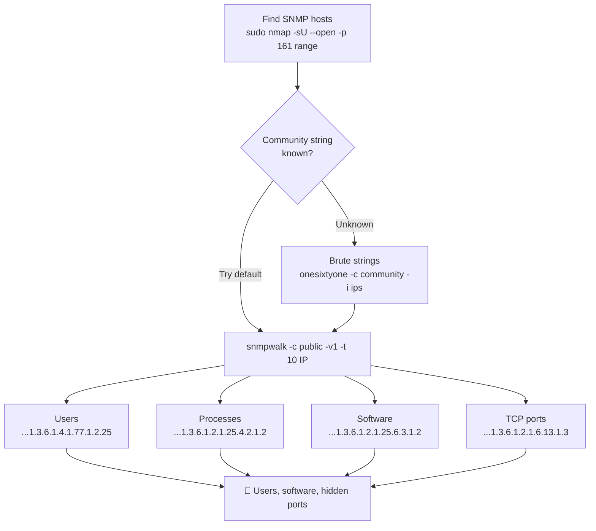

---
tags:
  - enumeration
  - phase/enumeration
  - snmp
---

# SNMP Enumeration

> [!tip] Quick Reference — SNMP
> | Goal | Command |
> |------|---------|
> | Sweep for SNMP hosts | `sudo nmap -sU -p 161 <IP>/24` |
> | Basic SNMP walk | `snmpwalk -c public -v1 <IP>` |
> | Enumerate everything | `snmpwalk -c public -v1 <IP> 1.3.6.1` |
> | Users/processes | `snmpwalk -c public -v1 <IP> 1.3.6.1.4.1.77.1.2.25` |
> | Running processes | `snmpwalk -c public -v1 <IP> 1.3.6.1.2.1.25.4.2.1.2` |
> | Open TCP ports | `snmpwalk -c public -v1 <IP> 1.3.6.1.2.1.6.13.1.3` |
> | Brute community strings | `onesixtyone -c /usr/share/seclists/Discovery/SNMP/common-snmp-community-strings.txt <IP>` |
> | Clean summary tool | `snmp-check <IP> -c public` |
> | Faster walk (v2c, bulk) | `snmpbulkwalk -c public -v2c <IP> 1.3.6.1` |
> | Nmap SNMP NSE sweep | `nmap -sU -p 161 --script snmp-sysdescr,snmp-processes,snmp-netstat,snmp-interfaces <IP>` |
> | SNMPv3 (no community string) | `snmpwalk -v3 -l authPriv -u <user> -a SHA -A <authpass> -x AES -X <privpass> <IP>` |

## Decision Tree

```
UDP 161 open?
├── Try default community string "public"
│   └── snmpwalk -c public -v1 <IP>
│       ├── Works → enumerate OIDs for users, processes, ports
│       └── Fails → brute community strings with onesixtyone
├── Got community string?
│   └── snmp-check <IP> -c <string>  (cleaner output than snmpwalk)
└── Windows SNMP?
    └── Reveals: local users, running services, installed software, TCP ports
```

## Key OIDs Cheatsheet

| OID | Data |
|-----|------|
| `1.3.6.1.2.1.25.1.6.0` | System processes |
| `1.3.6.1.2.1.25.4.2.1.2` | Running programs |
| `1.3.6.1.2.1.25.4.2.1.4` | Process paths |
| `1.3.6.1.2.1.25.2.3.1.4` | Storage units |
| `1.3.6.1.2.1.25.6.3.1.2` | Software names |
| `1.3.6.1.4.1.77.1.2.25` | User accounts |
| `1.3.6.1.2.1.6.13.1.3` | Open TCP ports |

## Visual Flow



> [!success] What success looks like
> `snmpwalk -c public -v1` prints a stream of `iso.3.6.1...= STRING:` lines instead of timing out. The user OID reveals account names like `"Administrator"` and `"student"`; the process OID lists running `.exe` names; the TCP-ports OID reveals services (e.g. 88, 135, 389, 445) that may not be reachable from outside.

> [!danger] Common errors
> - `Timeout: No Response from <IP>` → wrong community string or SNMP not listening on UDP 161; bump `-t 10` and brute strings with onesixtyone.
> - No output but no error → you used the wrong SNMP version; SNMP v1 devices need `-v1`, v2c needs `-v2c`.
> - `snmpwalk: Unknown host` / OID errors → quote or fully type the OID; install `snmp-mibs-downloader` if you want named OIDs instead of numbers.
> - `No Such Object available on this agent at this OID` / `No Such Instance currently exists at this OID` → not an error, it means you walked past the end of that branch or the OID doesn't exist on this device; try a parent OID or a full `1.3.6.1` walk to see what's actually populated.
> - `snmpwalk` works but `onesixtyone` finds nothing → community strings differ per-host; also confirm UDP/161 isn't being dropped by a firewall (`sudo nmap -sU -p161 <IP>` should show `open`, not `open|filtered`).
> Full list: [[⚠️ Common Errors & Troubleshooting]]

> [!tip] Beginner note
> A **community string** is SNMP's version of a password. By default many devices ship with `public` (read-only) and `private` (read-write) — guessing `public` first works surprisingly often. SNMP runs over **UDP 161**, so a normal TCP scan will miss it; you must scan with `-sU`.

## Resources
- [HackTricks — SNMP](https://book.hacktricks.xyz/network-services-pentesting/pentesting-snmp)


SNMP is based on UDP, a simple, stateless protocol, and is therefore susceptible to IP spoofing and replay attacks. Additionally, the commonly used SNMP protocols 1, 2, and 2c offer no traffic encryption, meaning that SNMP information and credentials can be easily intercepted over a local network. Traditional SNMP protocols also have weak authentication schemes and are commonly left configured with default public and private community strings.


The SNMP Management Information Base (MIB) is a database containing information typically related to network management. The database is organized like a tree, with branches that represent different organizations or network functions. The leaves of the tree (or final endpoints) correspond to specific variable values that can then be accessed and probed by an external user. The IBM Knowledge Center contains a wealth of information about the MIB tree.

For example, the following MIB values correspond to specific Microsoft Windows SNMP parameters and contain much more than network-based information:


1.3.6.1.2.1.25.1.6.0	System Processes
1.3.6.1.2.1.25.4.2.1.2	 Running Programs
1.3.6.1.2.1.25.4.2.1.4	Processes Path
1.3.6.1.2.1.25.2.3.1.4	Storage Units
1.3.6.1.2.1.25.6.3.1.2	Software Name
1.3.6.1.4.1.77.1.2.25	User Accounts
1.3.6.1.2.1.6.13.1.3	TCP Local Ports
[http://www.phreedom.org/software/onesixtyone/](http://www.phreedom.org/software/onesixtyone/)
This command enumerates the entire MIB tree using the -c option to specify the community string, and -v to specify the SNMP version number, as well as the -t 10 option to increase the timeout period to 10 seconds:

Revealed another way, we can use the output above to obtain target email addresses. This information can be used to craft a social engineering attack against the newly-discovered contacts.

To further practice what we've learned, let's explore a few SNMP enumeration techniques against a Windows target. We'll use the snmpwalk command, which can parse a specific branch of the MIB Tree called OID.
[https://www.ibm.com/docs/en/i/7.2?topic=schema-object-identifier-oid](https://www.ibm.com/docs/en/i/7.2?topic=schema-object-identifier-oid)

> [!info] SNMPv3 encryption
> Older SNMPv3 implementations shipped only with DES-56, a weak cipher that can be brute-forced. Newer SNMPv3 supports AES-256.


Scan for open SNMP ports with `-sU` (UDP) and `--open` to show only open ports:

```sh
sudo nmap -sU --open -p 161 192.168.50.1-254 -oG open-snmp.txt
```


Alternatively, `onesixtyone` brute-forces community strings against a list of IPs. Build a community-string file and an IP list, then run it:

```sh
echo public > community
echo private >> community
echo manager >> community
for ip in $(seq 1 254); do echo 192.168.50.$ip; done > ips
onesixtyone -c community -i ips
```


Once SNMP is found, query the MIB with `snmpwalk` using the read-only community string (usually `public`). `-c` sets the string, `-v1` the version, and `-t 10` raises the timeout to 10 seconds. Walking the whole tree reveals the system description (OS/hardware), a contact email, and the hostname:

```sh
snmpwalk -c public -v1 -t 10 192.168.50.151
```


Enumerate local Windows user accounts by walking the user-accounts OID. Output reveals names like `Guest`, `krbtgt`, `student`, and `Administrator`:

```sh
snmpwalk -c public -v1 192.168.50.151 1.3.6.1.4.1.77.1.2.25
```


Enumerate all currently running processes (e.g. `smss.exe`, `svchost.exe`, `lsass.exe`, `winlogon.exe`). This can reveal vulnerable applications or which anti-virus is running on the target:

```sh
snmpwalk -c public -v1 192.168.50.151 1.3.6.1.2.1.25.4.2.1.2
```


Enumerate all installed software (e.g. `VMware Tools`, various `Microsoft Visual C++` runtimes). Cross-referencing this with the running-process list confirms the exact software versions on the target:

```sh
snmpwalk -c public -v1 192.168.50.151 1.3.6.1.2.1.25.6.3.1.2
```


List all TCP listening ports. The integer values are the open ports (e.g. 88, 135, 389, 445, 636, 3268, 5985). This can disclose services that listen only locally, revealing ports not reachable from an external scan:

```sh
snmpwalk -c public -v1 192.168.50.151 1.3.6.1.2.1.6.13.1.3
```

---
%% graph-links %%
## Related
- [[SMB Enumeration]]
- [[SMTP Enumeration]]
- [[DNS Enumeration]]

> [!info] Navigation
> Section: [[Active Information Gathering/_index|Active Information Gathering]] · Home: [[🏠 Home]]

