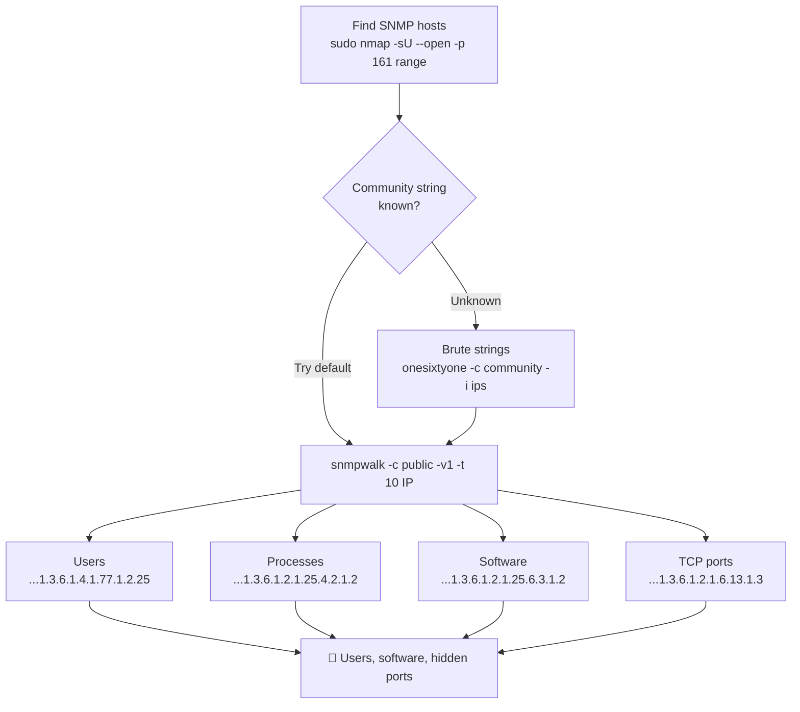

---
tags:
  - enumeration
  - phase/enumeration
  - snmp
---

# SNMP Enumeration

> [!tip] Quick Reference — SNMP
> | Goal | Command |
> |------|---------|
> | Sweep for SNMP hosts | `sudo nmap -sU -p 161 <IP>/24` |
> | Basic SNMP walk | `snmpwalk -c public -v1 <IP>` |
> | Enumerate everything | `snmpwalk -c public -v1 <IP> 1.3.6.1` |
> | Users/processes | `snmpwalk -c public -v1 <IP> 1.3.6.1.4.1.77.1.2.25` |
> | Running processes | `snmpwalk -c public -v1 <IP> 1.3.6.1.2.1.25.4.2.1.2` |
> | Open TCP ports | `snmpwalk -c public -v1 <IP> 1.3.6.1.2.1.6.13.1.3` |
> | Brute community strings | `onesixtyone -c /usr/share/seclists/Discovery/SNMP/common-snmp-community-strings.txt <IP>` |

## Decision Tree

```
UDP 161 open?
├── Try default community string "public"
│   └── snmpwalk -c public -v1 <IP>
│       ├── Works → enumerate OIDs for users, processes, ports
│       └── Fails → brute community strings with onesixtyone
├── Got community string?
│   └── snmp-check <IP> -c <string>  (cleaner output than snmpwalk)
└── Windows SNMP?
    └── Reveals: local users, running services, installed software, TCP ports
```

## Key OIDs Cheatsheet

| OID | Data |
|-----|------|
| `1.3.6.1.2.1.25.1.6.0` | System processes |
| `1.3.6.1.2.1.25.4.2.1.2` | Running programs |
| `1.3.6.1.2.1.25.4.2.1.4` | Process paths |
| `1.3.6.1.2.1.25.2.3.1.4` | Storage units |
| `1.3.6.1.2.1.25.6.3.1.2` | Software names |
| `1.3.6.1.4.1.77.1.2.25` | User accounts |
| `1.3.6.1.2.1.6.13.1.3` | Open TCP ports |

## Visual Flow



> [!success] What success looks like
> `snmpwalk -c public -v1` prints a stream of `iso.3.6.1...= STRING:` lines instead of timing out. The user OID reveals account names like `"Administrator"` and `"student"`; the process OID lists running `.exe` names; the TCP-ports OID reveals services (e.g. 88, 135, 389, 445) that may not be reachable from outside.

> [!danger] Common errors
> - `Timeout: No Response from <IP>` → wrong community string or SNMP not listening on UDP 161; bump `-t 10` and brute strings with onesixtyone.
> - No output but no error → you used the wrong SNMP version; SNMP v1 devices need `-v1`, v2c needs `-v2c`.
> - `snmpwalk: Unknown host` / OID errors → quote or fully type the OID; install `snmp-mibs-downloader` if you want named OIDs instead of numbers.
> Full list: [[⚠️ Common Errors & Troubleshooting]]

> [!tip] Beginner note
> A **community string** is SNMP's version of a password. By default many devices ship with `public` (read-only) and `private` (read-write) — guessing `public` first works surprisingly often. SNMP runs over **UDP 161**, so a normal TCP scan will miss it; you must scan with `-sU`.

## Resources
- [HackTricks — SNMP](https://book.hacktricks.xyz/network-services-pentesting/pentesting-snmp)


SNMP is based on UDP, a simple, stateless protocol, and is therefore susceptible to IP spoofing and replay attacks. Additionally, the commonly used SNMP protocols 1, 2, and 2c offer no traffic encryption, meaning that SNMP information and credentials can be easily intercepted over a local network. Traditional SNMP protocols also have weak authentication schemes and are commonly left configured with default public and private community strings.


The SNMP Management Information Base (MIB) is a database containing information typically related to network management. The database is organized like a tree, with branches that represent different organizations or network functions. The leaves of the tree (or final endpoints) correspond to specific variable values that can then be accessed and probed by an external user. The IBM Knowledge Center contains a wealth of information about the MIB tree.

For example, the following MIB values correspond to specific Microsoft Windows SNMP parameters and contain much more than network-based information:


1.3.6.1.2.1.25.1.6.0	System Processes
1.3.6.1.2.1.25.4.2.1.2	 Running Programs
1.3.6.1.2.1.25.4.2.1.4	Processes Path
1.3.6.1.2.1.25.2.3.1.4	Storage Units
1.3.6.1.2.1.25.6.3.1.2	Software Name
1.3.6.1.4.1.77.1.2.25	User Accounts
1.3.6.1.2.1.6.13.1.3	TCP Local Ports
[http://www.phreedom.org/software/onesixtyone/](http://www.phreedom.org/software/onesixtyone/)
This command enumerates the entire MIB tree using the -c option to specify the community string, and -v to specify the SNMP version number, as well as the -t 10 option to increase the timeout period to 10 seconds:

Revealed another way, we can use the output above to obtain target email addresses. This information can be used to craft a social engineering attack against the newly-discovered contacts.

To further practice what we've learned, let's explore a few SNMP enumeration techniques against a Windows target. We'll use the snmpwalk command, which can parse a specific branch of the MIB Tree called OID.
[https://www.ibm.com/docs/en/i/7.2?topic=schema-object-identifier-oid](https://www.ibm.com/docs/en/i/7.2?topic=schema-object-identifier-oid)

> [!note]- Screenshot
> ```
> Until recently, SNMPv3, which provides authentication and encryption,
> has been shipped to support only DES-56, proven to be a weak
> encryption scheme that can be easily brute-forced. A more recent
> SNMPv3 implementation supports the AES-256 encryption scheme.
> ```


> [!note]- Screenshot
> ```
> |
> 
> [isenz125.4214 | Processes atn_|
> 
> [136121256312 | SotwareName_|
> IS ie cnet
> ```


> [!note]- Screenshot
> ```
> To scan for open SNMP ports, we can run nmap, using the -su option to perform UDP.
> scanning and the --open option to limit the output and display only open ports.
> 
> kaligkali:~$ sudo nmap -sU --open -p 161 192.168.50.1-254 -0G open-snmp.txt
> 
> Starting Nmap 7.92 ( https://nmap.org ) at 2022-03-14 06:02 EDT
> 
> Nmap scan report for 192.168.509.151
> 
> Host is up (0.105 latency).
> 
> PORT STATE SERVICE
> 
> 161/udp open snmp
> 
> Nmap done: 1 IP address (1 host up) scanned in @.49 seconds
> 
> sting 60 - Using nmap to perform a SNMP scan
> ```


```sh
sudo nmap -sU --open -p 161 192.168.50.1-254 -oG open-snmp.txt
```


> [!note]- Screenshot
> ```
> Alternatively, we can use a tool such as onesixtyone, which will attempt a brute force
> attack against a list of IP addresses. First, we must build text files containing community
> ‘strings and the IP addresses we wish to scan.
> 
> kaligkali:~$ echo public > community
> 
> kaligkali:~$ echo private >> community
> 
> kaligxali:~$ echo manager >> community
> 
> kaligkali:~$ for ip in $(seq 1 254); do echo 192.168.50.Sip; done > ips
> 
> kali@kali:~$ onesixtyone -c comunity -i ips
> 
> ‘Scanning 254 hosts, 3 communities
> 
> 192.168.590.151 [public] Hardware: Inte164 Family 6 Model 79 Stepping 1 AT/AT COMPATIBLE
> 
> = Software: Windows Version 6.3 (Build 17763 Multiprocessor Free)
> 
> Listing 61 Using onesixtyone to brute force community strings
> ```


```sh
echo public > community
echo private >> community
echo manager >> community
for ip in $(seq 1 254); do echo 192.168.50.$ip; done > ips
onesixtyone -c community -i ips
```


> [!note]- Screenshot
> ```
> ‘Once we find SNMP services, we can start querying them for specific MIB data that
> might be interesting.
> We can probe and query SNMP values using a tool such as snmpwalk, provided we
> know the SNMP read-only community string, which in most cases is "public".
> Using some of the MIB values provided in Table 1, we can attempt to enumerate their
> corresponding values. Let's try the following example against a known machine in the
> labs, which has a Windows SNMP port exposed with the community string "public". This
> command enumerates the entire MIB tree using the -c option to specify the community
> string, and -v to specify the SNMP version number, as well as the -t 10 option to
> increase the timeout period to 10 seconds:
> 
> kaligkali:~$ snmpwalk -c public -v1 -t 10 192.168.50.151
> 
> is0.3.6.1.2.1.1.1.0 = STRING: "Hardware: Intel64 Family 6 Model 79 Stepping 1 AT/AT
> 
> COMPATIBLE - Software: Windows Version 6.3 (Build 17763 Multiprocessor Free)"
> 
> is0.3.6.1.2.1.1.2.0 = OID: is0.3.6.1.4.1.311.1.1.3.1.3
> 
> iso.3.6.1.2.1.1.3.@ = Timeticks: (78235) @:13:@2.35
> 
> iso.3.6.1.2.1.1.4.@ = STRING: "admin@megacorptwo.com"
> 
> is0.3.6.1.2.1.1.5.0 = STRING: “dcO1megacorptwo.con”
> 
> is0.3.6.1.2.1.1.6.0 ="
> 
> is0.3.6.1.2.1.1.7.0 = INTEGER: 79
> 
> is0.3.6.1.2.1.2.1.0 = INTEGER: 24
> 
> Listing 62 - Using snmpwalk to enumerate the ent MIB tree
> ```


```sh
snmpwalk -c public -v1 -t 10 192.168.50.151
```


> [!note]- Screenshot
> ```
> The following example enumerates the Windows users on the dc01 machine:
> kalignali:~$ snmpwalk -c public -v1 192.168.50.151 1.3.6.1.4.1.77-1.2.25
> iso.3.6.1.4.1.77-1.2.25.1.1.5.71-117-101.115.116 = STRING: “Guest”
> iso.3.6.1.4.1.77-1.2.25.1.1.6.107.114.98.116.103.116 = STRING: “krbtet™
> iso.3.6.1.4.1.77-1.2.25.1.1.7.115.116.117.100.101.110.116 = STRING: “student”
> is0.3.6.1.4.1.77-1.2.25.1.1.13.65.100.109.105.110.105.115.116.114.97.116.111.114 =
> STRING: “Administrator”
> 
> Listing 63 - Using snmpwalk to enumerate Windows users
> ```


```sh
snmpwalk -c public -v1 192.168.50.151 1.3.6.1.4.1.77.1.2.25
```


> [!note]- Screenshot
> ```
> Our command queried a specific MIB sub-tree that is mapped to all the local user
> account names.
> 
> As another example, we can enumerate all the currently-running processes:
> 
> | kali@calis-$ srmpwalk -c public -vi 192.168.50.151 1.3.6.1.2-1.25.4.2.1.2 a)
> j iso.3.6.1.2.1.25.4.2.1.2.1 = STRING: “System Idle Process” :
> { iso.3.6.1.2.1.25.4.2.1.2.4 = STRING: “System™ H
> } iso.3.6.1.2.1.25.4.2.1.2.88 = STRING: “Registry” H
> j iso.3.6.1.2.1.25.4.2.1.2.260 = STRING: “smss.exe” H
> | iso.3.6.1.2.1.25.4.2.1.2.316 = STRING: “svchost.exe” H
> } 4s0.3.6.1.2.1.25.4.2.1.2.372 = STRING: “csrss.exe" i
> j iso.3.6.1.2.1.25.4.2.1.2.472 = STRING: “svchost.exe” H
> | is0.3.6.1.2.1.25.4.2.1.2.476 = STRING: “wininit.exe” i
> | is0.3.6.1.2.1.25.4.2.1.2.494 = STRING: “csrss.exe™ i
> j iso.3.6.1.2.1.25.4.2.1.2.540 = STRING: “winlogon.exe” :
> | iso.3.6.1.2.1.25.4.2.1.2.616 = STRING: "services.exe" i
> | is0.3.6.1.2.1.25.4.2.1.2.632 = STRING: “Isass.exe" i
> { iso.3.6.1.2.1.25.4.2.1.2.689 = STRING: "svchost.exe" H
> The command returned an array of strings, each one containing the name of the
> tunning process. This information could be valuable, as it might reveal vulnerable
> applications or even indicate which kind of anti-virus is running on the target.
> ```


```sh
snmpwalk -c public -v1 192.168.50.151 1.3.6.1.2.1.25.4.2.1.2
```


> [!note]- Screenshot
> ```
> Similarly, we can query all the software that is installed on the machine:
> kaligkali:~$ snmpwalk -c public -vi 192.168.50.151 1.3.6.1.2.1.25.6.3.1.2
> iso.3.6.1.2.1.25.6.3.1.2.1 = STRING: “Microsoft Visual C++ 2019 X64 Minimum Runtime -
> 14.27.29016"
> iso.3.6.1.2.1.25.6.3.1.2.2 = STRING: "Wware Tools”
> iso.3.6.1.2.1.25.6.3.1.2.3 = STRING: “Microsoft Visual C++ 2019 X64 Additional Runtime
> = 14.27.29016"
> iso.3.6.1.2.1.25.6.3-1.2.4 = STRING: “Microsoft Visual C++ 2015-2019 Redistributable
> (86) - 14.27.290"
> iso.3.6.1.2.1.25.6.3-1.2.5 = STRING: “Microsoft Visual C++ 2015-2019 Redistributable
> (64) - 14.27.20"
> iso.3.6.1.2.1.25.6.3.1.2.6 = STRING: “Microsoft Visual C++ 2019 X86 Additional Runtime
> = 14.27.2016"
> iso.3.6.1.2.1.25.6.3.1.2.7 = STRING: “Microsoft Visual C++ 2019 X86 Minimum Runtime -
> 14.27.29016"
> 
> [sting 65 - Using snmpwalk to enumerate installed software
> ```


```sh
snmpwalk -c public -v1 192.168.50.151 1.3.6.1.2.1.25.6.3.1.2
```


> [!note]- Screenshot
> ```
> When combined with the running process list we obtained earlier, this information can
> become extremely valuable for cross-checking the exact software version a process is
> running on the target host.
> 
> Another SNMP enumeration technique is to list all the current TCP listening ports:
> kali@kali:~$ snmpwalk -c public -vi 192.168.50.151 1.3.6.1.2.1.6.13.1.3
> iso.3.6.1.2.1.6.13.1.3.0.0.0.0.88.0.0.0.0.0 = INTEGER: 88
> iso.3.6.1.2.1.6.13.1.3.0.0.0.0.135.0.0.0.0.0 = INTEGER: 135
> iso.3.6.1.2.1.6.13.1.3.0.0.0.0.389.0.0.0.0.0 = INTEGER: 389
> iso.3.6.1.2.1.6.13.1.3.0.0.0.0.445.0.0.0.0.0 = INTEGER: 445
> iso.3.6.1.2.1.6.13.1.3.0.0.0.0.464.0.0.0.0.0 = INTEGER: 464
> iso.3.6.1.2.1.6.13.1.3.0.0.0.0.593.0.0.0.0.0 = INTEGER: 593,
> iso.3.6.1.2.1.6.13.1.3.0.0.0.0.636.0.0.0.0.0 = INTEGER: 636
> iso.3.6.1.2.1.6.13.1.3.0.0.0.0.3268.0.0.0.0.0 = INTEGER: 3268
> iso.3.6.1.2.1.6.13.1.3.0.0.0.0.3269.0.0.0.0.0 = INTEGER: 3269
> iso.3.6.1.2.1.6.13.1.3.0.0.0.0.5357.0.0.0.0.0 = INTEGER: 5357
> iso.3.6.1.2.1.6.13.1.3.0.0.0.0.5985.0.0.0.0.0 = INTEGER: 5985
> 
> Listing 66 - Using sampwalk to enumerate open TCP ports
> 
> The integer value from the output above represents the current listening TCP ports on
> 
> the target. This information can be extremely useful, as it can disclose ports that are
> 
> listening only locally and thus reveal a new service that had been previously unknown.
> ```


```sh
snmpwalk -c public -v1 192.168.50.151 1.3.6.1.2.1.6.13.1.3
```

---
%% graph-links %%
## Related
- [[SMB Enumeration]]
- [[SMTP Enumeration]]
- [[DNS Enumeration]]

> [!info] Navigation
> Section: [[Active Information Gathering/_index|Active Information Gathering]] · Home: [[🏠 Home]]

