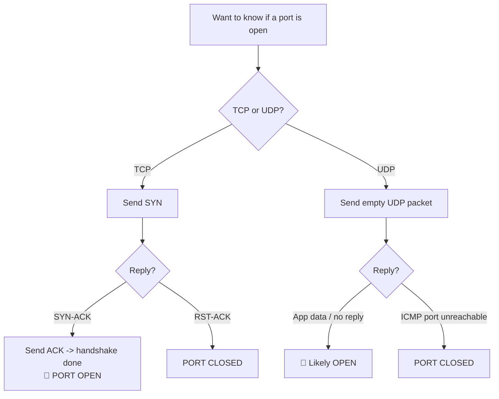

---
tags:
  - phase/enumeration
  - enumeration
  - nmap
---

# TCP/UDP Port Scanning Theory

Port scanning is the process of inspecting TCP or UDP ports on a remote machine with the intention of detecting what services are running on the target and what potential attack vectors may exist.

The simplest TCP port scanning technique, usually called CONNECT scanning, relies on the three-way TCP handshake mechanism. This mechanism is designed so that two hosts attempting to communicate can negotiate the parameters of the network TCP socket connection before transmitting any data.

In basic terms, a host sends a TCP SYN packet to a server on a destination port. If the destination port is open, the server responds with a SYN-ACK packet and the client host sends an ACK packet to complete the handshake. If the handshake completes successfully, the port is considered open.


UDP Scanning

> [!info] Netcat TCP scan flags: `-w` sets the connection timeout (seconds), `-z` enables zero-I/O (scan) mode that sends no data. Open ports report `open` (e.g. `3389 (ms-wbt-server) open`); closed ones show `Connection refused`.

```sh
nc -nvv -w 1 -z 192.168.50.152 3388-3390
```


> [!info] On the wire (Wireshark view): Netcat sends a TCP SYN to each port. The open port (3389) replies with SYN-ACK, confirming it is open, after which Netcat tears down the connection with a FIN-ACK. The closed ports (3388, 3390) reply with RST-ACK, actively rejecting the connection.


> [!info] UDP is stateless (no handshake), so scanning differs from TCP. Add `-u` to netcat for a UDP scan. An open port such as `123 (ntp)` reports `open`.

```sh
nc -nv -u -z -w 1 192.168.50.149 120-123
```


> [!info] On the wire, a UDP scan sends an empty UDP packet to each port. If the port is **open**, the packet reaches the application, whose reply (if any) depends on how it handles empty input — often silence. If the port is **closed**, the target's stack returns an ICMP "port unreachable". This ambiguity (silence could mean open or filtered) is why UDP scanning is slower and less reliable.

## Visual Flow



> [!success] What success looks like
> For TCP, netcat prints `(ms-wbt-server) open` and Wireshark shows the SYN -> SYN-ACK -> ACK exchange. For UDP, an open port like `123 (ntp) open` either replies with app data or stays silent, while a closed UDP port triggers an ICMP "port unreachable".

> [!danger] Common errors
> - UDP results say "open" everywhere → UDP is stateless; "open|filtered" is normal because silence is ambiguous. Confirm with a real service probe.
> - `nc` hangs forever → you forgot `-z` (zero-I/O scan mode) or `-w` (timeout); add both.
> - Everything shows "Connection refused" → the host is reachable but those ports are closed (RST-ACK), which is actually a useful result.
> Full list: [[⚠️ Common Errors & Troubleshooting]]

> [!tip] Beginner note
> The **TCP three-way handshake** is SYN -> SYN-ACK -> ACK: like saying "hi", "hi back", "great, let's talk". If the port is open the server completes it; if closed it slams the door with an RST. **UDP** has no handshake at all — you fire a packet and infer the state from whether you get an ICMP error back, which is why UDP scans are slower and less certain.

---
%% graph-links %%
## Related
- [[Nmap Scripting Engine (NSE)]]
- [[Window Test-NetConnection]]
- [[NMAP]]

> [!info] Navigation
> Section: [[Active Information Gathering/_index|Active Information Gathering]] · Home: [[🏠 Home]]

