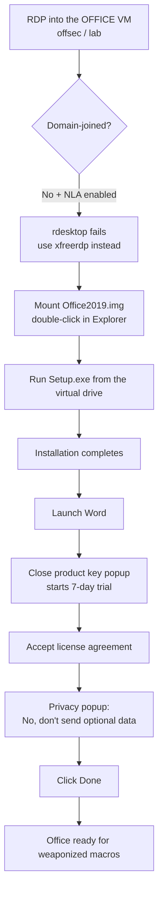

---
tags:
  - client-side-attacks
  - office-macros
  - rdp
  - phase/exploitation
---

# Installing Microsoft Office

> [!tip] Quick Reference
> | Step | Detail |
> |------|--------|
> | Connect | `xfreerdp /v:<OFFICE-IP> /u:offsec /p:lab` — not `rdesktop` (see below) |
> | Fix clipboard/cert/resolution issues | Add `/clipboard`, `/cert:ignore`, `/dynamic-resolution` as needed (see below) |
> | Mount installer | Double-click `C:\tools\Office2019.img` in Explorer |
> | Install | Run `Setup.exe` from the mounted virtual drive |
> | First launch | Close product key popup → 7-day trial → Accept license → decline telemetry → Done |

## Visual Flow



## Why `xfreerdp`, not `rdesktop`

Windows 11 has **Network Level Authentication (NLA)** enabled for RDP by default. Since the target machine isn't domain-joined, `rdesktop` won't connect — it doesn't handle NLA properly against non-domain-joined targets. `xfreerdp` does support this combination, so it's the correct tool here:

```bash
xfreerdp /v:<OFFICE-IP> /u:offsec /p:lab
```

> [!tip] Worth remembering beyond this lab
> This `rdesktop` vs `xfreerdp` distinction comes up constantly whenever you RDP into a standalone (non-domain) Windows box with NLA on — not just for Office installs.

> [!warning] Other common `xfreerdp` failure modes
> - **Certificate warning blocks the connection** — a self-signed RDP cert prompts `The following certificate ... is not trusted`. Answer the prompt, or skip it non-interactively with `/cert:ignore` (older FreeRDP builds) / `/cert-ignore` (newer builds).
> - **Tiny or laggy display** — add `/dynamic-resolution` to resize with the window, or fix a size with `/w:1920 /h:1080`. If the session feels sluggish over a slow VPN link, drop the graphics pipeline down with `/gfx:AVC420` or plain `/bpp:16`.
> - **Can't copy/paste between Kali and the VM** — clipboard sharing isn't on by default; add `/clipboard`. Relevant throughout this whole module, since building macros and library-file XML both mean pasting text into the VM.
> - **Need to move files in/out (e.g. `powercat.ps1`, a built `.docm`)** — mount a local folder with `/drive:share,/path/to/local/folder`; it shows up as a network drive inside the session.
> - **Login accepted but session immediately drops** — usually a `lab`/`offsec` credential typo or an expired lab VM; double check `/u:` and `/p:` against the exact lab guide values before assuming FreeRDP itself is broken.

## Mounting and installing

Double-clicking `Office2019.img` in Explorer mounts it as a **virtual CD/DVD drive**, exposing `Setup.exe` to run the installer directly — no extraction needed.

> [!info] Same trick, opposite intent
> This is the identical `.img`/ISO mounting mechanism discussed as a **MOTW bypass** in [[Preparing the attack]] — completely legitimate here for installing real software, but it's a good reminder that mounting container files is a normal Windows feature both installers *and* malware delivery rely on identically.

## First-launch setup in Word

Four popups to get through on first open:
1. **Product key** — close it via the **X** rather than entering a key; this starts a 7-day trial instead.
2. **License agreement** — click **Accept** (this also shows the trial expiry date, e.g. *"You can use Office until [date]. After that date, most features of Office will be disabled."*).
3. **Privacy ("Getting better together")** — select **No, don't send optional data**, then **Accept**. Worth doing as habit even in an isolated lab — no reason to send telemetry about a machine being used to build attack payloads.
4. Click **Done** to finish.

With that, Office is installed and configured — ready for [[Leveraging Microsoft Word macros]].

> [!success] What a clean install looks like
> Word opens with no further popups, ready to create and save `.docm` documents with macros enabled for testing.

> [!danger] Common pitfalls
> - Trying `rdesktop` against a non-domain-joined Windows 11 target with NLA on — it'll fail; use `xfreerdp`.
> - Entering a product key when none is needed — just close the popup to start the trial.
> - Leaving telemetry enabled out of habit — decline it, especially on an attack-focused build.

> [!tip] Beginner note
> Mounting an `.img`/`.iso` in Windows is just Explorer treating the file as a virtual optical disc — no third-party tool required, double-click is enough.

## Resources
- [xfreerdp man page](https://manpages.debian.org/testing/freerdp2-x11/xfreerdp.1.en.html)

---
%% graph-links %%
## Related
- [[Preparing the attack]]
- [[Leveraging Microsoft Word macros]]
- [[🧰 Command Cheat Sheet]]

> [!info] Navigation
> Section: [[Client-Side Attacks/Exploiting Microsoft Office/_index|Exploiting Microsoft Office]] · Home: [[🏠 Home]]
