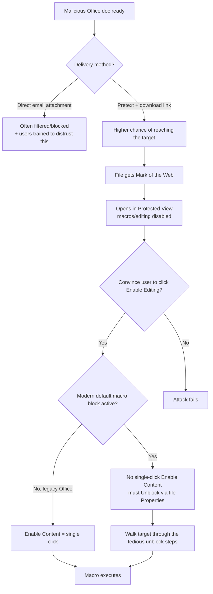

---
tags:
  - client-side-attacks
  - office-macros
  - motw
  - phase/exploitation
---

# Preparing the attack

> [!tip] Quick Reference
> | Obstacle | Attacker response |
> |----------|--------------------|
> | Mail filters strip Office attachments | Deliver via pretext + download link instead of a direct attachment |
> | Mark of the Web → Protected View | Convince the target to click "Enable Editing" (e.g. blur the document content) |
> | Target lacks Protected View support | Use another macro-capable app like Microsoft Publisher (less commonly installed) |
> | Default macro-blocking (Office 2013–2021+) | Walk the target through unblocking via the file's Properties checkbox |

## Visual Flow

## Three things to plan before attacking

### 1. Delivery method

Malicious macro attacks are well-known enough that **mail filters commonly strip Office attachments by default**, and most anti-phishing training specifically warns users about enabling macros in emailed documents. Sending the document as a direct attachment is often a dead end before it even reaches the target. Better: build a pretext and deliver via a **download link** instead — see [[Recognize malicious links]] and [[Understanding the role of inbound email filters]].

### 2. Mark of the Web → Protected View

Any document delivered via email or download gets tagged with the **Mark of the Web**. MOTW-tagged Office documents open in **Protected View** — editing, macros, and embedded objects are all disabled until the user clicks through.

> [!example] Protected View in action
> `PROTECTED VIEW — Be careful — files from the Internet can contain viruses. Unless you need to edit, it's safer to stay in Protected View. [Enable Editing]`

The basic bypass: convince the target to click **Enable Editing** — e.g. by blurring the rest of the document's content and instructing them that clicking the button "unlocks" it.

> [!tip] Sidestep Protected View entirely
> Some macro-capable Office apps — like **Microsoft Publisher** — don't implement Protected View at all. Less commonly installed than Word/Excel, so this only works if recon (like [[Client fingerprinting]] or [[Information gathering]]) confirms it's present.

### 3. Microsoft's default macro-blocking change

Rolled out across Access, Excel, PowerPoint, Visio, and Word (Office 2013 through 2021+), this closes the easy path entirely for internet-delivered files:

> [!example] Before vs. after
> **Before:** a single-click bar — `SECURITY WARNING Macros have been disabled. [Enable Content]`
> **After:** no more one-click option. Instead, a more ominous message with a **Learn More** button explaining the danger — clicking it just leads to a Microsoft support page. The *only* way to run the macro now is to open the file's **Properties**, check **Unblock**, apply, then reopen the document.

That's a meaningfully more tedious ask for the pretext to walk a target through — but not an impossible one.

## The bigger picture

Despite all these mitigations, malicious Office macros remain one of the most common client-side vectors — this is the classic defender/attacker arms race: every new control forces a new bypass, which forces a new control, and so on. As a penetration tester, treat each new defensive mechanism as **a puzzle to route around**, not a dead end.

> [!success] What getting through looks like
> The target clicks Enable Editing *and* completes the Properties → Unblock step — two separate hurdles now, both cleared because the pretext gave them a believable reason to.

> [!danger] Common pitfalls
> - Assuming the old single-click "Enable Content" behavior still applies — depends heavily on Office version/update channel, verify first.
> - Sending the document as a raw attachment and expecting it to reach the inbox unfiltered.
> - Betting on Microsoft Publisher being installed without confirming it via recon first.

> [!tip] Beginner note
> Two separate obstacles stack on modern Office: **Protected View** (needs "Enable Editing") and **default macro blocking** (needs the file's Properties → Unblock checkbox). Both need to be cleared, not just one.

## Lab question reasoning

> [!info] Answered from general technical knowledge, not a specific lab file — verify against your own VM if you want full confidence.

**Q1: "MOTW is not added to files on FAT32-formatted devices" — True or False?**
**True.** MOTW is implemented as an NTFS **Alternate Data Stream** (a hidden `Zone.Identifier` stream attached to the file). FAT32 doesn't support Alternate Data Streams at all — the underlying mechanism literally doesn't exist on that filesystem. This is exactly why attackers sometimes stage payloads on FAT32-formatted USB drives or volumes: MOTW can't be applied there in the first place.

**Q2: "Users will still be able to execute macros with a single click after the change" — True or False?**
**False.** Per the material itself: the `Enable Content` single-click bar is replaced with a message pointing to `Learn More`, and running the macro now requires the separate Properties → Unblock step before reopening. More steps, not fewer.

**Q3: "Can 7zip/ISO/IMG containers avoid a MOTW flag on the files inside?"**
**Yes — true, and it's a well-documented real-world technique.** MOTW is applied to the *downloaded container* itself, but historically doesn't propagate to files extracted or mounted from inside it. This became a very popular bypass specifically **because** of Microsoft's default macro-blocking change — malware families like Emotet, IcedID, and Qakbot pivoted heavily to ISO/IMG/7z/RAR delivery around 2022 for exactly this reason. It's a direct real-world example of the arms-race dynamic described above.

## Resources
- [Microsoft Learn — Macros from the internet blocked by default](https://learn.microsoft.com/en-us/deployoffice/security/internet-macros-blocked)

---
%% graph-links %%
## Related
- [[Installing Microsoft Office]]
- [[Leveraging Microsoft Word macros]]
- [[Identifying risks of malicious Office macros]]
- [[Recognize malicious links]]

> [!info] Navigation
> Section: [[Client-Side Attacks/Exploiting Microsoft Office/_index|Exploiting Microsoft Office]] · Home: [[🏠 Home]]
