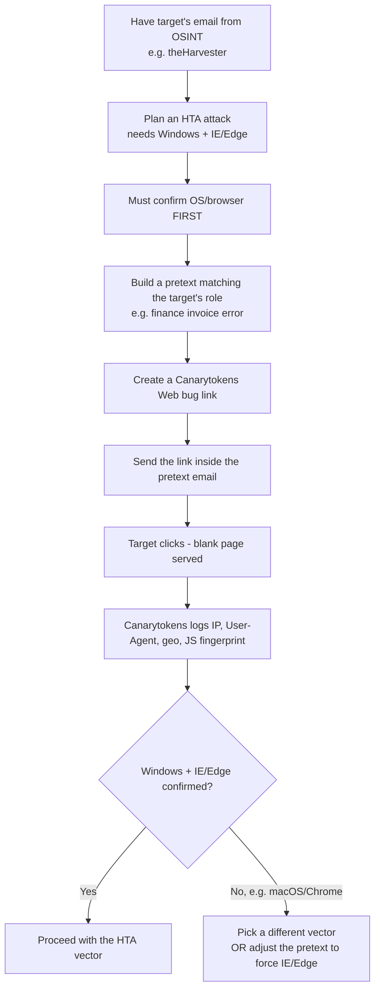

---
tags:
  - client-side-attacks
  - osint
  - fingerprinting
  - canarytokens
  - pretexting
  - phase/recon
---

# Client fingerprinting

> [!tip] Quick Reference
> | Goal | How |
> |------|-----|
> | Confirm target OS/browser before committing a vector | Canarytokens **Web bug / URL** token |
> | Track when a Word/Excel/PDF file is opened | Canarytokens **Microsoft Word / Excel / Acrobat Reader PDF** token |
> | Track when an EXE/DLL executes | Canarytokens **Custom EXE/binary** token |
> | Alternative IP logger | [Grabify](https://grabify.link/) |
> | Alternative JS fingerprint library | [fingerprint.js](https://github.com/fingerprintjs/fingerprintjs) |

## Visual Flow

## Why fingerprint before attacking

Say OSINT already turned up a promising target's email (e.g. via theHarvester). One popular vector is an **HTA (HTML Application)** attached to an email — it executes code in the context of Internet Explorer (and to some extent Edge), a technique widely used by real threat actors and ransomware groups. But that vector is **useless if the target isn't running Windows with IE/Edge available** — so confirming that has to happen *before* committing to it.

**Client/device fingerprinting** solves this: get OS and browser info from a target sitting on a non-routable internal network, without ever having direct access to their machine.

## Setting the pretext first

You can't just ask a stranger to click an arbitrary link — the ask needs context. Build the pretext around the **target's job role**. Example: target works in finance → *"we received an invoice with a financial error, here's a link to a screenshot with the error highlighted."* The link is actually the tracking token — the target always just sees a blank page. This is a direct application of everything in [[Enhancing phishing through social engineering]] and [[Creating a Zoom credential phishing pretext]], now aimed at recon instead of credential theft.

## Creating the Canarytoken

[Canarytokens](https://canarytokens.com) is a free service — fundamentally a **defensive deception tool** (it alerts *defenders* when an attacker touches something), repurposed here offensively for target recon. Its trigger catalog is broad: web bug, DNS, credit card, QR code, MySQL dump, AWS keys, fake app, Log4Shell, Azure login cert, Office documents, custom EXE/binary, Windows folder browsing, even cloned-website detection.

For fingerprinting, pick **Web bug / URL token**, supply a notification method (email address or webhook), and generate the link.

> [!info] Dual behavior depending on how the URL is requested
> If the URL is requested **as an image** (e.g. ``), a custom image is served. If it's **surfed directly in a browser**, a blank page is served along with fingerprinting JavaScript. Same token, two different delivery styles depending on how you embed it.

On the token's **Manage** page, a **Browser scanner** toggle controls whether JavaScript fingerprinting actually runs when the token is browsed — worth enabling deliberately for this use case, since it's what makes the result *more* reliable than the User-Agent header alone (see below).

## Reading the results

The **History** page starts empty. Once the target clicks the link (inside the pretext), an entry appears with a timestamp, source IP, channel, and a map pin of the approximate location. Opening the entry reveals:

- **User-Agent string** — lets you *infer* OS and browser (e.g. `Macintosh; Intel Mac OS X 10_15_7 ... Chrome/133.0.0.0`). Useful, but the User-Agent can be modified/spoofed — don't treat it as ground truth on its own.
- **JavaScript fingerprint data** — separate from the User-Agent, generated by the token's embedded fingerprinting JS (the Browser scanner toggle). This is **more precise and reliable** than parsing the User-Agent string alone.
- **Geo info** — coordinates, organization, city, country, region, hostname, ASN. Worth a second look: an organization like *"AS14618 Amazon.com, Inc."* instead of a normal residential/corporate ISP can mean the click came from cloud infrastructure — a VPN, a sandboxed security scanner, or an analyst pre-detonating the link rather than the actual human target.
- Everything is downloadable as CSV or JSON for later reference.

> [!success] What a clean result looks like
> A single click from a plausible residential/corporate IP, with a User-Agent and JS fingerprint that agree with each other — giving high confidence in the target's real OS and browser before committing a payload.

## When the fingerprint doesn't match the plan

In this walkthrough, the goal was confirming Windows + IE/Edge for an HTA — but the fingerprint showed **Chrome on macOS** instead. Two ways to respond:
1. **Pivot the vector** to match what was actually found (e.g. a macOS-appropriate technique).
2. **Adjust the pretext** to *force* the needed environment — e.g. *"this screenshot is only viewable in Internet Explorer or Edge."* Recon doesn't just inform vector choice; sometimes the pretext itself can manufacture the conditions the vector needs.

## Other useful token types

Beyond Web bug, Canarytokens can embed a tracker in a **Word/Excel/PDF document** (alerts when that specific file is opened — confirms the target actually has that application, not just guesses at it) or a **custom EXE/binary** (alerts on execution). The JS/CSS cloned-website tokens are actually the tool's *defensive* use case — they alert **you** if someone clones **your** site — worth knowing the distinction so you don't misapply them offensively.

> [!danger] Common pitfalls
> - Trusting the User-Agent string alone — it's easily spoofed; corroborate with the JS fingerprint.
> - Committing to a payload (like an HTA) before confirming OS/browser — wastes the one shot a pretext usually gets.
> - Ignoring the ASN/organization field — a cloud-hosting org instead of a normal ISP can mean the "click" wasn't the real target at all.
> - Assuming ad blockers or privacy extensions don't affect results — many block known tracking domains and fingerprinting scripts outright, which can produce a false "no click" even when the target did open the link. (Worth testing directly — try the link yourself with an ad blocker on vs. off and compare what actually gets logged.)

> [!tip] Beginner note
> A **web bug** (aka tracking pixel) is just a tiny, often invisible resource that logs a request when loaded — the same underlying idea behind email open-tracking and ad analytics, just aimed at recon here.

## Resources
- [Canarytokens](https://canarytokens.com)
- [Grabify](https://grabify.link/)
- [fingerprint.js (GitHub)](https://github.com/fingerprintjs/fingerprintjs)

---
%% graph-links %%
## Related
- [[Information gathering]]
- [[Enhancing phishing through social engineering]]
- [[Creating a Zoom credential phishing pretext]]
- [[Leveraging Microsoft Word macros]]

> [!info] Navigation
> Section: [[Client-Side Attacks/Target reconnaissance/_index|Target reconnaissance]] · Home: [[🏠 Home]]
