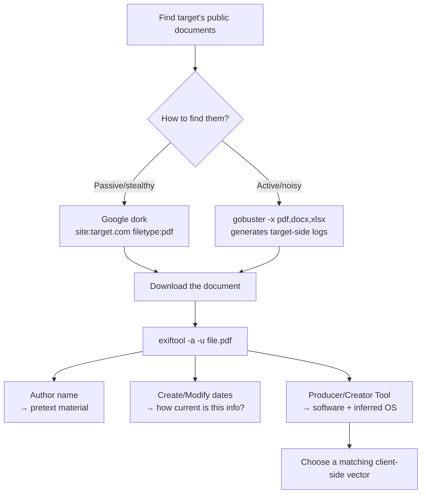

---
tags:
  - client-side-attacks
  - osint
  - metadata
  - exiftool
  - phase/recon
---

# Information gathering

> [!tip] Quick Reference
> | Goal | Command |
> |------|---------|
> | Find PDFs on target site (passive, stealthy) | `site:target.com filetype:pdf` (Google dork) |
> | Find files by extension (active, noisy) | `gobuster dir -u http://target -w list.txt -x pdf,docx,xlsx` |
> | Extract all metadata, incl. duplicate/unknown tags | `exiftool -a -u file.pdf` |

## Visual Flow



## Hands-off enumeration via document metadata

The goal: figure out what software (and OS) a target organization actually runs **without ever touching their infrastructure**. Since a Google dork only queries Google's already-crawled cache, nothing shows up in the target's own web server or security logs — no monitoring alert, no forensic trace.

The technique: inspect the **metadata** of publicly available documents tied to the organization (PDFs, Office files, etc.). Metadata can reveal the author, creation/modification dates, and — critically — the exact application (and often OS) used to create the file. Organizations *can* sanitize this before publishing, but frequently don't.

> [!warning] Don't over-trust a single document
> Metadata from an **old** document may be stale — software changes over time. Different **branches or departments** may also run different software entirely. Treat one document as a data point, not the whole picture; pull several if you can.

> [!tip] Pulling several documents at once
> Point `exiftool` at a whole directory instead of one file at a time: `exiftool -a -u -r ./downloads/` (recursive) scans every file, and `exiftool -csv -a -u ./downloads/*.pdf > metadata.csv` dumps it all to one CSV for a quick eyeball across many Author/Producer/date fields side by side.

> [!tip] `exiftool` missing
> Not installed by default on every Kali image — `sudo apt install libimage-exiftool-perl` if `exiftool: command not found`.

## Finding documents to inspect

- **Passive (preferred):** reuse [[Google Hacking]] dorks — `site:example.com filetype:pdf`, optionally narrowed with branch/location keywords.
- **Active (noisier):** [[Directory Brute Force with Gobuster|gobuster]] with `-x` to search for specific extensions on the target's site. This **does** touch their infrastructure and generates log entries — a real tradeoff against the stealth of dorking.
- Manually browsing the site can also surface documents worth checking.

## Worked example — Mountain Vegetables

> [!example] Finding a hidden download
> The target site (a single-page app under construction) doesn't obviously link anything — but scrolling and hovering over buttons reveals a **CURRENT** brochure download (and an **OLD** one alongside it), each opening a PDF directly in the browser.

Pull the metadata:
```bash
cd Downloads
exiftool -a -u brochure.pdf
```

Key fields from the output:
```
Author        : Stanley Yelnats
Producer      : Microsoft® PowerPoint® for Microsoft 365
Creator Tool  : Microsoft® PowerPoint® for Microsoft 365
Create Date   : 2022:04:27 07:34:01+02:00
Modify Date   : 2022:04:27 07:34:01+02:00
```

- **Create/Modify dates** — recent dates mean higher confidence this reflects the org's *current* software, not something outdated.
- **Author** — a real internal employee name. Dropping that name naturally into a phishing email or a phone pretext builds instant, low-effort trust (see [[Enhancing phishing through social engineering]] and [[Creating a Zoom credential phishing pretext]]) — especially effective if that person keeps a low public profile.
- **Producer / Creator Tool** — "PowerPoint for Microsoft 365" confirms the target uses **Microsoft Office**. No mention of "macOS" or "for Mac" anywhere in the tags makes **Windows** the most probable OS.

That combination — Office confirmed, Windows probable — is exactly what unlocks the rest of this module: malicious Office macros ([[Leveraging Microsoft Word macros]]) or Windows-specific vectors like [[Obtaining code execution via Windows library files]].

> [!success] What a good result looks like
> A recent document with an intact author name and a Producer/Creator Tool field that pins down both the application *and*, by omission of Mac-specific strings, a probable OS — enough to both pick a vector and season a pretext with real insider detail.

> [!danger] Common pitfalls
> - Treating a gobuster extension sweep as equivalent-risk to a Google dork — it isn't; one touches the target, one doesn't.
> - Trusting metadata from an old document as current without cross-checking against something more recent.
> - Assuming one document represents the whole organization's software stack.
> - Absence of metadata isn't proof of anything — some orgs sanitize it; just try another document.

> [!tip] Beginner note
> **"Hands-off"** here specifically means *no traffic reaches the target's own systems* — Google already did the crawling. That's what keeps this technique invisible to the target's monitoring, unlike gobuster which shows up in their access logs the moment you run it.

## Resources
- [ExifTool tag names reference](https://exiftool.org/TagNames/)
- [ExifTool supported file types](https://exiftool.org/#supported)

---
%% graph-links %%
## Related
- [[Client fingerprinting]]
- [[Google Hacking]]
- [[Directory Brute Force with Gobuster]]
- [[Enhancing phishing through social engineering]]
- [[Leveraging Microsoft Word macros]]

> [!info] Navigation
> Section: [[Client-Side Attacks/Target reconnaissance/_index|Target reconnaissance]] · Home: [[🏠 Home]]
