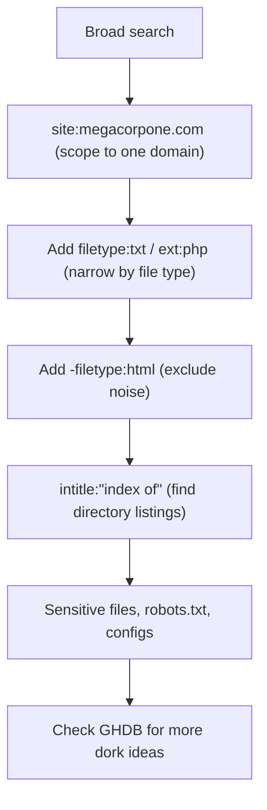

---
tags:
  - google-dork
  - osint
  - passive-recon
  - phase/recon
---

# Google Hacking

At the heart of this technique is using clever search strings and operators for the creative refinement of search queries, most of which work with a variety of search engines. The process is iterative, beginning with a broad search, which is narrowed using operators to sift out irrelevant or uninteresting results.


The output refers to directory listing pages that list the file contents of the directories without index pages. Misconfigurations like this can reveal interesting files and sensitive information.

These basic examples only scratch the surface of what we can do with search operators. The Google Hacking Database (GHDB) contains multitudes of creative searches that demonstrate the power of leveraging combined operators.
[https://www.exploit-db.com/google-hacking-database](https://www.exploit-db.com/google-hacking-database)

> [!example] The `site:` operator
> Limit results to a single domain to map an organization's web presence:
> ```
> site:megacorpone.com
> ```
> This surfaces every indexed page under the domain, including subdomains like www2.megacorpone.com and stray files (e.g. `latest.zip`).


> [!example] The `filetype:` / `ext:` operator
> Combine operators to restrict results to a file type. Find TXT files on the domain:
> ```
> site:megacorpone.com filetype:txt
> ```


> [!example] Result: robots.txt exposes a hidden page
> The query returned `robots.txt`:
> ```
> User-agent: *
> Allow: /
> Allow: /nanites.php
> ```
> `robots.txt` tells crawlers what to index. Here it revealed `/nanites.php`, a page not otherwise linked from the site — a useful lead.


> [!example] The exclude (`-`) operator
> Prefix an operator with `-` to remove noise. Find non-HTML pages by excluding HTML:
> ```
> site:megacorpone.com -filetype:html
> ```


> [!example] Finding directory listings
> Combine `intitle:` with a phrase to locate open directory listings:
> ```
> intitle:"index of" "parent directory"
> ```
> This matches pages with "index of" in the title and "parent directory" in the body — classic exposed directory listings.

## Visual Flow



> [!success] What success looks like
> A refined query surfaces something the normal site does not link to: a `robots.txt` revealing a hidden page (`/nanites.php`), an open directory listing (`index of`), or a downloadable config/backup file (`latest.zip`). Each hit is a lead for the active phase.

> [!danger] Common errors
> - Putting a space after the colon → `site: megacorpone.com` fails; it must be `site:megacorpone.com` with no space.
> - Quoting the whole query instead of just the phrase → use quotes only around exact phrases: `intitle:"index of"`, not `"site:megacorpone.com filetype:txt"`.
> - Getting rate-limited / CAPTCHA after many dorks → slow down, vary queries, or use the GHDB (exploit-db.com/google-hacking-database) for proven examples.
> Full list: [[⚠️ Common Errors & Troubleshooting]]

> [!tip] Beginner note
> Google Hacking ("dorking") is **passive** — you are searching Google's index, not touching the target's server. Operators like `site:`, `filetype:`, `intitle:` and the minus sign (`-`) for exclusion are just filters that narrow a broad search down to interesting files.

---
%% graph-links %%
## Related
- [[Open-Source Code]]
- [[Shodan]]
- [[WHOIS Enumeration]]
- [[LLM-Powered Passive Information Gathering]]

> [!info] Navigation
> Section: [[Passive Information Gathering/_index|Passive Information Gathering]] · Home: [[🏠 Home]]

