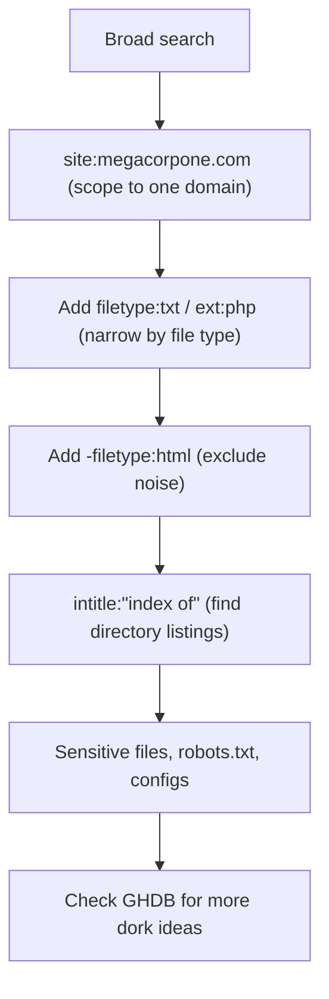

---
tags:
  - google-dork
  - osint
  - passive-recon
  - phase/recon
---

# Google Hacking

At the heart of this technique is using clever search strings and operators for the creative refinement of search queries, most of which work with a variety of search engines. The process is iterative, beginning with a broad search, which is narrowed using operators to sift out irrelevant or uninteresting results.


The output refers to directory listing pages that list the file contents of the directories without index pages. Misconfigurations like this can reveal interesting files and sensitive information.

These basic examples only scratch the surface of what we can do with search operators. The Google Hacking Database (GHDB) contains multitudes of creative searches that demonstrate the power of leveraging combined operators.
[https://www.exploit-db.com/google-hacking-database](https://www.exploit-db.com/google-hacking-database)

> [!note]- Screenshot
> ```
> The site operator limits searches to a single domain. We can use this operator to gather
> a rough idea of an organization's web presence.
> sitezmegacorpone.com - Google Search Maaila Firefox eo0
> & sitermegacorpone.com- x | +
> eo Da googte.com " =e WO =
> #2 Most Visited @ Getting Started “Kali Linux “Kali Training Kal Tools Kali Docs “Kall Forums »
> Ogle —_sitemegacorpone.com
> Do yo osm megacorpane.com? Get indexing and ankng data om Coole
> Iitpsvww megacorpone.com +
> fe Create, Through years of experience, we have some ofthe most bleding-edge
> echnologies avaiable o create opportunites that never seemed feasible
> vnww2.megacorpone.com *
> Name - Last modiied - Size . Descipion.] latestzip, 12-Apr-2013 08:40, 52M. [DR]
> sdpress, 08-Jan-2012 12°01, (Ubant) Server
> Figure !: Searching witha Sita Operator
> ```


> [!note]- Screenshot
> ```
> We can then use further operators to narrow these results. For example, the filetype (or
> ext) operator limits search results to the specified file type.
> In the example below, we combine operators to locate TXT files (filetype:txt) on
> www.megacorpone.com (site:megacorpone.com):
> < >a@ O08 google.com , % oO @=
> BWKali Linux HEKali Toots HX Kali Forums  KaliDocs @ENetHunter M Offensive Security Mk MSFU »
> oogle sile:megacorpone.com fetype:tt xm
> Q Ale Biker Nyheter O Shopring Mee ek
> bpsvmauegacorpone.com 0. +
> ‘Figure 2: Searching with a Fletype Operator
> ```


> [!note]- Screenshot
> ```
> We receive an interesting result. Our query found the robots.txt file, containing
> following content:
> 
> User-agent: *
> 
> Allow: /
> 
> Allow: /nanites.php
> 
> Listing 4~ robots.txt fle
> 
> The robots.txt file instructs web crawlers, such as Google's search engine crawler, to
> allow or disallow specific resources. In this case, it revealed a specific PHP page
> (/nanities.php) that was otherwise hidden from the regular search, despite being listed
> allowed by the policy.
> ```


> [!note]- Screenshot
> ```
> For example, to find interesting non-HTML pages, we can use site:megacorpone.com
> to limit the search to megacorpone.com and subdomains, followed by -filetype:html to
> exclude HTML pages from the results.
> «>2¢0 a google.com
> REKallLiu ERKaV Toots HYKalForums (BKatDocs GENetHunter Offense Securty ALMSFU #Explat-DB 4 GHDR
> Cogle —_stemegacerpone com ltypeml x =
> pst megserpone com as. +
> . fi e39, 20160021 112, [DF
> ane Last mde Se -Descipion [PARENTOIR, Parent tea, IMGI epee
> re ash mode Sie esto [PARENTOIR, Paver econ on
> 900-21 11:21, zk [casos 201
> Figure 3 Searching withthe Exclude Operator
> ```


> [!note]- Screenshot
> ```
> In another example, we can use a search for intitle:"index of" “parent directory" to
> find pages that contain "index of" in the title and the words "parent directory" on the
> page.
> ae is Wiafne Bs Rhett AOtemeScaty AMSAU Ape Oe cK
> joogle sate nas pam entry -
> 
> —
> 
> —
> 
> —
> 
> ‘Fgure 4: Using Google to Find Directory Listings
> ```

## Visual Flow



> [!success] What success looks like
> A refined query surfaces something the normal site does not link to: a `robots.txt` revealing a hidden page (`/nanites.php`), an open directory listing (`index of`), or a downloadable config/backup file (`latest.zip`). Each hit is a lead for the active phase.

> [!danger] Common errors
> - Putting a space after the colon → `site: megacorpone.com` fails; it must be `site:megacorpone.com` with no space.
> - Quoting the whole query instead of just the phrase → use quotes only around exact phrases: `intitle:"index of"`, not `"site:megacorpone.com filetype:txt"`.
> - Getting rate-limited / CAPTCHA after many dorks → slow down, vary queries, or use the GHDB (exploit-db.com/google-hacking-database) for proven examples.
> Full list: [[⚠️ Common Errors & Troubleshooting]]

> [!tip] Beginner note
> Google Hacking ("dorking") is **passive** — you are searching Google's index, not touching the target's server. Operators like `site:`, `filetype:`, `intitle:` and the minus sign (`-`) for exclusion are just filters that narrow a broad search down to interesting files.

---
%% graph-links %%
## Related
- [[Open-Source Code]]
- [[Shodan]]
- [[WHOIS Enumeration]]
- [[LLM-Powered Passive Information Gathering]]

> [!info] Navigation
> Section: [[Passive Information Gathering/_index|Passive Information Gathering]] · Home: [[🏠 Home]]

