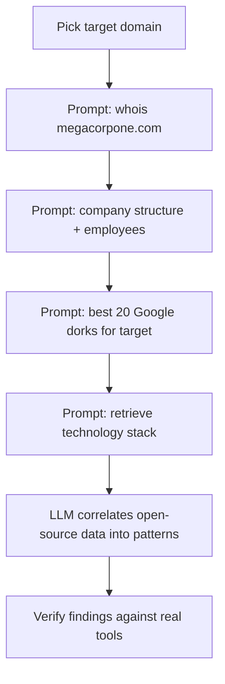

---
tags:
  - ai-assisted
  - passive-recon
  - phase/recon
---

# LLM-Powered Passive Information Gathering

> [!tip] Quick Reference — Prompts
> | Goal | Prompt |
> |------|--------|
> | WHOIS summary | `whois megacorpone.com` |
> | Org/people OSINT | `Can you print out all the public information about company structure and employees of megacorpone?` |
> | Tailored dorks | `Can you provide the best 20 Google dorks for megacorpone.com tailored for a penetration test?` |
> | Tech stack guess | `Retrieve the technology stack of the megacorpone.com website` |
> | Force a live lookup | Use a model/tool with browsing enabled (e.g. web-search-enabled Claude/ChatGPT, Perplexity) and ask it to cite sources |
> | Verify a claim | `What is your source for that, and how current is it?` |

As we know, passive information gathering involves exploring open-source data for insights into a target's infrastructure, personnel, policies, and technology stack - all without direct contact with the target's systems. LLMs can bring significant advantages to this stage. By using natural language processing to analyze vast amounts of unstructured data from various sources, these tools help us uncover patterns and connections that might otherwise go unnoticed.

> [!example] WHOIS prompt
> Ask the LLM for registration data in plain language:
> ```
> whois megacorpone.com
> ```


> [!info] LLM WHOIS response (summary)
> The LLM returns the WHOIS data in prose: domain registered 2013-01-22 (expires 2025-01-22), registrar Gandi SAS, registrant Alan Grofield / MegaCorpOne at 2 Old Mill St, Rachel, Nevada, phone +1.9038836342. Name servers ns1–ns3.megacorpone.com; status `clientTransferProhibited` (locked against transfer). It notes the data may be stale or privacy-protected.


> [!example] Company structure / employee prompt
> ```
> Can you print out all the public information about company structure
> and employees of megacorpone?
> ```
> The LLM returns an organized roster: MegaCorp One (nanotechnology, HQ in Rachel, Nevada), leadership and staff with roles, emails, and Twitter handles where public — e.g. CEO Joe Sheer (joe@megacorpone.com), Marketing Director Matt Smith (msmith@megacorpone.com), Senior Developer Tanya Rivera (trivera@megacorpone.com) — plus an approximate headcount (~237). This is a ready-made target list for people OSINT.


> [!example] Tailored Google dorks prompt
> ```
> Can you provide the best 20 Google dorks for megacorpone.com
> tailored for a penetration test?
> ```
> The LLM returns a themed set of ~20 dorks. Representative examples:
> ```
> site:megacorpone.com intitle:"index of"
> site:megacorpone.com ext:php | ext:html | ext:asp | ext:jsp
> site:megacorpone.com inurl:admin | inurl:login | inurl:upload
> site:megacorpone.com ext:env | ext:conf | ext:log | ext:json
> site:megacorpone.com "password" filetype:txt | filetype:csv
> site:megacorpone.com "github" | "gitlab" | "bitbucket"
> ```
> Bonus tips it suggests: use `cache:` for cached pages and `related:megacorpone.com` to find similar/vendor sites.


> [!example] Technology stack prompt
> ```
> Retrieve the technology stack of the megacorpone.com website
> ```
> ChatGPT does not do live lookups by default — it may simulate results (à la Netcraft, Datanyze, 6sense) from training data. For megacorpone.com it reports:
> - **Languages/frameworks:** JavaScript, jQuery, Bootstrap, Font Awesome, HTML, ECMAScript
> - **CDN:** Google Hosted Libraries
> - **Web/app server:** Apache HTTP Server
> - **Hosting:** GitHub Pages
>
> Treat this as a lead and confirm with a live tool like Wappalyzer.

## Visual Flow



> [!success] What success looks like
> The LLM returns organized OSINT it would otherwise take many manual queries to gather: WHOIS details (registrar, dates, name servers), a roster of employees with emails/handles, a themed set of 20 tailored Google dorks, and a categorized technology stack — all from natural-language prompts.

> [!danger] Common errors
> - Assuming the LLM did a live lookup → tools like ChatGPT often do NOT query the internet by default; they may simulate results from training data, which can be outdated or wrong.
> - Acting on hallucinated data → always confirm names, emails, and tech with real tools (whois, Netcraft/Wappalyzer, actual Google dorks) before using them.
> - Stale dates/contacts → WHOIS and personnel info change; treat LLM output as leads, not facts.
> - Prompt refused or answered vaguely → phrasing a request with words like "attack", "hack", or "exploit" can trigger safety filters on some hosted chat tools; rephrase around the *public information* angle (e.g. "summarize public OSINT about X") to get a useful answer.
> - Hitting a usage cap mid-session → free tiers of hosted LLMs rate-limit messages per hour; space out prompts or switch to an API key with its own quota.
> Full list: [[⚠️ Common Errors & Troubleshooting]]

> [!tip] Beginner note
> The LLM is just an **accelerator** for passive recon — it summarizes open-source data and suggests queries without you contacting the target. It is not a source of truth: use it to draft dorks and connect dots, then verify everything with the real tools.

## Resources
- [Google Hacking Database (GHDB)](https://www.exploit-db.com/google-hacking-database) — verify LLM-suggested dorks here
- [[Google Hacking]] — run the dorks the LLM suggests for real

---
%% graph-links %%
## Related
- [[Active LLM-Aided Enumeration]]
- [[Google Hacking]]
- [[Open-Source Code]]

> [!info] Navigation
> Section: [[Passive Information Gathering/_index|Passive Information Gathering]] · Home: [[🏠 Home]]

