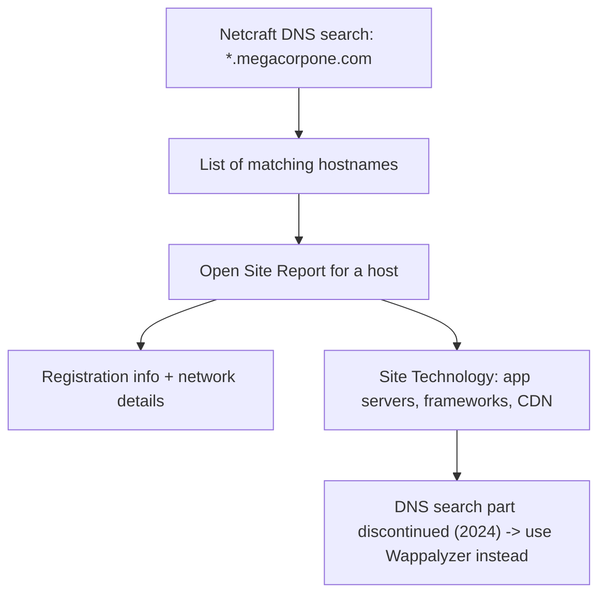

---
tags:
  - osint
  - passive-recon
  - phase/recon
---

# Netcraft

> [!tip] Quick Reference
> | Goal | Query / URL |
> |------|-------------|
> | List known hostnames for a domain | `*.megacorpone.com` at [DNS Search](https://searchdns.netcraft.com/) |
> | Jump straight to a Site Report | `https://sitereport.netcraft.com/?url=megacorpone.com` |
> | Live tech stack (post-2024) | [wappalyzer.com/lookup/megacorpone.com](https://www.wappalyzer.com/lookup/megacorpone.com/) |
> | Certificate-based subdomain enum | `crt.sh/?q=%.megacorpone.com` |
> | Alternative tech profiler | [builtwith.com](https://builtwith.com/) |

Netcraft is an internet service company based in England offering a free web portal that performs various information gathering functions, such as discovering which technologies are running on a given website and finding which other hosts share the same IP netblock.

> [!example] Netcraft DNS search
> Use Netcraft's DNS search page with a wildcard pattern to list a domain's hostnames:
> ```
> *.megacorpone.com
> ```
> The results are the hostnames Netcraft knows for that domain and its subdomains.


> [!info] Site reports
> Click the file icon next to any site URL to open its **Site Report**, which shows additional detail and history for that server — including Background and Network sections (e.g. for http://www.megacorpone.com).


> [!info] Site Technology section
> The report opens with registration info; scroll down to the **Site Technology** section, which lists the server's technology stack — application servers, server-side scripting frameworks, and any content delivery network in use.

*** During 2024, Netcraft has decided to discontinue this part of their service. The info to answer the following questions are in the images, or we can visit
[https://www.wappalyzer.com/lookup/megacorpone.com/](https://www.wappalyzer.com/lookup/megacorpone.com/)
to find the answers on a live site.

## Visual Flow



> [!success] What success looks like
> Netcraft returns a list of hostnames matching `*.megacorpone.com`, and each Site Report shows registration info plus the server's technology stack (application servers, scripting frameworks, CDN). On the live Wappalyzer lookup you get the same kind of tech-stack breakdown.

> [!danger] Common errors
> - Expecting the old DNS search to work → Netcraft discontinued that part of the service in 2024; use the screenshots here or pivot to Wappalyzer for live results.
> - Searching the bare domain only → use the wildcard form `*.megacorpone.com` to catch subdomains, not just the apex.
> - Treating the tech stack as confirmed → it is third-party reported and may be stale; verify during the active phase.
> - Netcraft can't reach lab/internal targets → like other third-party scanners, Netcraft only sees internet-facing hosts; it is useless against isolated OSCP lab IPs (e.g. `192.168.x.x`) — use active tools (Wappalyzer browser extension, `whatweb`, `curl -I`) against those instead.
> Full list: [[⚠️ Common Errors & Troubleshooting]]

> [!tip] Beginner note
> Netcraft is **passive**: a third-party site (Netcraft) does the looking, so you never connect to the target yourself. It is a quick way to learn what technologies a site runs and which hosts share its netblock before any active scanning.

> [!tip] Alternatives for subdomain/tech enumeration
> Since Netcraft's DNS search was discontinued, reach for [crt.sh](https://crt.sh/) (certificate-transparency logs — search `%.megacorpone.com`) or [SecurityTrails](https://securitytrails.com/) to rebuild the hostname list that Netcraft used to provide.

## Resources
- [Netcraft Site Report](https://sitereport.netcraft.com/)
- [crt.sh — certificate transparency search](https://crt.sh/)
- [Wappalyzer](https://www.wappalyzer.com/)

---
%% graph-links %%
## Related
- [[WHOIS Enumeration]]
- [[Security Headers and SSLTLS]]
- [[Shodan]]

> [!info] Navigation
> Section: [[Passive Information Gathering/_index|Passive Information Gathering]] · Home: [[🏠 Home]]

