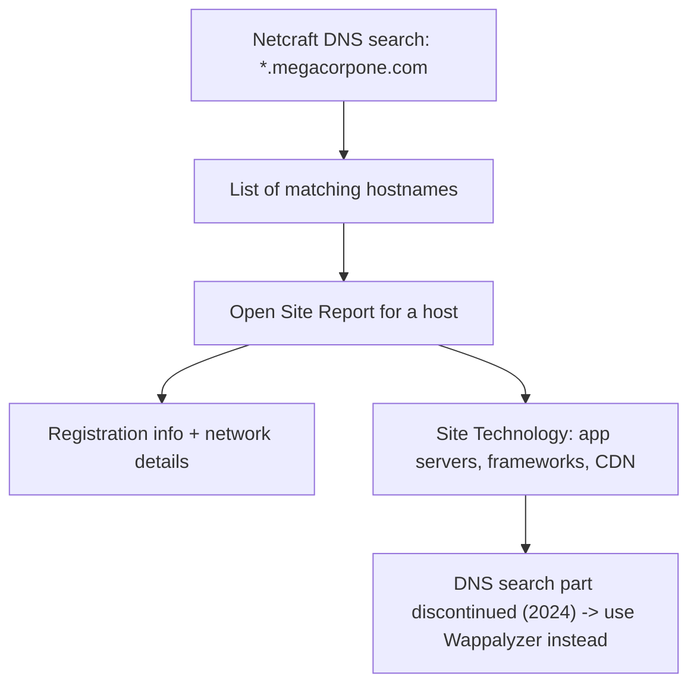

---
tags:
  - osint
  - passive-recon
  - phase/recon
---

# Netcraft

Netcraft is an internet service company based in England offering a free web portal that performs various information gathering functions, such as discovering which technologies are running on a given website and finding which other hosts share the same IP netblock.

> [!note]- Screenshot
> ```
> Let's review some of Netcraft's capabilities. For example, we can use Netcraft's DNS
> search page to gather information about the megacorpone.com domain:
> « neteraft [caw wore
> Hostnames matching
> *,megacorpone.com
> + Q search with another pattern?
> 4results
> 5
> 7 von B
> - Figure 6: Netcraft Results for *megacorpone.com Seerch 7
> ```


> [!note]- Screenshot
> ```
> For each server found, we can view a "site report" that provides additional information
> and history about the server by clicking on the file icon next to each site URL.
> «¥ netcraft LEARN WORE
> Site report for
> http://www.megacorpone.com
> + intig meer
> <6 xX fing
> 1 Background
> B Network
> — Figure 7: Netcraft Site Report for www.megacorpone.com
> ```


> [!note]- Screenshot
> ```
> The start of the report covers registration information. However, if we scroll down, we
> discover various "site technology" entries.
> 
> G Site Technology wu2et2anuot
> 
> Application Servers
> 
> Chaneside
> 
> ion side seripting Frameworks
> 
> Content Datvery Network
> 
> Figure 8: Site Technology for www.megacorpone.com
> ```

*** During 2024, Netcraft has decided to discontinue this part of their service. The info to answer the following questions are in the images, or we can visit
[https://www.wappalyzer.com/lookup/megacorpone.com/](https://www.wappalyzer.com/lookup/megacorpone.com/)
to find the answers on a live site.

## Visual Flow



> [!success] What success looks like
> Netcraft returns a list of hostnames matching `*.megacorpone.com`, and each Site Report shows registration info plus the server's technology stack (application servers, scripting frameworks, CDN). On the live Wappalyzer lookup you get the same kind of tech-stack breakdown.

> [!danger] Common errors
> - Expecting the old DNS search to work → Netcraft discontinued that part of the service in 2024; use the screenshots here or pivot to Wappalyzer for live results.
> - Searching the bare domain only → use the wildcard form `*.megacorpone.com` to catch subdomains, not just the apex.
> - Treating the tech stack as confirmed → it is third-party reported and may be stale; verify during the active phase.
> Full list: [[⚠️ Common Errors & Troubleshooting]]

> [!tip] Beginner note
> Netcraft is **passive**: a third-party site (Netcraft) does the looking, so you never connect to the target yourself. It is a quick way to learn what technologies a site runs and which hosts share its netblock before any active scanning.

---
%% graph-links %%
## Related
- [[WHOIS Enumeration]]
- [[Security Headers and SSLTLS]]
- [[Shodan]]

> [!info] Navigation
> Section: [[Passive Information Gathering/_index|Passive Information Gathering]] · Home: [[🏠 Home]]

