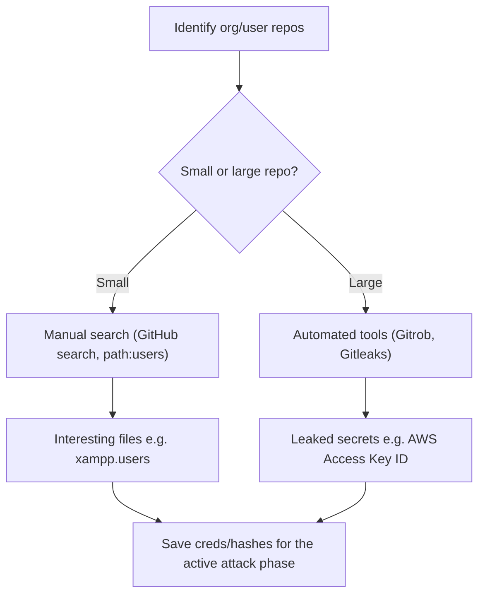

---
tags:
  - phase/recon
---

# Open-Source Code

> [!tip] Quick Reference
> | Goal | Query / Command |
> |------|-----------------|
> | Search a filename | `path:users` (GitHub search) |
> | Search a specific filename exactly | `filename:xampp.users` |
> | Scope to an org/user | `org:megacorpone` or `user:agrofield` |
> | Filter by language | `language:php password` |
> | Filter by extension | `extension:env` |
> | Exclude a term | `password NOT test` |
> | Scan a repo for secrets | `gitleaks detect --source=<repo-dir> -v` |
> | Scan a remote repo directly | `gitleaks detect --source=https://github.com/<org>/<repo> -v` |
> | Alternative secret scanner | `trufflehog git https://github.com/<org>/<repo>` |
> | Clone full history for offline scanning | `git clone --mirror <repo-url>` |

Code stored online can provide a glimpse into the programming languages and frameworks used by an organization. On a few rare occasions, developers have even accidentally committed sensitive data and credentials to public repositories (often colloquially referred to as "repos").|


GitHub
GitHub Gist
GitLab
SourceForge


This manual approach will work best on small repos. For larger repos, we can use several tools to help automate some of the searching, such as Gitrob and Gitleaks. Most of these tools require an access token to use the source code-hosting provider's API.

> [!info] GitHub search
> Many of these platforms support the same search operators covered earlier in this module. GitHub's search is very flexible: you can search a single user's or organization's repos freely, but searching across *all* public repos requires a (free) account. Once logged in, run keyword searches from the top-right search field.


> [!example] File-name search
> Use the `path:` operator to find files by name — e.g. `path:users` returns any file with "users" in its filename across MegaCorp One's repos.


> [!info] Interesting hit: xampp.users
> The search returned one file, `xampp.users` (XAMPP is a web-app dev environment). Its contents include a username and a password hash — save it for the active attack phase.


> [!example] Gitleaks finding a leaked AWS key
> ```
> kali@kali:~/Downloads$ ./gitleaks-linux-amd64 -v -r=https://github.com/<repo>
> ...
> rule:     "AWS Client ID"
> match:    (A3T[A-Z0-9]|AKIA|AGPA|AIDA|AROA|...)[A-Z0-9]{16}   (regex match)
> commitMsg: "Merge pull request #1 ... Update aws"
> tags:     [key, AWS]
> ```
> Gitleaks scans commit history and flags secrets like an AWS Access Key ID committed to a repo — a high-value find for the active phase.

## Visual Flow



> [!success] What success looks like
> A search turns up a file that should not be public — for example `xampp.users` containing a username and password hash, or Gitleaks flagging an AWS Access Key ID in commit history. Anything credential-like is gold for the later active phase.

> [!danger] Common errors
> - Trying to search all public repos without logging in → GitHub requires a (free) account for cross-repo search; without it you can only browse a specific user/org.
> - Running Gitrob/Gitleaks without an API token → most of these tools need a provider access token to reach the API; generate one first.
> - Only checking the current code → secrets often live in old commit history; tools like Gitleaks scan history, so don't rely on the latest snapshot alone.
> - `403` or `You have exceeded a secondary rate limit` from GitHub's search → unauthenticated search is capped (~10 requests/min); log in, wait a minute, or authenticate `gitleaks`/API calls with a personal access token.
> - `gitleaks: command not found` → download the release binary for your OS from the [Gitleaks releases page](https://github.com/gitleaks/gitleaks/releases) or `sudo apt install gitleaks` if packaged; make sure the binary is executable (`chmod +x`).
> - Scanning a huge repo times out over the network → `git clone --mirror` it locally first, then run `gitleaks detect --source=<local-dir> -v` against the local copy instead of the remote URL.
> Full list: [[⚠️ Common Errors & Troubleshooting]]

> [!tip] Beginner note
> This is **passive**: you are reading code already published on GitHub/GitLab/etc., not touching the target's own servers. The same search operators from Google Hacking (like `path:`) work in GitHub's search box.

## Resources
- [Gitleaks](https://github.com/gitleaks/gitleaks)
- [TruffleHog](https://github.com/trufflesecurity/trufflehog)
- [GitHub code search syntax](https://docs.github.com/en/search-github/searching-on-github/searching-code)

---
%% graph-links %%
## Related
- [[Google Hacking]]
- [[Enumerating and Abusing APIs]]
- [[Shodan]]

> [!info] Navigation
> Section: [[Passive Information Gathering/_index|Passive Information Gathering]] · Home: [[🏠 Home]]

