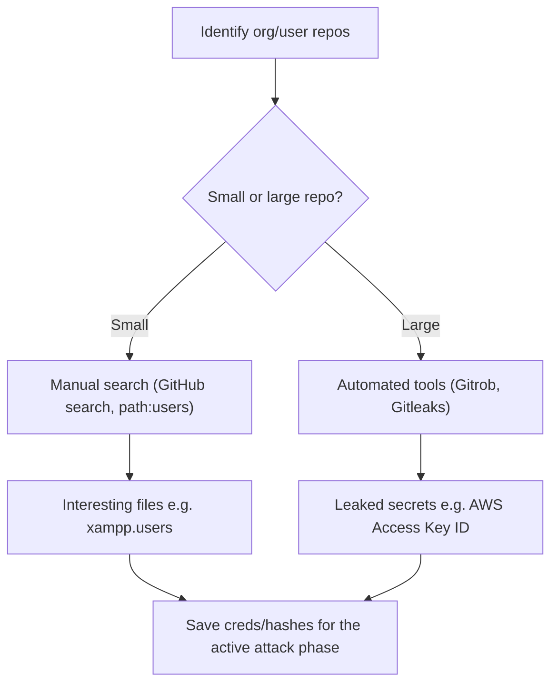

---
tags:
  - phase/recon
---

# Open-Source Code

Code stored online can provide a glimpse into the programming languages and frameworks used by an organization. On a few rare occasions, developers have even accidentally committed sensitive data and credentials to public repositories (often colloquially referred to as "repos").|


GitHub
GitHub Gist
GitLab
SourceForge


This manual approach will work best on small repos. For larger repos, we can use several tools to help automate some of the searching, such as Gitrob and Gitleaks. Most of these tools require an access token to use the source code-hosting provider's API.

> [!note]- Screenshot
> ```
> The search tools for some of these platforms will support the Google search operators
> that we discussed earlier in this Module.
> GitHlub's search for example, is very flexible. We can use Github to search a user's or
> organization's repos; however, we need an account if we want to search across all
> public repos.
> To perform any Github search, we first need to register a basic account, which is free
> for individuals and organizations.
> ‘Once we've logged in to our Github account, we can perform multiple keyword-based
> searches by typing into the top-right search field.
> 
> Omen ==
> 
> Figure 9: Gttub Search
> ```


> [!note]- Screenshot
> ```
> Let's search MegaCorp One's repos for interesting information. We can use path:users
> to search for any files with the word "users" in the filename and press ENTER.
> ‘Figure 8: File Operator in Giblub Search
> ```


> [!note]- Screenshot
> ```
> Our search only found one file - xampp.users. This is nevertheless interesting because
> XAMPPis a web application development environment. Let's check the contents of the
> file.
> 
> O(c menonaionne
> To oe ° aneeeene
> 
> “ Figure 10: xampp.users File Content
> This file appears to contain a username and password hash, which could be very useful
> when we begin our active attack phase. Let's add it to our notes.
> ```


> [!note]- Screenshot
> ```
> The following screenshot shows an example of Gitleaks finding an AWS Access Key ID
> inafile.
> KaLiokalis~/Downloads$../gitteaks-Linux-and64 -v -r=https://9ithb.con/ i
> {ir0(2019-10-67111;13:06-04:00] cloning https: //sihb-</
> Enumerating objects: 8, done
> Counting objects: 1098 (8/8), done,
> Compressing objects: Tee. (6/8), done.
> Total 20 (delta 6), reused ® (delta 8), pack-reused 22
> t
> Tine: “Access ey 1 TT
> TT:
> a
> srule': “ans client 1D",
> “infor: *(A31LA-20-9]|AKTA|AGPA|AIDA|AROA|ATPA|ANPA[ARVA| ASIA) [A-20-9]{16) regex natch
> “commitMsg": "Merge pull request #1 from (MMMM Update aws’
> a
> ‘oa
> site's vauee
> Sdater: “aeneeteetsae"05°32-08:00",
> tage" “key, AWS",
> severity:
> 2
> Figure 1: Example Gitleaks Output
> ```

## Visual Flow



> [!success] What success looks like
> A search turns up a file that should not be public — for example `xampp.users` containing a username and password hash, or Gitleaks flagging an AWS Access Key ID in commit history. Anything credential-like is gold for the later active phase.

> [!danger] Common errors
> - Trying to search all public repos without logging in → GitHub requires a (free) account for cross-repo search; without it you can only browse a specific user/org.
> - Running Gitrob/Gitleaks without an API token → most of these tools need a provider access token to reach the API; generate one first.
> - Only checking the current code → secrets often live in old commit history; tools like Gitleaks scan history, so don't rely on the latest snapshot alone.
> Full list: [[⚠️ Common Errors & Troubleshooting]]

> [!tip] Beginner note
> This is **passive**: you are reading code already published on GitHub/GitLab/etc., not touching the target's own servers. The same search operators from Google Hacking (like `path:`) work in GitHub's search box.

---
%% graph-links %%
## Related
- [[Google Hacking]]
- [[Enumerating and Abusing APIs]]
- [[Shodan]]

> [!info] Navigation
> Section: [[Passive Information Gathering/_index|Passive Information Gathering]] · Home: [[🏠 Home]]

