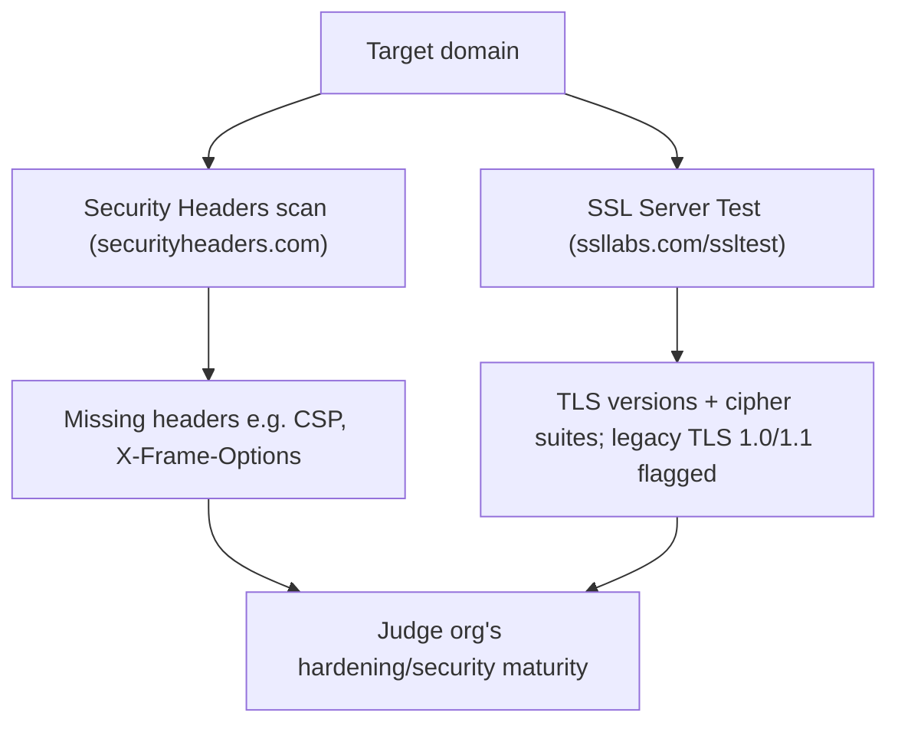

---
tags:
  - http
  - passive-recon
  - ssl
  - web
---

# Security Headers and SSL/TLS

There are several other specialty websites that we can use to gather information about a website or domain's security posture. Some of these sites blur the line between passive and active information gathering, but the key point for our purposes is that a third-party is initiating any scans or checks.

One such site, Security Headers, will analyze HTTP response headers and provide basic analysis of the target site's security posture. We can use this to get an idea of an organization's coding and security practices based on the results.
[https://securityheaders.com/](https://securityheaders.com/)
Another scanning tool we can use is the SSL Server Test from Qualys SSL Labs. This tool analyzes a server's SSL/TLS configuration and compares it against current best practices. It will also identify some SSL/TLS related vulnerabilities, such as Poodle or Heartbleed. Let's scan
[www.megacorpone.com](http://www.megacorpone.com)
and check the results.
[https://www.ssllabs.com/ssltest/](https://www.ssllabs.com/ssltest/)

> [!note]- Screenshot
> ```
> Let's scan www.megacorpone.com and check the results.
> Security Report Summary
> Figura 15: Scan results for www.megacorpone.com
> ```


> [!note]- Screenshot
> ```
> The site is missing several defensive headers, such as Content-Security-Policy and X-
> Frame-Options. These missing headers are not necessarily vulnerabilities in and of
> themselves, but they could indicate web developers or server admins that are not
> familiar with server hardening.
> ```


> [!note]- Screenshot
> ```
> a Scan Another »
> ‘igure 16: SSL Server Test results for wwrs.megacorpone.com
> These results seem better than the Security Headers check. However, this shows that
> the server supports TLS versions such as 1.0 and 1.1, which are deemed legacy as they
> implement insecure - this ultimately suggests that our target is not
> applying current best practices for SSL/TLS hardening. Disabling the
> TLS_DHE_RSA_WITH_AES_256.CBC_SHA suite has been
> , for example, due to multiple vulnerabilities both on AES cipher block chaining
> 
> mode and the SHA1 algorithm. We can use these findings to gain insights about the
> security practices, or lack thereof, within the target organization.
> ```

## Visual Flow



> [!success] What success looks like
> Security Headers returns a letter-graded report listing present vs. missing headers (e.g. no Content-Security-Policy or X-Frame-Options). Qualys SSL Labs returns a grade plus the supported TLS versions and cipher suites, flagging legacy TLS 1.0/1.1 and weak suites — together they paint a picture of the org's hardening.

> [!danger] Common errors
> - Treating missing headers as instant vulnerabilities → they are indicators of weak hardening, not exploits by themselves; note them, don't overstate.
> - Including a path or scheme in the input → enter the hostname (`www.megacorpone.com`), not a full URL with `https://` and a path.
> - Re-running a fresh SSL Labs scan unnecessarily → use the cached result if recent; full scans take a couple of minutes.
> Full list: [[⚠️ Common Errors & Troubleshooting]]

> [!tip] Beginner note
> This blurs the passive/active line, but stays **passive for you**: a third party (Security Headers / Qualys) initiates the check, so the scan does not come from your IP. You only read the report.

---
%% graph-links %%
## Related
- [[Netcraft]]
- [[Inspecting HTTP Response Headers and Sitemaps]]
- [[Technology Stack Identification with Wappalyzer]]

> [!info] Navigation
> Section: [[Passive Information Gathering/_index|Passive Information Gathering]] · Home: [[🏠 Home]]

