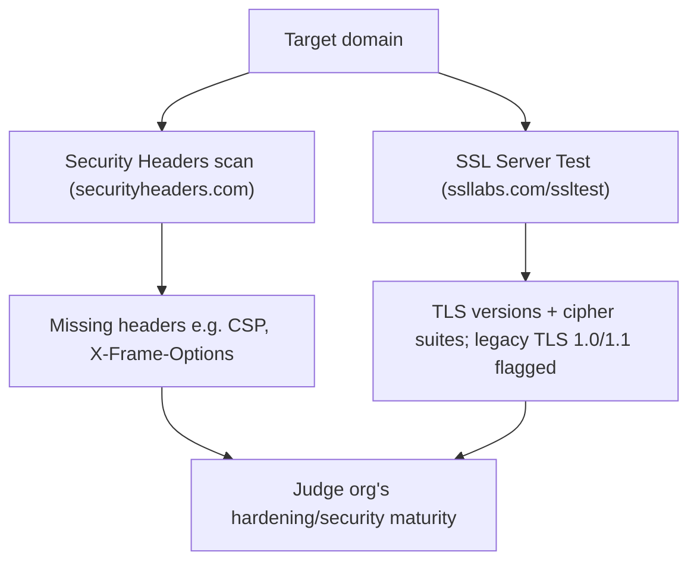

---
tags:
  - phase/recon
  - http
  - passive-recon
  - ssl
  - web
---

# Security Headers and SSL/TLS

> [!tip] Quick Reference
> | Goal | Command / URL |
> |------|---------------|
> | Third-party header scan | [securityheaders.com](https://securityheaders.com/) → enter hostname |
> | Third-party SSL/TLS scan | [ssllabs.com/ssltest](https://www.ssllabs.com/ssltest/) → enter hostname |
> | Manually pull headers (works on internal/lab IPs) | `curl -I https://www.megacorpone.com` |
> | Pull headers, follow redirects | `curl -IL https://www.megacorpone.com` |
> | Local TLS scan (works on internal/lab IPs) | `testssl.sh www.megacorpone.com` |
> | Lighter local TLS scan | `sslscan www.megacorpone.com` |
> | TLS scan via Nmap | `nmap --script ssl-enum-ciphers -p 443 www.megacorpone.com` |
> | Manual TLS handshake / cert inspection | `openssl s_client -connect www.megacorpone.com:443` |

There are several other specialty websites that we can use to gather information about a website or domain's security posture. Some of these sites blur the line between passive and active information gathering, but the key point for our purposes is that a third-party is initiating any scans or checks.

One such site, Security Headers, will analyze HTTP response headers and provide basic analysis of the target site's security posture. We can use this to get an idea of an organization's coding and security practices based on the results.
[https://securityheaders.com/](https://securityheaders.com/)
Another scanning tool we can use is the SSL Server Test from Qualys SSL Labs. This tool analyzes a server's SSL/TLS configuration and compares it against current best practices. It will also identify some SSL/TLS related vulnerabilities, such as Poodle or Heartbleed. Let's scan
[www.megacorpone.com](http://www.megacorpone.com)
and check the results.
[https://www.ssllabs.com/ssltest/](https://www.ssllabs.com/ssltest/)

> [!info] Security Headers scan
> Enter `www.megacorpone.com` at securityheaders.com to get a "Security Report Summary" — a letter grade plus a breakdown of which HTTP response headers are present and which are missing.


> [!info] Interpreting missing headers
> The site is missing several defensive headers, such as `Content-Security-Policy` and `X-Frame-Options`. These absences are not vulnerabilities in themselves, but they suggest developers or admins who are not applying server hardening — a hint about the org's overall security maturity.


> [!info] SSL Server Test results
> The Qualys SSL Labs scan grades better than the headers check, but still shows the server supporting legacy **TLS 1.0 and 1.1**, so the target is not fully applying current SSL/TLS hardening. Weak suites like `TLS_DHE_RSA_WITH_AES_256_CBC_SHA` are recommended for disabling due to known issues with AES-CBC mode and the SHA-1 algorithm. Findings like these reveal the org's security practices.

> [!warning] These sites can't reach OSCP lab targets
> securityheaders.com and SSL Labs are third-party scanners on the public internet — they can only reach hostnames/IPs that are internet-routable. Most OSCP lab and exam boxes sit on private ranges (`192.168.x.x`, `10.x.x.x`) that these sites simply cannot connect to. For lab machines, replicate the check locally instead:
> ```bash
> curl -IL https://192.168.50.10
> testssl.sh 192.168.50.10
> nmap --script ssl-enum-ciphers -p 443 192.168.50.10
> ```

## Visual Flow



> [!success] What success looks like
> Security Headers returns a letter-graded report listing present vs. missing headers (e.g. no Content-Security-Policy or X-Frame-Options). Qualys SSL Labs returns a grade plus the supported TLS versions and cipher suites, flagging legacy TLS 1.0/1.1 and weak suites — together they paint a picture of the org's hardening.

> [!danger] Common errors
> - Treating missing headers as instant vulnerabilities → they are indicators of weak hardening, not exploits by themselves; note them, don't overstate.
> - Including a path or scheme in the input → enter the hostname (`www.megacorpone.com`), not a full URL with `https://` and a path.
> - Re-running a fresh SSL Labs scan unnecessarily → use the cached result if recent; full scans take a couple of minutes.
> - `This host name is unknown` / scan never starts on SSL Labs → the site can't resolve or reach the target (common for lab/internal IPs); fall back to `testssl.sh`/`sslscan`/`openssl s_client` run locally.
> - SSL Labs shows `Assessment failed: Unable to connect to the server` → the target may be rate-limiting new TLS handshakes or is behind a firewall that blocks Qualys' IP ranges; retry later or scan locally instead.
> - `testssl.sh: command not found` → clone it (`git clone https://github.com/drwetter/testssl.sh.git`) or `sudo apt install testssl.sh`; it also runs standalone with no install via `./testssl.sh`.
> Full list: [[⚠️ Common Errors & Troubleshooting]]

> [!tip] Beginner note
> This blurs the passive/active line, but stays **passive for you**: a third party (Security Headers / Qualys) initiates the check, so the scan does not come from your IP. You only read the report. `curl -I` / `testssl.sh` run from your own box are **active** the moment you point them at a real target — reach for them once you're past pure passive recon.

## Resources
- [testssl.sh](https://testssl.sh/)
- [OWASP Secure Headers Project](https://owasp.org/www-project-secure-headers/)

---
%% graph-links %%
## Related
- [[Netcraft]]
- [[Inspecting HTTP Response Headers and Sitemaps]]
- [[Technology Stack Identification with Wappalyzer]]

> [!info] Navigation
> Section: [[Passive Information Gathering/_index|Passive Information Gathering]] · Home: [[🏠 Home]]

