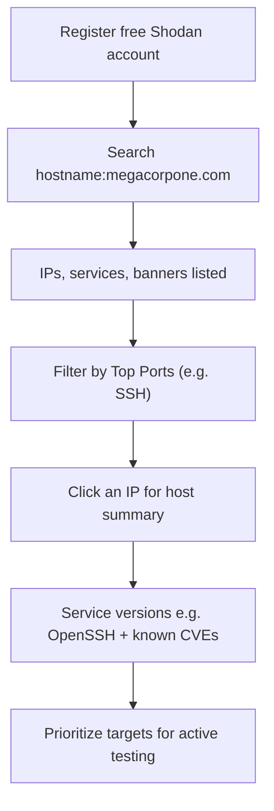

---
tags:
  - osint
  - passive-recon
  - phase/recon
  - shodan
---

# Shodan

Shodan is a search engine that crawls devices connected to the internet, including the servers that run websites, as well as devices like routers and IoT devices.


We can review the ports, services, and technologies used by the server on this page. Shodan will also reveal if there are any published vulnerabilities for any of the identified services or technologies running on the same host. This information is invaluable when determining where to start when we move to active testing.

> [!example] Searching Shodan
> Register a free account (limited access), then scope the search to your target's hostname:
> ```
> hostname:megacorpone.com
> ```


> [!info] Reading the results
> Shodan lists the target's IPs, services, and banners — all gathered passively, without touching the site. This is a snapshot of the internet footprint (e.g. four servers running SSH). Drill down by clicking a service under **Top Ports** on the left pane to filter results.


> [!info] Host summary
> Shodan's banners reveal the exact software versions (e.g. which OpenSSH build) on each server. Click an individual IP to open a host summary with its open ports, services, and any known CVEs for those versions.

## Visual Flow



> [!success] What success looks like
> Shodan lists your target's IPs with open ports, service banners, and software versions (e.g. the exact OpenSSH version), and flags published vulnerabilities for those services — a ready-made map of where to start active testing.

> [!danger] Common errors
> - Skipping registration → many results and filters need a free account; sign up first.
> - Searching the wrong filter → use `hostname:megacorpone.com` (not just a bare keyword) to scope results to the target.
> - Trusting banners as 100% current → Shodan data comes from earlier crawls and can be stale; confirm versions in the active phase.
> Full list: [[⚠️ Common Errors & Troubleshooting]]

> [!tip] Beginner note
> Shodan is **passive**: it shows data it already crawled from internet-facing devices, so querying it never touches the target. Think of it as a search engine for servers and IoT devices instead of web pages.

---
%% graph-links %%
## Related
- [[WHOIS Enumeration]]
- [[Netcraft]]
- [[Google Hacking]]
- [[Nessus]]

> [!info] Navigation
> Section: [[Passive Information Gathering/_index|Passive Information Gathering]] · Home: [[🏠 Home]]

