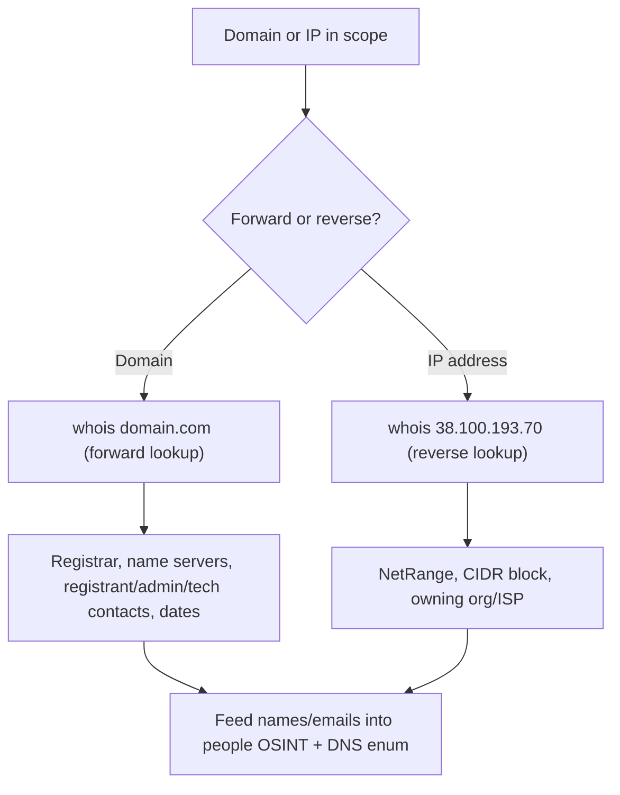

---
tags:
  - osint
  - passive-recon
  - phase/recon
---

# WHOIS Enumeration

> [!tip] Quick Reference
> | Goal | Command |
> |------|---------|
> | Forward lookup (domain → records) | `whois megacorpone.com` |
> | Forward lookup via specific server | `whois megacorpone.com -h whois.iana.org` |
> | Reverse lookup (IP → owner) | `whois 38.100.193.70` |
> | RDAP lookup (modern JSON alternative) | `curl -s https://rdap.org/domain/megacorpone.com \| jq` |
> | Quick DNS sanity check alongside whois | `dig megacorpone.com any +noall +answer` |
> | Install whois if missing | `sudo apt install whois` |
> | Web-based whois (bypasses local rate limits) | [who.is](https://who.is/) or [lookup.icann.org](https://lookup.icann.org/) |

Whois is a protocol that uses TCP port 43 to communicate with public databases. The whois tool queries the databases to retrieve domain registration records.

> [!info] What WHOIS records contain
> - **Name Server** – DNS servers that resolve the domain (e.g. NS1.MEGACORPONE.COM).
> - **Registrar** – company the domain was registered through (GoDaddy, Namecheap, Gandi).
> - **Registrant contact** – legal owner: name, organization, email, phone.
> - **Administrative contact** – manages ownership/access and domain changes.
> - **Technical contact** – manages DNS records and server infrastructure.
> - **Creation / Expiration dates** – shows how long the domain has been active.
> - **Domain status** – flags like locked, active, or in transfer.
>
> Much of this is public unless the owner pays the registrar for private registration.


> [!example] Forward lookup (domain → records)
> ```
> kali@kali:~$ whois megacorpone.com -h 192.168.50.251
> Domain Name:            MEGACORPONE.COM
> Registrar WHOIS Server: whois.gandi.net
> Creation Date:          2013-01-22
> Registry Expiry Date:   2023-01-22
> Registrant Name:        Alan Grofield
> Registrant Organization: MegaCorpOne
> Registrant Phone:       +1.9038836342
> Admin/Tech Contact:     Alan Grofield (same as registrant)
> Name Server:            NS1/NS2/NS3.MEGACORPONE.COM
> ```
> A single record hands you the registrar, dates, name servers, and a real contact name to pivot on.


> [!info] Useful findings
> The registrant, admin, and technical contacts are all **Alan Grofield**, and the name servers are NS1–NS3.MEGACORPONE.COM. Per MegaCorp One's contact page, Alan is the "IT and Security Director" — a strong lead for people-focused OSINT.


> [!example] Reverse lookup (IP → owner)
> ```
> kali@kali:~$ whois 38.100.193.70 -h 192.168.50.251
> NetRange:  38.0.0.0 - 38.255.255.255
> CIDR:      38.0.0.0/8
> NetName:   COGENT-A
> Address:   2450 N Street NW, Washington, DC 20037, US
> ```
> The IP falls in the large 38.0.0.0/8 block registered to the ISP (PSINet/Cogent) hosting the address — useful for mapping netblocks.

## Visual Flow



> [!success] What success looks like
> whois returns concrete records: registrar (e.g. Gandi), creation/expiry dates, name servers (NS1.MEGACORPONE.COM), and contact names like Alan Grofield. A reverse lookup on an IP returns a NetRange and the owning org. These are real pivot points for the next recon step.

> [!danger] Common errors
> - `No whois server is known for this kind of object` → tell whois which server to use: `whois -h whois.iana.org domain.com` (or the `-h 192.168.50.251` server used in the lab).
> - Records look empty or show "REDACTED FOR PRIVACY" → the registrar hides personal data under GDPR/privacy; try the registrar's own web whois, RDAP (`curl https://rdap.org/domain/<domain>`), or pivot to other OSINT sources.
> - Querying a domain with `https://` or a trailing path → use the bare domain only (`megacorpone.com`, not `https://megacorpone.com/`).
> - `command not found: whois` → not installed by default on every distro; `sudo apt install whois`.
> - `Query rate limit exceeded` / connection refused after several lookups → some registrar whois servers rate-limit by source IP; wait a bit, query a different registrar's server with `-h`, or use a web whois front-end (who.is, ICANN Lookup) instead.
> Full list: [[⚠️ Common Errors & Troubleshooting]]

> [!tip] Beginner note
> WHOIS is **passive** — you query a public registration database over TCP port 43, never the target's own servers. So it is stealthy and safe to run early. A *forward* lookup goes domain → details; a *reverse* lookup goes IP → owner. **RDAP** is the modern, structured (JSON) successor to WHOIS — same idea, easier to parse, and increasingly what registrars point you to as WHOIS is phased out.

## Resources
- [ICANN Lookup (WHOIS/RDAP)](https://lookup.icann.org/)
- [rdap.org](https://rdap.org/)

---
%% graph-links %%
## Related
- [[DNS Enumeration]]
- [[Netcraft]]
- [[Shodan]]
- [[Google Hacking]]

> [!info] Navigation
> Section: [[Passive Information Gathering/_index|Passive Information Gathering]] · Home: [[🏠 Home]]

