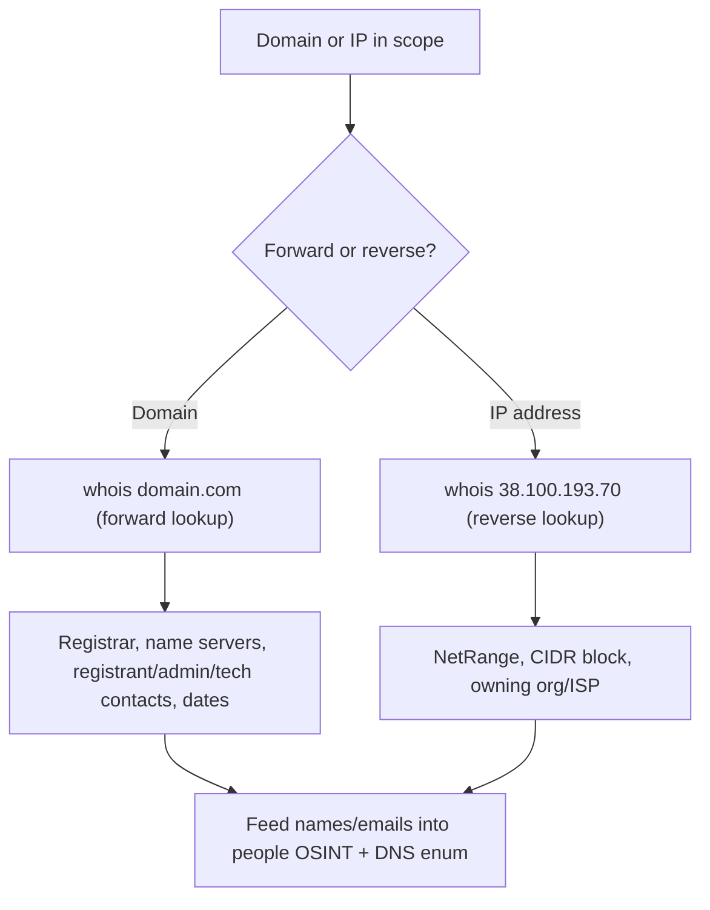

---
tags:
  - osint
  - passive-recon
  - phase/recon
---

# WHOIS Enumeration

Whois is a protocol that uses TCP port 43 to communicate with public databases. The whois tool queries the databases to retrieve domain registration records.

> [!note]- Screenshot
> ```
> WHOIS records typically include information such as:
> 
> + Name Server: These servers are part of the Domain Name System (DNS) and help
> translate domain names into IP addresses, directing traffic to the appropriate web
> server.
> 
> + Registrar The company through which the domain name was registered. Examples
> include GoDaddy, Namecheap, and Gandi.
> 
> + Registrant Contact. The individual or organization that legally owns the domain. This
> may include a name, organization, email, and phone number.
> 
> + Administrative Contact: The person responsible for managing domain ownership and
> access. Often the main point of contact for domain changes.
> 
> + Technical Contact. The individual or team that manages the domain's technical setup,
> such as DNS records or server integration.
> 
> * Creation and Expiration Dates: When the domain was first registered and when it is
> set to expire. This helps assess how long a domain has been active.
> 
> + Domain Status: Flags that indicate whether the domain is locked, active, or in transfer
> 
> This information is often public, since registrars charge a fee for private registration.
> ```


> [!note]- Screenshot
> ```
> kaligkali:~$ whois megacorpone.com -h 192.168.50.251
> Domain Name: MEGACORPONE.COM
> Registry Domain ID: 1775445745 DOMAIN_COM-VRSN
> Registrar WHOIS Server: whois.gandi.net
> Registrar URL: http://me.gandi.net
> Updated Date: 2019-01-01709:45:032,
> Creation Date: 2013-01-22723:01:002
> Registry Expiry Date: 2023-01-22123:01:00Z
> 
> Registry Registrant ID:
> 
> Registrant Nane: Alan Grofield
> 
> Registrant Organization: MegaCorpOne
> 
> Registrant Street: 2 Old Mill St
> 
> Registrant City: Rachel
> 
> Registrant State/Province: Nevada
> 
> Registrant Postal Code: 89001
> 
> Registrant Country: US
> 
> Registrant Phone: +1.9038836342
> 
> Registry Admin 1D:
> 
> Admin Name: Alan Grofield
> 
> ‘Admin Organization: MegaCorpOne
> 
> Adnin Street: 2 Old Mill St
> 
> ‘Adnin City: Rachel
> 
> ‘Admin State/Province: Nevada
> 
> ‘Admin Postal Code: 89001
> 
> ‘Admin Country: US
> 
> ‘Admin Phone: +1.9038836342
> 
> Registry Tech 1D:
> 
> Tech Name: Alan Grofield
> 
> Tech Organization: MegaCorpOne
> 
> Tech Street: 2 Old Mill st
> 
> Tech City: Rachel
> 
> Tech State/Province: Nevada
> 
> Tech Postal Code: 39001
> 
> Tech Country: US
> 
> Tech Phone: +1.9038836342
> 
> Name Server: NS1.HEGACORPONE.COM
> 
> Name Server: NS2.HEGACORPONE.COM
> 
> Name Server: NS3.MEGACORPONE.COM
> 
> Listing 2 - WHOIS forward lookup for megacorpone.com
> ```


> [!note]- Screenshot
> ```
> Not all this data is useful, but we did discover some valuable information.
> 
> + Registrant: Who legally owns the domain. (Alan Grofield)
> 
> + Admin Contact: The person managing administrative access. (Alan Grofield)
> 
> + Technical Contact: The person managing DNS, infrastructure, etc. (Alan Grofield)
> 
> + Name Server: Helps direct internet traffic by translating domain names into IP
> addresses. (NS1.MEGACORPONE.COM)
> 
> According to the Megacorp One Contact page, Alan is the "IT and Security Director".
> ```


> [!note]- Screenshot
> ```
> Assuming we have an IP address, we can also use the whois client to perform a reverse
> lookup and gather more information.
> 
> kali@kali:~$ whois 38.100.193.70 -h 192.168.50.251
> 
> NetRange: -38.0.0.0 - 38.255.255.255
> 
> cpr: 38.0.0.0/8
> 
> NetName: ‘COGENT-A
> 
> Orgid: PSE
> 
> Address: 2450 N Street Ni
> 
> City: Washington
> 
> StateProv: OC
> 
> PostalCode: 20037
> 
> Country: us
> 
> RegDate:
> 
> Updated: 2015-06-04
> 
> isting 3= WHOIS reverse lookup for IP 38.100.193.70
> 
> The reverse WHOIS lookup reveals that this IP address falls within the 38.0.0.0/8 CIDR
> block — a large subnet range — and is registered to PSINet, Inc., the ISP hosting that
> address.
> ```

## Visual Flow



> [!success] What success looks like
> whois returns concrete records: registrar (e.g. Gandi), creation/expiry dates, name servers (NS1.MEGACORPONE.COM), and contact names like Alan Grofield. A reverse lookup on an IP returns a NetRange and the owning org. These are real pivot points for the next recon step.

> [!danger] Common errors
> - `No whois server is known for this kind of object` → tell whois which server to use: `whois -h whois.iana.org domain.com` (or the `-h 192.168.50.251` server used in the lab).
> - Records look empty or show "REDACTED FOR PRIVACY" → the registrar hides personal data under GDPR/privacy; try the registrar's own web whois or pivot to other OSINT sources.
> - Querying a domain with `https://` or a trailing path → use the bare domain only (`megacorpone.com`, not `https://megacorpone.com/`).
> Full list: [[⚠️ Common Errors & Troubleshooting]]

> [!tip] Beginner note
> WHOIS is **passive** — you query a public registration database over TCP port 43, never the target's own servers. So it is stealthy and safe to run early. A *forward* lookup goes domain → details; a *reverse* lookup goes IP → owner.

---
%% graph-links %%
## Related
- [[DNS Enumeration]]
- [[Netcraft]]
- [[Shodan]]
- [[Google Hacking]]

> [!info] Navigation
> Section: [[Passive Information Gathering/_index|Passive Information Gathering]] · Home: [[🏠 Home]]

