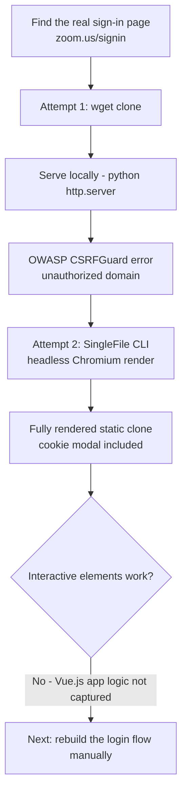

---
tags:
  - phishing
  - credential-harvesting
  - website-cloning
  - hands-on-lab
  - phase/initial-access
---

# Cloning a legitimate website

> [!tip] Quick Reference
> | Tool | Command | Result |
> |------|---------|--------|
> | wget | `wget -E -k -K -p -e robots=off -nd "URL"` | Fast, but breaks on live JS that checks its own origin |
> | SingleFile CLI | `single-file "URL" out.html --browser-executable-path /usr/bin/chromium` | Full-fidelity static render via real Chromium — visuals work, app logic doesn't |
> | Local preview | `sudo python -m http.server 80` | Serve the clone locally to check how it renders |

## Visual Flow



## Attempt 1: cloning with wget

Find the real login page (a search for "Zoom signin" leads to `https://zoom.us/signin#/`), then pull it down:

```bash
mkdir ZoomSignin && cd ZoomSignin
wget -E -k -K -p -e robots=off -nd "https://zoom.us/signin#/login"
```

> [!info] What each flag does
> | Flag | Purpose |
> |------|---------|
> | `-E` | Match the saved file extension to the MIME type |
> | `-k` | Convert in-page links to local references |
> | `-K` | Keep the original file too, saved with `.orig` |
> | `-p` | Download all assets needed to render the page |
> | `-e robots=off` | Ignore `robots.txt` restrictions |
> | `-nd` | Save everything flat — no subdirectories |

Serve it locally to preview: `sudo python -m http.server 80`, then browse to `http://127.0.0.1/signin.html#/login`.

> [!danger] It doesn't render cleanly
> The clone throws an alert: *"OWASP CSRFGuard JavaScript was included from within an unauthorized domain!"* — the original page includes client-side JavaScript that checks its own origin, and a locally-served clone at `127.0.0.1` fails that check instantly. A visible error dialog like this would blow the pretext the moment a real target saw it.

## Attempt 2: SingleFile CLI

Rather than saving raw page source, [SingleFile CLI](https://github.com/gildas-lormeau/single-file-cli) drives a **real headless Chromium instance** to fully render the page — executing its JavaScript and loading its assets — then serializes the final rendered result into one self-contained HTML file. Because it captures an already-rendered snapshot rather than re-executing the original scripts against a new origin, it sidesteps the CSRFGuard-style origin check entirely.

```bash
rm -rf ./*   # clear the failed wget attempt first
sudo apt install nodejs npm chromium -y
sudo npm install -g single-file-cli

single-file "https://zoom.us/signin" signin.html --browser-executable-path /usr/bin/chromium
```

Reopening the result now shows a visually faithful clone — right down to the cookie consent modal, a small but important authenticity detail (most real sites show one, so its presence makes the fake feel more legitimate).

## What's still broken

Two problems remain, both because SingleFile only captured **static HTML/CSS**, not live application behavior:
- The **"Cookie Settings"** link does nothing — the real banner depends on Zoom's OneTrust JavaScript, which isn't functional in the static clone.
- **No interactive element works at all.** Entering an email and clicking "Next" does nothing — the page's actual login flow is powered by a Vue.js single-page application, and that client-side logic wasn't preserved by the clone. Only the rendered picture came through, not the app behind it.

This sets up the next step: replacing these broken elements with working, attacker-controlled versions (see [[Cleaning up the clone]]).

> [!success] What a convincing clone looks like
> Visually indistinguishable from the original, including expected UI details like a cookie modal — served, in a real engagement, over valid HTTPS to avoid the browser warnings covered in [[Recognize malicious links]].

> [!danger] Common pitfalls
> - Shipping a clone that still throws a visible JS error (like the CSRFGuard alert) — an instant giveaway.
> - Assuming a visually perfect clone is a functionally complete one — a static render has no working login flow yet.
> - Forgetting broken interactive elements are exactly the kind of "carelessness" that erodes trust, per [[Enhancing phishing through social engineering]].

> [!tip] Beginner note
> A modern website's front end is often a JavaScript application (like Vue.js) that needs real backend/session logic to function — saving the rendered HTML gets you the *picture* of the site, not the *app*. That gap is exactly what the next step has to fill.

## Resources
- [SingleFile CLI (GitHub)](https://github.com/gildas-lormeau/single-file-cli)
- See also: [[🧰 Command Cheat Sheet]] for general `python -m http.server` usage

---
%% graph-links %%
## Related
- [[Creating a Zoom credential phishing pretext]]
- [[Cleaning up the clone]]
- [[Capturing credentials]]
- [[Recognize malicious links]]

> [!info] Navigation
> Section: [[Phishing Basics/Hands-on credential phishing/_index|Hands-on credential phishing]] · Home: [[🏠 Home]]
