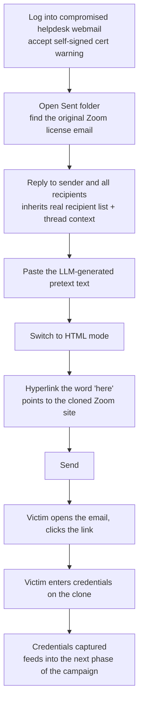

---
tags:
  - phishing
  - credential-harvesting
  - pretexting
  - hands-on-lab
  - phase/initial-access
---

# Crafting the phishing email

> [!tip] Quick Reference
> | Step | Detail |
> |------|--------|
> | Access webmail | `http://<MAILER-IP>/mail/` — accept the self-signed cert warning |
> | Login | `helpdesk@mail.corp.com` / the leaked password |
> | Find the thread | Sent folder → the original Zoom license email |
> | Reply | **Reply to sender and all recipients** — inherits the real recipient list |
> | Add the link | Switch to HTML mode → select text → Insert/Edit Link → malicious URL |
> | Send | Off it goes |

## Visual Flow



## Getting into the compromised mailbox

Browsing to the webmail portal triggers Firefox's **"Warning: Potential Security Risk Ahead"** — a self-signed certificate warning on the internal mail server. Click **Advanced → Accept the Risk and Continue** to proceed, then log in with the leaked `helpdesk@mail.corp.com` credentials.

> [!warning] Even legitimate internal infrastructure can look risky
> Users click through self-signed cert warnings on internal systems all the time — it's normalized. That habituation is exactly what an attacker's own infrastructure needs to *avoid* triggering; a phishing site throwing the same warning would be far more damaging to the pretext than an internal tool doing it.

## Why "Reply to sender and all recipients" beats composing fresh

In the Sent folder, find the original Zoom license email and hit **Reply to sender and all recipients** rather than writing a new message. Two big advantages:
1. **The recipient list is inherited automatically** — no need to separately gather every Sales team member's address.
2. **The reply visually includes the original trusted email as quoted context underneath** — recipients see this is literally a continuation of something they already received, reinforcing legitimacy far more than a cold, freshly composed email could.

Paste in the LLM-generated pretext text from [[Creating a Zoom credential phishing pretext]] as the new reply body, above the quoted original.

## Adding the malicious link

Plain text mode can't create a clickable hyperlink — switch to **HTML mode** first. Then select the natural anchor text already sitting in the pretext (the word "here" in *"please click here to log in"*), open **Insert/Edit Link**, and set the URL to the cloned site.

> [!example] Insert/Edit Link dialog
> URL: the cloned site's address (in the lab, a raw IP like `http://192.168.48.3/signin.html#/login` — no FQDN available). Text to display: `here`. Open link in: current window.

> [!tip] Lab constraint vs. real engagement
> The lab can't use a real domain due to DNS limitations, so the raw IP has to stand in as the link. In an actual campaign, **never ship a raw IP** — host the clone on a domain that visually matches the pretext (a look-alike domain, per [[Email phishing]]). A bare IP address in a hyperlink is an immediate, obvious red flag that a raw-IP-only lab environment doesn't have to worry about.

## Closing the loop

Send the email, then (playing the victim's role in the lab) log into `j.smith.sales@mail.corp.com`, open the phishing email, click the link, and submit credentials on the clone.

```
[+] Raw data: email=j.smith.sales%40corp.com&password=W00tw00t%21%21
[+] Captured credentials!
    Email:    j.smith.sales@corp.com
    Password: W00tw00t!!
127.0.0.1 - - [23/May/2026 14:24:26] "POST /creds HTTP/1.1" 302 -
```

The captured credentials become the seed for the **next** phase of the campaign — exactly the same pattern that started this whole chain back in [[Creating a Zoom credential phishing pretext]], where a single leaked low-value account was leveraged into something bigger. Phishing campaigns compound: today's captured credential is tomorrow's foothold.

> [!success] What a completed campaign looks like
> A reply-to-thread email that visually continues a real conversation, sent to a genuine recipient list, containing a naturally embedded link — and a credential server quietly logging every submission.

> [!danger] Common pitfalls
> - Composing a brand-new email instead of replying to an existing thread — loses both the automatic recipient list and the "this looks familiar" effect.
> - Forgetting to switch to HTML mode before inserting the link — it'll paste as plain, unclickable text.
> - Shipping a raw IP address as the visible link destination in a real campaign — a look-alike domain is mandatory outside lab constraints.

> [!tip] Beginner note
> This step is where every earlier concept actually converges into a real send: the pretext ([[Email phishing]]), the tone-matching ([[Enhancing phishing through social engineering]]), the clone ([[Cloning a legitimate website]]), and the capture server ([[Capturing credentials]]) all come together in one reply.

## Resources
- [HackTricks — Phishing Methodology](https://book.hacktricks.xyz/generic-methodologies-and-resources/phishing-methodology)

---
%% graph-links %%
## Related
- [[Creating a Zoom credential phishing pretext]]
- [[Cloning a legitimate website]]
- [[Cleaning up the clone]]
- [[Capturing credentials]]

> [!info] Navigation
> Section: [[Phishing Basics/Hands-on credential phishing/_index|Hands-on credential phishing]] · Home: [[🏠 Home]]
