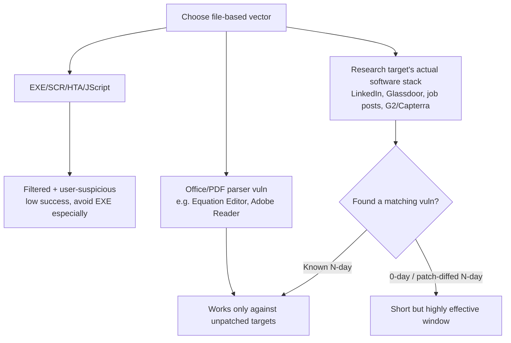

---
tags:
  - phishing
  - malicious-files
  - cve
  - phase/initial-access
---

# Assess threats from malicious files

> [!tip] Quick Reference
> | File type | Vector | Note |
> |-----------|--------|------|
> | EXE/SCR | Direct executable | Heavily filtered + user-suspicious — avoid |
> | HTA/JScript | Script-based executable | Less scrutinized than EXE |
> | Office doc (non-macro) | Parser vuln — CVE-2017-11882 (Equation Editor), CVE-2023-21716 (Word RTF parser) | Needs an unpatched target |
> | PDF | Parser vuln — CVE-2023-21608 (Adobe Reader use-after-free) | Needs an unpatched target |
> | Targeted 0-day/N-day | Vuln in software specific to the target's stack | Found via recon (LinkedIn, Glassdoor, job posts, G2/Capterra) |

## Visual Flow

## Beyond macros: file-parsing vulnerabilities

EXE attachments are a dead end statistically — they rarely reach the inbox past filtering, and even when they do, most users already distrust `.exe` files on sight. Attackers moved to less-obvious executable formats: **SCR, HTA, and JScript** files.

More interestingly, some Office document vulnerabilities grant code execution **without needing macros at all** — the file itself exploits a bug in how Office parses it:
- **CVE-2017-11882** — a memory corruption bug in the Equation Editor (bundled with Office until 2018). Still seen actively exploited as late as 2023, against organizations that hadn't updated.
- **CVE-2023-21716** — targets Word's RTF parser; public PoCs exist.

PDF viewers carry the same risk — **Adobe Acrobat Reader** is a frequent target, e.g. **CVE-2023-21608**, a use-after-free with public PoCs achieving arbitrary code execution.

> [!warning] Shelf life is short
> Once a CVE is public, the enterprise patch cycle closes the window fast. These only work against genuinely unpatched targets — you can't assume they'll land against a random organization.

## Going targeted: research the actual software stack

For a truly targeted attack, research **what software the target organization actually runs**, then look for vulnerabilities in that specific software. Useful recon sources: job postings, LinkedIn, Glassdoor, the company website, software review sites (G2 Crowd, Capterra), industry forums/blogs, and tech news — this is a direct extension of the OSINT techniques in [[Google Hacking]] and [[Open-Source Code]].

> [!info] 0-days and patch-diffing
> Hunting 0-days is historically rare (costly, slow) — but Microsoft's tightened macro security is pushing more attackers toward file-parsing bugs, making this more common. Advanced attackers also **reverse-engineer newly released security patches** to find the vulnerability before most organizations have deployed the fix — a short but effective window between patch release and patch adoption.

> [!success] What works
> Matching a specific, verifiably outdated or unpatched piece of software in the target's actual stack — found through targeted recon, not guessed generically.

> [!danger] Common pitfalls
> - Relying on a known, already-patched CVE against a well-maintained enterprise.
> - Skipping recon into the target's real software versions before picking an exploit.
> - Treating 0-day hunting as a default option — it's costly and rarely proportionate outside advanced engagements.

> [!tip] Beginner note
> A **file-parsing vulnerability** means the malicious file itself triggers code execution the moment a buggy version of the app opens it — no "enable macros" click required. That makes it more advanced (and more version-dependent) than a macro-based attack.

## Resources
- [CVE-2017-11882 details](https://nvd.nist.gov/vuln/detail/CVE-2017-11882)
- [CVE-2023-21608 details](https://nvd.nist.gov/vuln/detail/CVE-2023-21608)

---
%% graph-links %%
## Related
- [[Identifying risks of malicious Office macros]]
- [[Recognize malicious links]]
- [[Google Hacking]]
- [[Open-Source Code]]

> [!info] Navigation
> Section: [[Phishing Basics/Payloads, misdirection, and speedbumps/_index|Payloads, misdirection, and speedbumps]] · Home: [[🏠 Home]]
