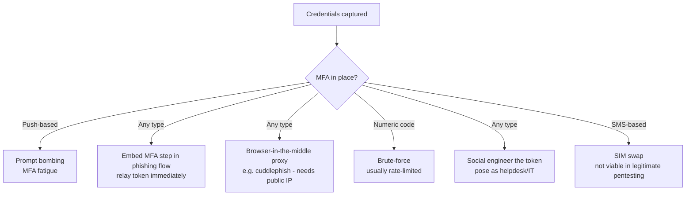

---
tags:
  - phishing
  - credential-harvesting
  - mfa-bypass
  - phase/initial-access
---

# Differentiate credential phishing and MFA

> [!tip] Quick Reference
> | Technique | Mechanism | Constraint |
> |-----------|-----------|------------|
> | Prompt bombing | Spam push prompts until the user approves | Needs push-based MFA |
> | Real-time relay via phishing site | Capture the token in the fake login flow, replay immediately | Token is short-lived — timing critical, single-use |
> | Browser-in-the-middle (cuddlephish, evilginx2) | Proxy the real session live | Needs a public IP + valid TLS on a lookalike domain — awkward for pure internal/assumed-breach engagements |
> | Brute-force | Guess the numeric token | Usually blocked by rate limiting |
> | Social engineering | Pose as helpdesk/IT, ask for the token | Needs a strong, credible pretext |
> | SIM swapping (SMS MFA) | Port the number to intercept SMS codes | Not legally viable in standard pentesting |

## Visual Flow



## Capturing creds is often not the finish line

Even with valid credentials, **MFA** slows an attacker down. Several ways to work around it:

**Prompt bombing (MFA fatigue).** Repeatedly trigger push-based login prompts on the target's phone until they approve one just to make the alerts stop — they often assume it's a glitch rather than an active attack. **Lapsus$** used this successfully in real-world breaches.

**Real-time token relay.** Embed the MFA step directly into the credential-phishing site's own login flow, capturing username, password, *and* MFA token together. The token must be relayed to the real service **immediately** — tokens are short-lived, so timing is critical. This only grants single-use access, but is effective when planned precisely.

**Browser-in-the-middle (BitM).** Proxy the target's real, live session — they're genuinely interacting with the legitimate site, but the resulting authenticated session (including the MFA token) belongs to the attacker's proxy. Tools like **cuddlephish** automate this; **evilginx2** is the more widely used equivalent for AiTM/BitM phishing:
```bash
git clone https://github.com/kgretzky/evilginx2
cd evilginx2 && make
sudo ./evilginx2 -p ./phishlets
```
Requires a **public IP** and isn't easily run purely internally — a real constraint on assumed-breach engagements aiming at internal-only web apps.

> [!danger] BitM proxy captures a session that doesn't actually work
> Session cookies are commonly scoped `Secure`, and sometimes `SameSite=Strict` — a self-signed cert, or a proxy domain that doesn't closely resemble the real one, can make the browser reject the cookie outright or the captured session fail server-side validation. A real (or Let's Encrypt-issued) certificate on a convincing lookalike domain is close to mandatory for BitM to work reliably, on top of the public IP requirement above.

**Brute-forcing the token.** In theory possible (most tokens are 6 digits), but rate limiting and short response windows usually make this impractical.

**Social engineering the token directly.** Contact the target posing as helpdesk/IT and ask them to read out their MFA code — requires a genuinely solid pretext to work.

> [!danger] SIM swapping — know it, don't do it
> If MFA is delivered by SMS, some threat actors SIM-swap the target's number to receive the code themselves (see [[Smishing, vishing, and chatting]]). This is **not something you can generally do in legitimate pentesting** due to the legal implications — it involves social-engineering a third party (the carrier) outside the scope of any client engagement. Understand the tactic; don't perform it without extremely explicit, separately-scoped authorization.

> [!success] What a working MFA bypass looks like
> Either a user fatigued into approving a push prompt, or a real-time capture-and-relay of a token executed entirely within its short validity window.

> [!danger] Common pitfalls
> - Relaying a captured token too slowly — it expires before you can reuse it.
> - Assuming BitM tooling will work from a purely internal foothold — most need a public IP.
> - Attempting brute-force against a service with reasonable rate limiting — wastes time for near-zero odds.
> - Treating SIM swapping as an available technique on a standard engagement — it isn't.

> [!tip] Beginner note
> **Browser-in-the-middle** in plain terms: the victim really is logging into the real site — just through the attacker's proxy sitting in between, which walks away with the same authenticated session the victim gets.

## Resources
- [cuddlephish (GitHub)](https://github.com/fkasler/cuddlephish)
- [evilginx2 (GitHub)](https://github.com/kgretzky/evilginx2)
- [Lapsus$ MFA fatigue reporting — Microsoft](https://www.microsoft.com/en-us/security/blog/)

---
%% graph-links %%
## Related
- [[Recognize malicious links]]
- [[Smishing, vishing, and chatting]]
- [[Creating a Zoom credential phishing pretext]]
- [[Capturing credentials]]

> [!info] Navigation
> Section: [[Phishing Basics/Payloads, misdirection, and speedbumps/_index|Payloads, misdirection, and speedbumps]] · Home: [[🏠 Home]]
