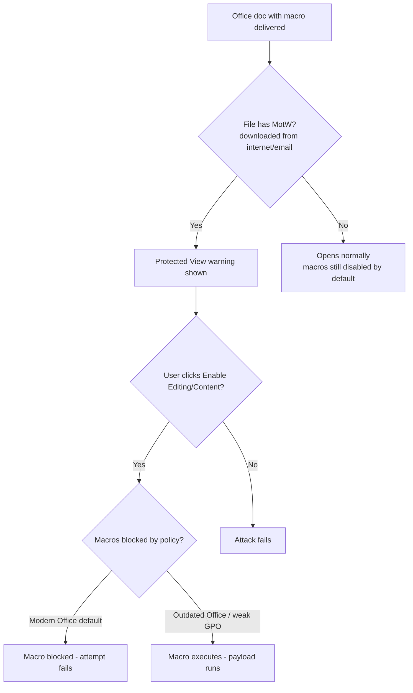

---
tags:
  - phishing
  - office-macros
  - motw
  - defensive-evasion
  - phase/initial-access
---

# Identifying risks of malicious Office macros

> [!tip] Quick Reference — Defense Layers (oldest → newest)
> | Defense | What it does | Attacker angle |
> |---------|---------------|-----------------|
> | Macros disabled by default | User must explicitly enable | Pretext must convince the user to "Enable Content" |
> | Mark of the Web (MotW) | NTFS attribute flags internet-downloaded files | Bypass via CVE-2022-41091 (patched fast) |
> | Protected View | Read-only warning for MotW-flagged docs | Convince user to click "Enable Editing" |
> | Macros blocked by default (modern) | Blocks macros outright in any MotW-flagged file | Largely defeats email-delivered macro docs |
> | AD Group Policy enforcement | Locks settings org-wide, can't be user-overridden | No workaround if enforced |

## Visual Flow

## Why Office macros are a classic vector

Several Office apps support **VBA (Visual Basic for Applications)**, a built-in scripting language meant to automate dynamic documents. That same capability has been abused since at least **1999**, when the Melissa Macro Virus (a malicious Word doc) triggered a US-CERT warning — Office macros have been a phishing staple ever since.

## How Microsoft has locked this down over time

1. **Macros disabled by default** — users must explicitly enable them.
2. **Mark of the Web (MotW)** — an NTFS file attribute Windows sets automatically when a file is downloaded from an external source (email attachment, browser download, etc.).
3. **Protected View** — Office opens any MotW-flagged document in a read-only warning state; the user must actively click through to edit or run macros.
4. **Macros now blocked by default** in *any* MotW-flagged document — the newest and biggest change. Since virtually every phishing attachment carries MotW, this alone kills most macro-based phishing against up-to-date installs.
5. **AD Group Policy** can lock all of this at the domain level — preventing users from exiting Protected View or running macros at all, with no individual override.

> [!example] Mark of the Web in practice
> A file (`wincalc.exe`, in this case) downloaded via a browser into `Downloads` shows a **Security** notice in its Properties dialog: *"This file came from another computer and might be blocked to help protect this computer,"* with an **Unblock** checkbox. That checkbox is the user-facing control for MotW — checking it strips the flag and lets the file run without the warning. Office documents carry the same flag and trigger Protected View instead.

> [!info] Known bypass
> CVE-2022-41091 allowed bypassing MotW — but Microsoft patches these gaps quickly once discovered, so bypasses of this kind shouldn't be relied on as a durable technique.

## Why macros still matter despite all this

Macro-based phishing is trending toward obsolete against modern, well-configured environments — but two conditions keep it alive:
- **Outdated Office versions** that predate the latest default-blocking behavior.
- **Weak or absent Group Policy configuration**, where an org never bothered to enforce macro-blocking or Protected View lockdown at all.

> [!success] What a working macro phish looks like today
> Realistically, it only lands against outdated Office installs or organizations with permissive/absent macro Group Policy. Recon into the target's patch level and Office version is worth doing before betting on this vector.

> [!danger] Common pitfalls
> - Assuming macros still work by default against a modern, patched org — they almost certainly don't.
> - Relying on a known MotW bypass CVE without checking whether it's already been patched.
> - Not verifying Office version/patch level during recon before choosing this vector.

> [!tip] Beginner note
> MotW isn't Office-specific — it's a general Windows feature (a "zone identifier") applied to any file downloaded from the internet or email, and plenty of non-Office apps respect it too (that's exactly what the screenshot above shows: a plain `.exe`, not a document).

## Resources
- [HackTricks — Office Macros](https://book.hacktricks.xyz/generic-methodologies-and-resources/phishing-methodology/phishing-documents)
- [MITRE ATT&CK — T1204.002 User Execution: Malicious File](https://attack.mitre.org/techniques/T1204/002/)

---
%% graph-links %%
## Related
- [[Understanding the role of inbound email filters]]
- [[Assess threats from malicious files]]
- [[Recognize malicious links]]
- [[Email phishing]]

> [!info] Navigation
> Section: [[Phishing Basics/Payloads, misdirection, and speedbumps/_index|Payloads, misdirection, and speedbumps]] · Home: [[🏠 Home]]
