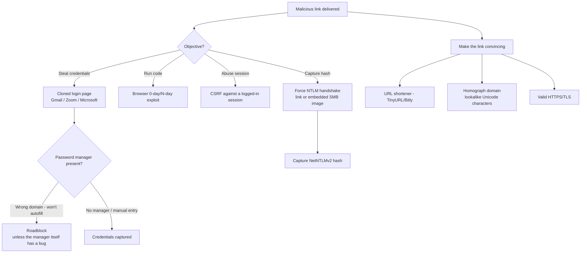

---
tags:
  - phishing
  - malicious-links
  - credential-harvesting
  - csrf
  - ntlm-relay
  - phase/initial-access
---

# Recognize malicious links

> [!tip] Quick Reference
> | Link objective | Technique | Defense it must beat |
> |-----------------|-----------|------------------------|
> | Steal credentials | Cloned login page (Gmail/Zoom/Microsoft) | Password manager domain-matching |
> | Run arbitrary code | Browser 0-day/N-day exploit | Browser patch level |
> | Abuse an authenticated session | CSRF (e.g. CVE-2024-1879, AutoGPT) | Needs an active session, no credentials required |
> | Capture an NTLM hash | Forced auth via link or embedded SMB image | Only affects legacy NTLM-reliant systems |
> | Make the link believable | URL shortener, homograph domain, valid TLS | User visual inspection |

## Visual Flow

## Credential harvesting via cloned sites

Host a clone of a commonly used service — **Gmail, Zoom, Microsoft login** — and pair it with a convincing pretext to get the target to enter real credentials.

> [!warning] Password managers are a real roadblock
> Password managers only autofill on the **exact correct domain** — they won't fill Microsoft credentials into `m1cros0ft.com`. This alone silently defeats naive clone attempts against anyone using one. It's not bulletproof, though — password managers have had their own bugs:
> - **LastPass (2016)** — a crafted URI could trick the extension into revealing passwords.
> - **LastPass (2017, Google Project Zero)** — a bug allowed arbitrary vault reads, possibly code execution.
> - **Safari 1Password extension (2021)** — allowed reading vault items like credit card data.
> - **AutoSpill (2023)** — exploited how Android exposes WebViews to a parent app, letting a malicious app steal credentials.
>
> These are situational, not reliable defaults — **password managers remain a genuine roadblock in most credential phishing campaigns.**

## Beyond credentials: code execution and session abuse

- **Browser exploitation** — a malicious page triggers a browser 0-day/N-day for arbitrary code execution. Requires a reliable exploit *and* the target opening the link in the specific vulnerable browser — advanced, uncommon without real exploit access.
- **CSRF** — abuses an *existing authenticated session* in the target's browser, forcing an action on a service without new credentials. Example: **CVE-2024-1879**, a CSRF bug in AutoGPT enabling arbitrary code execution on a vulnerable system.

## Making the link itself believable

- **URL shorteners** (TinyURL, Bitly) obfuscate the real destination — but the provider can disable the link if it's flagged as malicious.
- **Homograph URLs** substitute look-alike Unicode characters (Cyrillic/Greek/Latin) for ASCII — e.g. `аррӏе.com` vs. `apple.com`, where the "l" is actually a Cyrillic "І". Many browsers render these almost identically in the address bar despite pointing to a completely different site.
- **Valid HTTPS/TLS** is required — an insecure-site browser warning kills the pretext instantly (same principle as [[Enhancing phishing through social engineering]]).
- Avoid random or context-mismatched strings in the URL itself — they're an easy visual tell.

## NTLM hash capture via forced authentication

Even as NTLM is being deprecated, older systems remain vulnerable to **authentication leak** attacks: a malicious link — or even just an **embedded image pointing to a UNC/SMB path** — can trigger an NTLM handshake the moment it's rendered, letting the attacker capture a **NetNTLMv2 hash** without any click on a hyperlink at all. Dated, but still spotted in the wild as recently as **February 2024**.

> [!success] What a convincing link looks like
> Valid HTTPS, a domain that's shortened or homograph-disguised well enough to survive a glance, and a pretext that explains the click naturally — combined, for credential harvesting, with either no password manager present or a target who types credentials manually anyway.

> [!danger] Common pitfalls
> - Assuming a clone site will always capture credentials — password managers can silently block this.
> - URL shorteners getting killed once flagged by the provider.
> - Betting on a browser 0-day without a genuinely reliable exploit and a matching browser version.
> - Assuming NTLM hash capture works broadly — it only affects legacy, NTLM-reliant configurations.

> [!tip] Beginner note
> **CSRF** in plain terms: a malicious page makes your already-logged-in browser perform an action on a real site *without you meaning to* — it rides on a session you didn't realize was still active. **Homograph attack**: characters that *look* identical but aren't the same character to a computer, used to disguise a fake domain as a real one.

## Resources
- [HackTricks — Phishing Methodology](https://book.hacktricks.xyz/generic-methodologies-and-resources/phishing-methodology)
- [CVE-2024-1879 (AutoGPT CSRF)](https://nvd.nist.gov/vuln/detail/CVE-2024-1879)

---
%% graph-links %%
## Related
- [[Understanding the role of inbound email filters]]
- [[Assess threats from malicious files]]
- [[Differentiate credential phishing and MFA]]
- [[Creating a Zoom credential phishing pretext]]
- [[Cloning a legitimate website]]

> [!info] Navigation
> Section: [[Phishing Basics/Payloads, misdirection, and speedbumps/_index|Payloads, misdirection, and speedbumps]] · Home: [[🏠 Home]]
