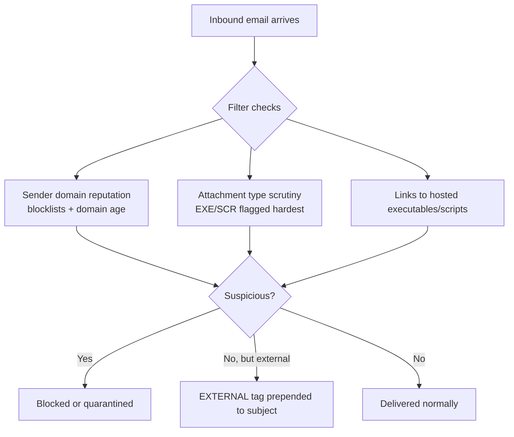

---
tags:
  - phishing
  - email-filters
  - defensive-evasion
  - phase/initial-access
---

# Understanding the role of inbound email filters

> [!tip] Quick Reference
> | Filter check | What it looks at | Attacker angle |
> |--------------|-------------------|-----------------|
> | Domain reputation | Blocklists + sender domain age | Age/warm a domain before the campaign |
> | Attachment type | EXE/SCR scrutinized hardest; Office/PDF/ZIP/scripts next | Prefer less-flagged formats, obfuscate |
> | Links to executables | External links pointing to hosted exe/script files | Host on legitimate-looking cloud storage |
> | External sender marker | `[EXTERNAL]` prepended to subject | Can't be removed — pretext must survive it |

## Visual Flow



## What inbound filters actually check

Before payload choices even come into play, every phishing email has to survive the target's mail filtering. Two main defenses:

**1. Domain reputation.** Filters score the sending domain using reputation blocklists plus signals like **domain age**. A domain registered yesterday is inherently more suspicious than one that's been active for years — this is exactly why skilled phishers register and "age" look-alike domains well ahead of a campaign (see [[Email phishing]]).

> [!tip] Checking a domain before you commit to it
> ```bash
> whois corp-vendor.com | grep -i "creation date"     # domain age
> dig txt corp-vendor.com +short                       # SPF record, if any
> dig txt _dmarc.corp-vendor.com +short                 # DMARC policy — p=reject/quarantine hurts spoofing attempts
> dig txt selector._domainkey.corp-vendor.com +short    # DKIM (selector varies — check a real header sample, or try common defaults like google/selector1/selector2)
> ```
> A young domain with no SPF/DMARC at all is easy to spoof but also easy to flag; a well-aged domain (or a genuinely compromised mailbox, as in [[Creating a Zoom credential phishing pretext]]) with SPF/DKIM already configured correctly is what actually clears modern filters.

**2. Attachment scrutiny.** Filters inspect attachments and flag risky types:
- **EXE and SCR** — treated as maximally suspicious by nearly every product.
- **Office documents, PDFs, ZIP archives, and script files** — scrutinized to varying degrees depending on the product.
- **Links pointing externally** to pages hosting any of the above file types can be flagged the same way as a direct attachment.

## The `[EXTERNAL]` fallback

Many organizations prepend `[EXTERNAL]` to the subject line of any email arriving from outside the org — a visual cue for users, independent of how well the email is spoofed. Even a perfectly crafted pretext that looks like it's from a colleague will still carry this tag if it originated externally, so the pretext has to be believable *even with that flag visible*.

> [!success] What survives filtering
> An aged, reputable-looking sending domain; an attachment type that isn't in the highest-scrutiny bucket (or none at all — a credential-harvesting link often beats an attachment); and a pretext plausible enough to survive an `[EXTERNAL]` tag if one appears.

> [!danger] Common pitfalls
> - Registering a brand-new domain right before the campaign — reputation/age scoring flags it immediately.
> - Attaching an EXE/SCR directly — the single most-scrutinized attachment type.
> - Ignoring the `[EXTERNAL]` tag when building the pretext — if the story only works assuming an internal sender, it collapses the moment the tag appears.

> [!tip] Beginner note
> Filters aren't just "attachment scanners" — reputation and domain age matter as much as file type. That's part of why a compromised legitimate account (from [[Email phishing]]) is so much more effective than a fresh look-alike domain: it already has an established, trusted reputation.

## Resources
- [HackTricks — Phishing Methodology](https://book.hacktricks.xyz/generic-methodologies-and-resources/phishing-methodology)

---
%% graph-links %%
## Related
- [[Email phishing]]
- [[Identifying risks of malicious Office macros]]
- [[Assess threats from malicious files]]
- [[Recognize malicious links]]

> [!info] Navigation
> Section: [[Phishing Basics/Payloads, misdirection, and speedbumps/_index|Payloads, misdirection, and speedbumps]] · Home: [[🏠 Home]]
