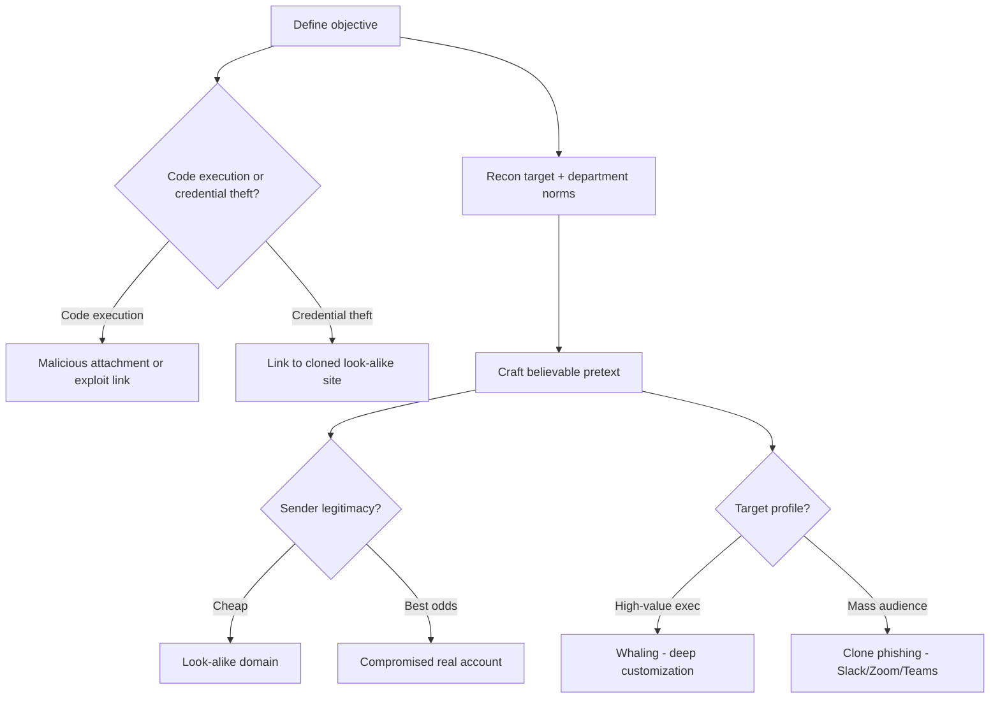

---
tags:
  - phishing
  - social-engineering
  - pretexting
  - phase/initial-access
---

# Email phishing

> [!tip] Quick Reference — Email Phishing
> | Objective | Vector |
> |-----------|--------|
> | Code execution | Malicious attachment (Office macro doc, PDF, 7zip/zip, `.lnk` shortcut, `.ics` calendar invite) |
> | Code execution | Exploit-laden link (browser exploit → RCE) |
> | Credential theft | Link to a cloned look-alike login page |
> | Mass / low-effort | Clone phishing (fake Slack/Zoom/Gmail/Teams notification) |
> | High-value target | Whaling (heavily customized, single-target spear phishing) |

## Visual Flow



## The two objectives

Every phishing email is built around one of two goals:
1. **Run code on the target's machine** — via a malicious attachment (Office macro, PDF, archive, `.lnk`, calendar invite) or a link to an exploit-laden site that abuses a browser vulnerability.
2. **Steal credentials** — via a link to a site that closely clones one the target already logs into.

The objective decides everything downstream: the payload, the pretext, and how the email is built.

## Crafting a believable pretext

A **pretext** is the fake story that convinces someone to open the link or attachment. Small details — typos, bad grammar, formatting mistakes — are what expose a scam, so the pretext needs to be as seamless as possible.

Two things make a pretext land:

**1. Sender legitimacy.** An email from an unfamiliar domain gets ignored. Attackers address this two ways:
- **Look-alike domains** — cheaply registered domains resembling the target's org, vendor, or a familiar company.
- **A genuinely compromised account** — from a breach or leaked credentials belonging to the target's org or one of their clients. This beats a look-alike domain by a wide margin: it's not just visually similar, it *is* a real, trusted sender.

> [!tip] Checking candidate look-alike domains
> ```bash
> dnstwist corp.com
> ```
> Generates permutations (typos, homographs, alternate TLDs) of a target domain and checks which are already registered — useful both offensively (picking an unregistered, plausible variant) and defensively (spotting domains already squatted by someone else).

**2. Matching the target's expectations.** The pretext has to fit what that specific audience normally receives. A campaign against HR should look like the kind of email HR is used to seeing — which takes research into that department's role and routine.

> [!info] Whaling
> Whaling is spear phishing aimed at high-profile individuals (execs, finance leads). It demands far more customization and research than a standard campaign — often requiring inside knowledge of the target.

> [!info] Do-Not-Phish lists
> On a real engagement, the client typically supplies a list of email addresses that are **off-limits** — usually high-profile individuals. Always ask for (and respect) this list; it's a standard part of scoping the engagement.

## Clone phishing (the generic, scalable approach)

Rather than researching one person, mimic an email from a **commonly used service** — Slack, Zoom, Gmail, Microsoft Teams — linking to a cloned site that resembles that service's login page. Low research cost, works at scale across an entire org. This is exactly the technique built hands-on later in this module (see [[Creating a Zoom credential phishing pretext]]).

> [!tip] Running a campaign at scale with GoPhish
> Manually replying to one thread (as in the hands-on walkthrough) doesn't scale to hundreds of targets. [GoPhish](https://getgophish.com/) manages templates, landing pages, sending profiles, and per-recipient tracking in one tool:
> ```bash
> # download a release from https://github.com/gophish/gophish/releases, then:
> unzip gophish-*.zip && cd gophish
> sudo ./gophish
> ```
> The admin UI listens on `https://127.0.0.1:3333` by default; GoPhish prints the initial admin password to the console on first launch.

## The pipeline

```
Recon target → Set objective → Build pretext → Execute campaign
```
Research feeds the pretext; the pretext carries the objective; execution is just the technical delivery of both.

> [!success] What a strong pretext looks like
> Sender domain/account matches what the target expects, the tone and formatting match that department's normal traffic, and there's a plausible, mildly urgent reason to act (e.g. "verify your account to complete payroll setup" for a new hire).

> [!danger] Common pitfalls
> - Typos/grammar errors — the fastest way to blow the pretext.
> - Sender domain or metadata that doesn't match what the target expects.
> - Targeting someone on the client's do-not-phish list — a scoping violation, not just a technical mistake.
> - A pretext that doesn't match the target department's normal email traffic (e.g. an "HR" email that reads nothing like HR).

> [!tip] Beginner note
> **Pretext** = the cover story. **Clone phishing** = pretending to be a well-known service instead of a specific person — cheap and scalable. **Whaling** = the opposite extreme — one high-value target, maximum research.

## Resources
- [HackTricks — Phishing Methodology](https://book.hacktricks.xyz/generic-methodologies-and-resources/phishing-methodology)
- [GoPhish](https://getgophish.com/) — open-source phishing campaign framework
- [dnstwist (GitHub)](https://github.com/elceef/dnstwist) — look-alike domain permutation checker

---
%% graph-links %%
## Related
- [[Smishing, vishing, and chatting]]
- [[Enhancing phishing through social engineering]]
- [[Creating a Zoom credential phishing pretext]]
- [[Google Hacking]]
- [[LLM-Powered Passive Information Gathering]]

> [!info] Navigation
> Section: [[Phishing Basics/Phishing 101/_index|Phishing 101]] · Home: [[🏠 Home]]
