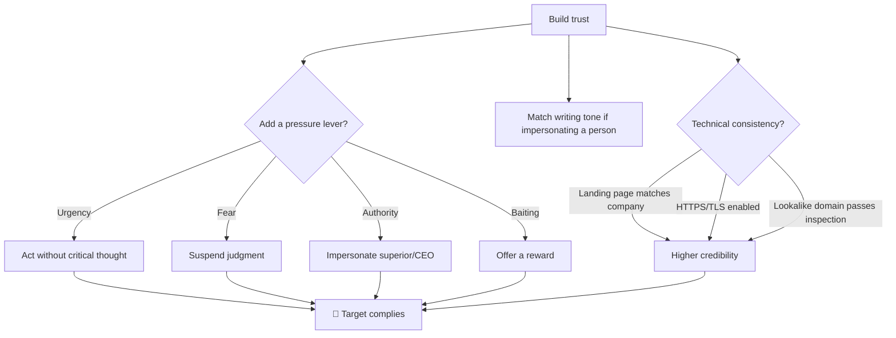

---
tags:
  - phishing
  - social-engineering
  - pretexting
  - phase/initial-access
---

# Enhancing phishing through social engineering

> [!tip] Quick Reference — Manipulation Levers
> | Lever | Mechanism | Example |
> |-------|-----------|---------|
> | Trust | Exploit/build a relationship | Compromised account, matched writing tone |
> | Urgency | Bypass critical thought | "Complete before EOD or payroll fails" |
> | Fear | Suspend judgment | "Your account will be suspended" |
> | Authority | Amplify urgency via rank | Posing as a manager or the CEO |
> | Baiting | Positive incentive | Gift card, cash, favor with a superior |

## Visual Flow



## Trust is the foundation

Social engineering relies on **psychological manipulation, not technical skill** — it's a "human" craft, refined through trial and error. The ultimate goal of any phishing campaign is to earn just enough trust that the target follows through on the ask.

Trust has two sides:

**1. Technical consistency.** Every element of the phish has to tell the *same* story:
- If the pretext claims to be Company X, the landing page must mirror Company X's real site.
- The sending domain and link must survive a cursory glance — hence lookalike domains.
- Small details matter: an **HTTP-only** (non-TLS) landing page is an easy tell that breaks the illusion instantly.
- Carelessness anywhere erodes trust everywhere — one inconsistency and the whole pretext is suspect.

> [!tip] Verify TLS actually works before launch
> ```bash
> curl -Iv https://clone-site.example/ 2>&1 | grep -i "SSL certificate"
> openssl s_client -connect clone-site.example:443 -servername clone-site.example </dev/null
> ```
> Catches a missing/expired/self-signed cert before a real target ever sees the browser's own "Not Secure" warning — the single fastest way to blow the trust this section is about building.

**2. Soft skills.** If impersonating a specific person (or using their compromised account), match their **writing tone**. The most sophisticated version of this is building genuine **rapport** with the target over time before ever making the ask.

## Pressure levers

Once trust is established, phishers often layer in a lever that pushes the target past their own rational judgment:

- **Urgency** — act now, don't think. Most effective in organizations with an **unhealthy work culture**, where urgent, no-questions-asked requests are already normal — the target is pre-trained to comply without scrutiny.
- **Fear** — momentarily suspends judgment ("your account will be suspended").
- **Authority** — impersonating a superior or the CEO amplifies urgency; people are less likely to push back on someone they perceive as senior.
- **Baiting** — the positive-incentive counterpart: a gift card, cash, or a favor with a superior. Because "reward for participation" (e.g. a survey incentive) is common in normal business, it can blend into the background rather than raising alarm.

> [!warning] Balance matters
> These levers must be balanced against trust and rapport. Overdo the pressure and the pretext starts to feel like a scam rather than a legitimate — if unusual — request.

> [!success] What makes it click
> Every touchpoint reinforces the same story — domain, landing page, tone, and urgency level are all consistent — so there's nothing for the target's scrutiny to snag on.

> [!danger] Common pitfalls
> - HTTP-only landing page when the pretext claims to be a real company.
> - Writing tone that doesn't match the person being impersonated.
> - Stacking too many pressure levers (urgency + fear + authority at once) — it reads as manufactured rather than genuine.
> - Branding/visual inconsistency between the email and the landing page.

> [!tip] Beginner note
> Remember the levers as **Trust, Urgency, Fear, Authority, Baiting**. Trust is the foundation everything else sits on; the other four are ways to short-circuit the target's critical thinking once trust is in place.

## Resources
- [HackTricks — Phishing Methodology](https://book.hacktricks.xyz/generic-methodologies-and-resources/phishing-methodology)
- [Social Engineering Framework](https://www.social-engineer.org/framework/general-discussion/)

---
%% graph-links %%
## Related
- [[Email phishing]]
- [[Smishing, vishing, and chatting]]
- [[LLMs, generative AI and deepfakes]]
- [[Recognize malicious links]]

> [!info] Navigation
> Section: [[Phishing Basics/Phishing 101/_index|Phishing 101]] · Home: [[🏠 Home]]
