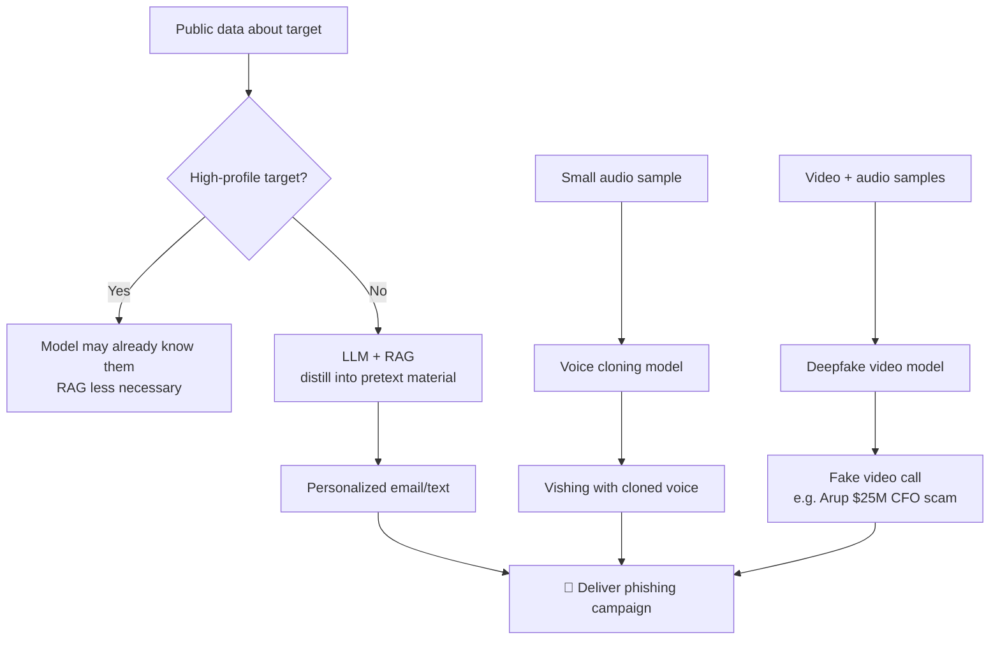

---
tags:
  - phishing
  - social-engineering
  - llm
  - generative-ai
  - deepfake
  - vishing
  - phase/initial-access
---

# LLMs, generative AI and deepfakes

> [!tip] Quick Reference
> | Use case | Technique | Note |
> |----------|-----------|------|
> | Research/recon | LLM + RAG | Distills large volumes of public data into pretext material |
> | Pretext writing | LLM text generation | Personalized, convincing copy at scale |
> | Vishing | Voice cloning | A small audio sample is enough; increasingly hard to detect |
> | Video-call BEC | Deepfake video | Real-time fake video, e.g. the Arup $25M case |

## Visual Flow

## LLMs for research and pretext development

Generative AI speeds up two stages of a phishing campaign: **research** and **pretext writing**.

- **RAG (Retrieval Augmented Generation)** lets an LLM process a large volume of publicly available information about a target and distill it into usable pretext material — effectively automating what would otherwise be manual OSINT (see [[LLM-Powered Passive Information Gathering]]).
- Against a **high-profile target**, RAG may not even be necessary — the model's training data may already contain enough detail about them to be useful on its own.
- The result: more personalized, more convincing attacks, produced faster than manual research would allow.

> [!info] The blind spot in threat intelligence
> Reports like Microsoft's 2023 warning on LLM-crafted phishing emails, or Mandiant's 2024 M-Trends report on rising Gen AI use in social engineering, can only describe **observable** activity — the delivered email or message. They can't see how an attacker used an LLM privately during planning and research; that stage leaves no artifact for defenders to find.

## Voice cloning

Voice cloning has become broadly accessible: a **relatively small amount of recorded audio** is enough to build a model of someone's voice, which can then be made to say anything. As the underlying Gen AI has improved, cloned voices have become both more convincing and harder to detect — directly upgrading the vishing techniques from [[Smishing, vishing, and chatting]].

## Deepfake video

Deepfakes extend the same idea to video calls.

> [!example] Real-world case — Arup (2024)
> During a video call, deepfake clones of the CFO and other staff appeared and acted as real employees. The deepfaked CFO signed off on a transfer of **$25 million**, which was sent directly to the attackers. No email, no link — just a convincing live video call.

## Why this matters for phishing campaigns

As a pentester, these technologies **complement rather than replace** traditional phishing:
- LLM-assisted recon and drafting → faster, more personalized [[Email phishing]] and [[Smishing, vishing, and chatting]] pretexts.
- Voice cloning → far more convincing vishing.
- Deepfake video → an entirely new attack surface: the live video call, previously assumed hard to fake.

> [!success] What it looks like when it works
> Text that's indistinguishable from something the impersonated person would actually write, and — at the extreme end — a voice or video call that survives real-time scrutiny from people who know the impersonated person.

> [!danger] Common pitfalls
> - AI-generated text can still carry generic "AI voice" tells (overly formal phrasing, hedge words) if not reviewed and edited to match the real person's tone.
> - Cloned voices can degrade over low-quality phone/VoIP compression, exposing artifacts.
> - Deepfake video still shows tells under close scrutiny (lighting mismatches, lip-sync drift) — don't assume it's undetectable.
> - **Scope check**: impersonating a real, named individual's voice or likeness is a bigger ask than standard phishing — confirm it's explicitly authorized in the Rules of Engagement before using it (see [[Phishing Basics/_index|module overview]]).

> [!tip] Beginner note
> **RAG** = an LLM technique for pulling in outside data (like public OSINT) before generating a response, rather than relying only on what it learned during training. That's what lets an LLM build a pretext from a target's real, current public footprint instead of generic guesses.

## Resources
- [Microsoft Threat Intelligence — LLM-themed phishing](https://www.microsoft.com/en-us/security/blog/)
- [Mandiant M-Trends Report](https://www.mandiant.com/m-trends)

---
%% graph-links %%
## Related
- [[Email phishing]]
- [[Smishing, vishing, and chatting]]
- [[Enhancing phishing through social engineering]]
- [[LLM-Powered Passive Information Gathering]]
- [[Active LLM-Aided Enumeration]]

> [!info] Navigation
> Section: [[Phishing Basics/Phishing 101/_index|Phishing 101]] · Home: [[🏠 Home]]
