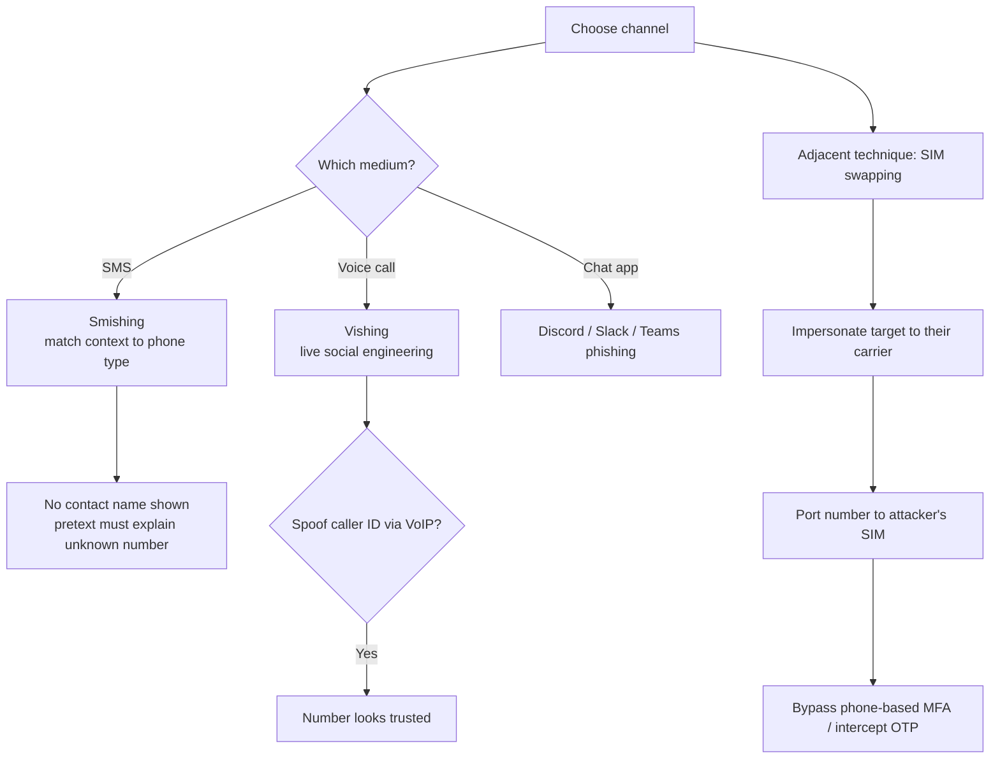

---
tags:
  - phishing
  - social-engineering
  - smishing
  - vishing
  - sim-swapping
  - phase/initial-access
---

# Smishing, vishing, and chatting

> [!tip] Quick Reference
> | Goal | Technique |
> |------|-----------|
> | SMS-based phishing | Smishing — match the pretext to the phone type (work vs. personal) |
> | Live social engineering | Vishing — phone call, driven by improvisation, not tooling |
> | Hide/alter the real number | Caller ID spoofing (cheap via VoIP) |
> | Bypass phone-based MFA | SIM swapping — port the number via carrier impersonation |
> | Chat-app phishing | Discord / Slack / Microsoft Teams |

## Visual Flow

## Smishing (SMS phishing)

SMS is more personal and direct than email, so the pretext has to be sharper:
- **Work phone** → work-related context.
- **Personal phone** → convincing personal detail, e.g. a reference to a specific friend or family member.
- The target won't recognize the sending number (it's not in their contacts) — the pretext must account for that on its own.

> [!example] CEO gift card scam
> The attacker poses as a senior executive urgently asking an employee to buy and send gift cards. Effective because it exploits authority + urgency, and gift cards are easy to cash out.

## Vishing (voice phishing)

A live phone call. Unlike email/smishing, vishing is driven almost entirely by **social engineering skill** rather than technical tooling — there's no crafted document or link, just real-time improvisation and persuasion.

## Caller ID spoofing

VoIP makes it cheap to alter the number a call or text appears to come from. Used in both smishing and vishing to make the sender look trusted or familiar. For authorized engagements, a legitimate programmable-communications provider (e.g. **Twilio**) with a client-approved caller ID is the standard way to do this without touching anything of dubious legality.

> [!danger] Spoofed/VoIP numbers get auto-flagged
> Many carriers now label calls/texts from unfamiliar VoIP numbers as **"Scam Likely"** (or similar) before the target even answers — killing the pretext instantly, no social engineering skill can recover from that. Mitigations: use a number with a local area code matching the target's region, avoid dialing the same number across many targets in a short window (a major spam-flag trigger), and where the engagement timeline allows it, "warm" the number with a handful of ordinary-looking calls beforehand.

## SIM swapping

An adjacent technique, not phishing itself, but often chained with it:
1. The attacker calls the target's **mobile carrier**, posing as the account owner.
2. They convince the carrier to port the phone number onto a SIM the attacker controls.
3. The attacker now receives the target's calls and texts until the real owner recovers access.

> [!danger] Why this matters more than it sounds
> SIM swapping is most dangerous as an **MFA bypass** — if a target's 2FA relies on SMS codes or phone calls, the attacker now receives those codes directly. This defeats MFA even when the victim's password was never compromised. See [[Differentiate credential phishing and MFA]].

## Chat & messaging apps

Discord, Slack, and Microsoft Teams are increasingly common phishing surfaces — same pretext principles apply, just delivered through a different client.

## Broad vs. targeted still applies

Regardless of channel (SMS, voice, chat), the same choice from [[Email phishing]] holds: a **broad**, generic approach across many targets, or a **precise**, researched attack against one.

> [!success] What a strong smishing/vishing attempt looks like
> The context matches the phone type (work vs. personal), there's a plausible reason the number is unrecognized, and the ask carries urgency without being implausible (see the gift card scam above).

> [!danger] Common pitfalls
> - Work-context pretext sent to a personal number (or vice versa) — instantly suspicious.
> - No cover story for why the number isn't a saved contact.
> - Caller ID spoofing that doesn't hold up if the target calls the number back.
> - SIM swap attempts fail against carriers with strong account-verification (PINs, in-store ID checks) — don't assume it always works.

> [!tip] Beginner note
> **Smishing** = SMS. **Vishing** = voice call. **SIM swapping** isn't phishing on its own — it's a social-engineering attack against the *carrier* that hijacks the victim's phone number, most often to intercept SMS-based MFA codes.

## Resources
- [HackTricks — Phishing Methodology](https://book.hacktricks.xyz/generic-methodologies-and-resources/phishing-methodology)

---
%% graph-links %%
## Related
- [[Email phishing]]
- [[Enhancing phishing through social engineering]]
- [[LLMs, generative AI and deepfakes]]
- [[Differentiate credential phishing and MFA]]

> [!info] Navigation
> Section: [[Phishing Basics/Phishing 101/_index|Phishing 101]] · Home: [[🏠 Home]]
