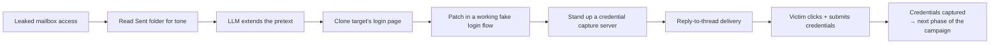

---
tags:
  - phishing
  - social-engineering
  - phase/initial-access
---

# Phishing Basics

%% moc %%
> [!abstract] Map of Content
> Initial access via phishing: the delivery channels (email, smishing, vishing), how payloads slip past filters, and a hands-on credential-harvesting walkthrough.
>
> ⬆ Up: [[🏠 Home]]

## Overview

Phishing blends technical delivery with social manipulation. Two flavors:
- **Broad phishing** — mass, generic messages cast at many targets (a numbers game).
- **Spear phishing** — personalized attacks against specific individuals, built from recon into their behaviors, preferences, and vulnerabilities.

> [!tip] Generative AI is changing the tradeoff
> LLMs process public data to find and profile targets fast, closing the effort gap between broad and spear phishing. Voice-cloning and deepfake video extend this into vishing and video-based pretexts — making AI-augmented phishing both more convincing and harder to catch.

## Subsections
- 📁 [[Phishing Basics/Phishing 101/_index|Phishing 101]] — channels & social engineering
- 📁 [[Phishing Basics/Payloads, misdirection, and speedbumps/_index|Payloads, misdirection, and speedbumps]] — filters, macros, files, links, MFA
- 📁 [[Phishing Basics/Hands-on credential phishing/_index|Hands-on credential phishing]] — clone a site, capture creds, send the mail

## Wrapping up

Phishing is as much an art as a technical exercise — it takes a solid read on human behavior, meticulous research, and precise execution. From crafting a convincing pretext to leveraging Gen AI and deepfakes, the attacker's toolkit keeps expanding, but the core loop stays the same:

Building and running this chain end-to-end (see [[Phishing Basics/Hands-on credential phishing/_index|Hands-on credential phishing]]) is a practical foundation for anticipating, leveraging, and countering these threats — not just recognizing them in theory.

## Related Sections
- [[Passive Information Gathering/_index|Passive Information Gathering]] — OSINT to craft the pretext
- [[Web Applications/_index|Web Applications]] — cloning + credential capture
